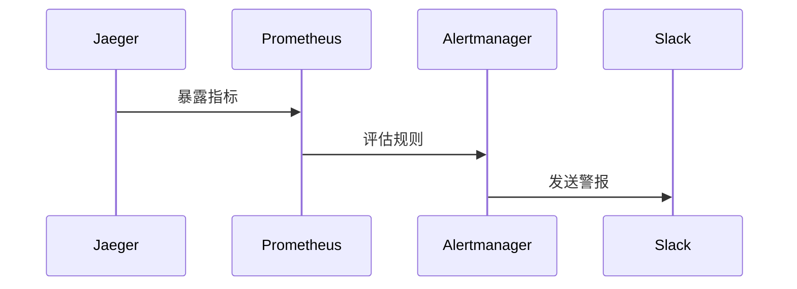

# 警报配置

## 介绍

在分布式系统中，监控和警报是确保系统可靠性的关键环节。Jaeger作为分布式追踪工具，不仅帮助开发者可视化请求链路，还能通过配置警报规则主动发现潜在问题。本文将介绍如何为Jaeger指标配置警报，以便在异常（如延迟激增或错误率上升）时及时通知团队。

:::note 什么是警报配置？
警报配置是一组规则，用于定义系统何时触发通知（如邮件、Slack消息等）。这些规则基于指标阈值（例如：`请求延迟 > 500ms`）。
:::

---

## 核心概念

### 1. 警报规则组成
Jaeger的警报通常依赖以下组件：
- **指标来源**：Jaeger暴露的Prometheus指标（如`jaeger_trace_latency_seconds`）。
- **规则表达式**：基于PromQL的查询语句。
- **通知渠道**：如Email、Slack或PagerDuty。

### 2. 常用监控指标
| 指标名称                     | 描述                          | 示例阈值规则               |
|------------------------------|-------------------------------|----------------------------|
| `jaeger_trace_latency_seconds` | 请求延迟（秒）                | `> 1s`                     |
| `jaeger_error_count`           | 错误请求数                    | `rate(jaeger_error_count[5m]) > 5` |

---

## 配置步骤

### 步骤1：定义Prometheus规则
在Prometheus的`alert.rules.yml`中添加Jaeger相关规则：

```yaml
groups:
- name: jaeger-alerts
  rules:
  - alert: HighRequestLatency
    expr: histogram_quantile(0.99, sum(rate(jaeger_trace_latency_seconds_bucket[5m])) by (le)) > 1
    for: 10m
    labels:
      severity: critical
    annotations:
      summary: "High latency detected in {{ $labels.service }}"
      description: "99th percentile latency is {{ $value }}s"
```

### 步骤2：配置Alertmanager
在Alertmanager中设置通知渠道（以Slack为例）：

```yaml
route:
  receiver: 'slack-notifications'
receivers:
- name: 'slack-notifications'
  slack_configs:
  - api_url: 'https://hooks.slack.com/services/...'
    channel: '#alerts'
```

---

## 实际案例

### 场景：电商网站订单服务延迟
假设订单服务的`jaeger_trace_latency_seconds`突然升高：
1. Prometheus每5分钟计算一次99分位延迟。
2. 若延迟持续10分钟超过1秒，触发`HighRequestLatency`警报。
3. 团队通过Slack收到通知，内容包含服务名称和当前延迟值。



---

## 总结

通过配置Jaeger的警报规则，团队可以主动发现性能退化或错误激增问题。关键步骤包括：
1. 选择关键指标（如延迟、错误率）。
2. 编写PromQL表达式定义阈值。
3. 设置通知渠道确保及时响应。

:::tip 练习
尝试为`jaeger_error_count`配置一个警报规则，当5分钟内错误率超过10次时触发。
:::

**扩展阅读**：
- [Prometheus官方警报指南](https://prometheus.io/docs/alerting/latest/overview/)
- [Jaeger指标文档](https://www.jaegertracing.io/docs/latest/monitoring/)