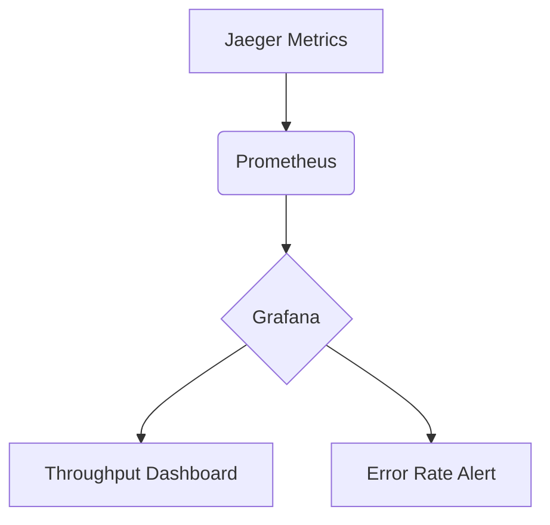

# 监控最佳实践

## 引言

在现代分布式系统中，监控是确保系统可靠性和性能的关键环节。Jaeger作为一款开源的分布式追踪工具，不仅能帮助开发者追踪请求链路，还能通过指标（Metrics）提供系统健康状态的实时洞察。本文将介绍如何结合Jaeger实现监控的最佳实践，适合刚接触监控概念的初学者。

---

## 1. 监控的核心目标

监控的主要目标包括：
- **问题检测**：快速发现系统异常（如错误率上升、延迟增加）。
- **性能优化**：识别瓶颈（如数据库查询慢）。
- **容量规划**：通过历史数据预测资源需求。

:::tip
好的监控系统应做到：**可观测性**（Observability）、**实时性**和**可操作性**。
:::

---

## 2. Jaeger 监控指标基础

Jaeger 默认收集的指标包括：
- **请求速率**（Requests per second）
- **错误率**（Error rate）
- **延迟分布**（Latency percentiles）

通过 Prometheus 集成，可以暴露这些指标。例如，以下配置将 Jaeger 指标导出到 Prometheus：

```yaml
# jaeger-config.yaml
metrics:
  backend: prometheus
  prometheus:
    host-port: "0.0.0.0:14269"
```

---

## 3. 关键实践步骤

### 3.1 定义关键指标（SLIs/SLOs）
选择与用户体验直接相关的指标作为服务等级指标（SLIs），例如：
- 成功率 ≥ 99.9%
- 延迟 ≤ 200ms（P99）

### 3.2 配置告警规则
在 Prometheus 中设置告警规则，当错误率超过阈值时触发：

```yaml
# prometheus-alerts.yaml
groups:
- name: example
  rules:
  - alert: HighErrorRate
    expr: sum(rate(jaeger_http_errors_total[5m])) by (service) / sum(rate(jaeger_http_requests_total[5m])) by (service) > 0.01
    for: 10m
```

### 3.3 可视化监控数据
使用 Grafana 创建仪表盘，展示 Jaeger 的黄金信号（吞吐量、错误、延迟、饱和度）：



---

## 4. 实际案例：电商订单系统

**场景**：用户下单延迟突增。<br />
**监控流程**：
1. 通过 Jaeger 发现订单服务的 `checkout` 操作 P99 延迟从 150ms 升至 800ms。
2. 检查关联指标，发现数据库查询耗时增加。
3. 定位到慢查询：`SELECT * FROM orders WHERE user_id=?` 未使用索引。

**解决方案**：添加索引并优化查询后，延迟恢复正常。

---

## 5. 总结

- **监控要点**：聚焦核心指标、设置合理告警、快速定位问题。
- **Jaeger 优势**：集成追踪与指标，提供端到端可见性。

## 6. 扩展练习
1. 在本地部署 Jaeger 和 Prometheus，导出服务指标。
2. 模拟高延迟场景，触发告警并分析追踪数据。

## 7. 附加资源
- [Jaeger 官方文档](https://www.jaegertracing.io/docs/)
- 《SRE：Google运维实践》- 第5章（监控与告警）