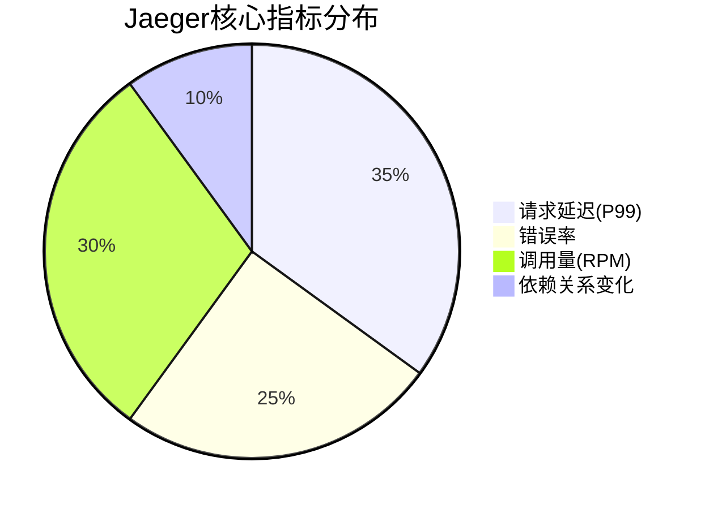
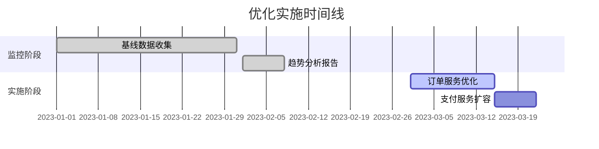

# 长期趋势分析

## 介绍
长期趋势分析是通过收集和分析系统在一段时间内的性能指标数据，识别模式、异常和潜在优化点的过程。在分布式系统中，Jaeger提供的监控指标（如请求延迟、错误率等）能帮助开发者理解系统行为的长期变化。

:::tip 为什么重要？
- 发现性能退化趋势
- 预测容量需求
- 验证优化措施效果
:::

## 核心指标
Jaeger中用于趋势分析的关键指标包括：



## 数据收集方法

### 1. 配置Jaeger采样策略
在Jaeger客户端配置长期采样（例如100%采样关键服务）：
```javascript
const { Sampler } = require('jaeger-client');

const sampler = new Sampler({
  type: 'probabilistic',
  param: 1.0, // 100%采样
  refreshIntervalMs: 300000 // 5分钟更新间隔
});
```

### 2. 存储优化
长期数据建议使用Elasticsearch或Cassandra等支持TTL的存储后端：
```yaml
# Jaeger Collector配置示例
storage:
  elasticsearch:
    server-urls: http://es-cluster:9200
    index-prefix: "jaeger-"
    ttl: 8760h # 1年数据保留
```

## 分析技术

### 时间序列分解
将指标分解为三个组成部分：
1. **趋势**：长期上升/下降
2. **季节性**：固定周期模式
3. **残差**：随机波动

:::note 示例：延迟趋势分析
```python
# 使用Python statsmodels进行分解
from statsmodels.tsa.seasonal import seasonal_decompose

result = seasonal_decompose(
    jaeger_data['p99_latency'], 
    model='additive', 
    period=24*7 # 按周分析
)
result.plot()
```
:::

## 实际案例

### 电商大促准备
某电商平台通过分析过去12个月的Jaeger指标发现：
- 订单服务P99延迟每月增长3%
- 支付服务错误率在每周四上午有峰值

**优化措施**：
1. 对订单服务进行数据库索引优化
2. 在周四上午增加支付服务实例



## 工具推荐
1. **Grafana**：创建长期趋势仪表盘
2. **Prometheus**：与Jaeger集成存储指标
3. **Python Pandas**：进行自定义分析

## 总结
长期趋势分析能帮助您：
- 从被动救火变为主动预防
- 量化系统健康度变化
- 为架构演进提供数据支持

## 延伸学习
1. 尝试在测试环境配置30天的Jaeger数据收集
2. 使用Grafana对比优化前后的趋势曲线
3. 分析您系统中是否存在季节性模式

:::warning 注意
长期数据存储需要考虑：
- 存储成本
- 查询性能
- 数据隐私合规要求
:::