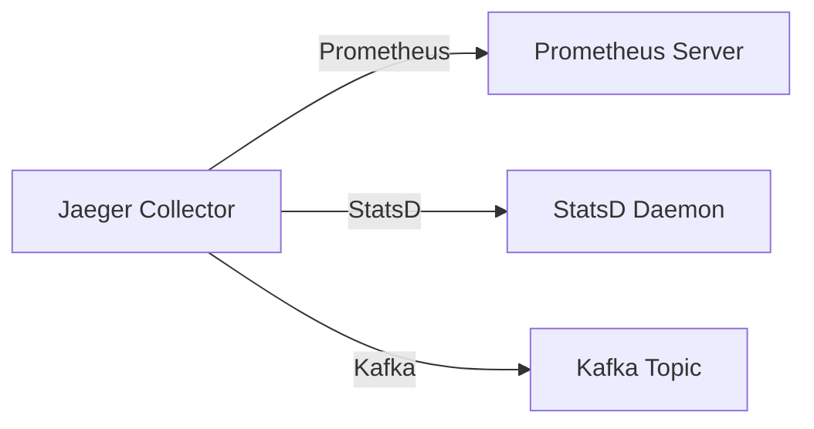

# 指标数据导出

## 介绍

在分布式系统监控中，Jaeger不仅用于追踪请求链路，还能收集丰富的性能指标数据。**指标数据导出**是指将这些内部收集的指标（如请求延迟、错误率等）发送到外部监控系统（如Prometheus、Datadog）的过程，以便进行集中分析和可视化。

:::tip 为什么需要导出？
- 长期存储（Jaeger默认只保留短期数据）
- 与其他系统指标关联分析
- 创建自定义仪表盘
- 设置跨系统告警
:::

## 基础概念

Jaeger支持通过多种方式导出指标：

1. **Prometheus**（最常用）
2. **StatsD**
3. **Kafka**
4. **自定义导出器**



## Prometheus导出配置

这是最常见的导出方式，配置示例：

```yaml
# jaeger-collector-config.yaml
metrics:
  backend: "prometheus"
  prometheus:
    host-port: "localhost:9090"
    prefix: "jaeger_"
```

关键参数说明：
- `host-port`: Prometheus服务器地址
- `prefix`: 指标名称前缀（避免命名冲突）
- `interval`: 推送间隔（默认15s）

## 实际案例：导出QPS指标

假设我们要监控服务的每秒查询数（QPS）：

1. 首先确保Jaeger Collector已配置Prometheus导出
2. 在Prometheus中查询：
```promql
rate(jaeger_collector_spans_received_total[1m])
```

输出示例：
```
jaeger_collector_spans_received_total{instance="localhost:9090",job="jaeger"} 3421
```

:::note 指标类型
Jaeger导出的主要指标类型包括：
- Counter（计数器）：如总请求数
- Gauge（仪表）：如当前内存使用量
- Histogram（直方图）：如延迟分布
:::

## 进阶：自定义指标导出

通过OpenTelemetry Collector可以实现更灵活的导出：

```yaml
# otel-collector-config.yaml
exporters:
  prometheus:
    endpoint: "0.0.0.0:8889"
  logging:
    logLevel: debug

service:
  pipelines:
    metrics:
      receivers: [otlp]
      processors: [batch]
      exporters: [prometheus, logging]
```

## 常见问题解决

:::caution 指标不显示？
1. 检查防火墙规则
2. 验证Prometheus的scrape配置
3. 查看Jaeger Collector日志中的错误
:::

## 总结

指标数据导出是构建完整可观测性体系的关键步骤。通过将Jaeger指标与外部监控系统集成，您可以：

- 获得历史数据分析能力
- 创建统一的监控仪表盘
- 实现跨系统的关联分析

## 延伸学习

推荐练习：
1. 配置Jaeger将指标导出到本地Prometheus
2. 在Grafana中创建Jaeger指标仪表盘
3. 尝试设置基于QPS的告警规则

附加资源：
- [Jaeger官方指标文档](https://www.jaegertracing.io/docs/latest/monitoring/)
- [Prometheus查询指南](https://prometheus.io/docs/prometheus/latest/querying/basics/)