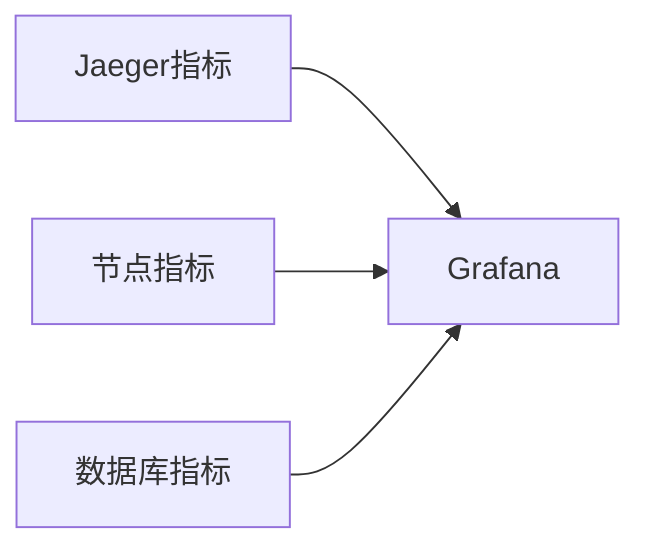

# Grafana仪表板

## 介绍

Grafana是一个开源的可视化平台，允许你将时序数据（如Jaeger收集的监控指标）转换为直观的图表和仪表板。在本指南中，你将学习如何：

1. 连接Grafana到Jaeger数据源
2. 创建基本的监控仪表板
3. 自定义可视化效果
4. 设置警报规则

:::tip
Grafana支持多种数据源，包括Prometheus（Jaeger常用的指标存储后端）、Elasticsearch、InfluxDB等。
:::

## 先决条件

在开始之前，请确保你有：

- 运行中的Jaeger实例
- Prometheus或其他兼容的时序数据库
- 已安装Grafana（版本7.0+）

## 连接数据源

首先，我们需要将Grafana连接到Jaeger的指标数据源（通常是Prometheus）：

1. 登录Grafana控制台
2. 导航到"Configuration" > "Data Sources"
3. 点击"Add data source"
4. 选择Prometheus
5. 配置URL（例如：`http://prometheus:9090`）

```yaml
# 示例Prometheus配置片段
scrape_configs:
  - job_name: 'jaeger'
    static_configs:
      - targets: ['jaeger-collector:14269']
```

## 创建第一个仪表板

让我们创建一个显示Jaeger请求率的简单仪表板：

1. 点击"+" > "Dashboard"
2. 选择"Add new panel"
3. 在查询编辑器中输入PromQL查询：

```promql
rate(jaeger_spans_received_total[1m])
```

4. 设置可视化类型为"Time series"
5. 为图表添加标题"请求率"

:::note
PromQL是Prometheus的查询语言，`rate()`函数计算时间窗口内的每秒平均增长率。
:::

## 常用Jaeger指标

以下是一些有用的Jaeger指标，你可以监控：

| 指标名称 | 描述 |
|---------|------|
| `jaeger_spans_received_total` | 接收到的总span数 |
| `jaeger_traces_sampled_total` | 采样的trace数 |
| `jaeger_collector_queue_length` | 收集器队列长度 |
| `jaeger_query_latency_seconds` | 查询延迟 |

## 高级仪表板配置

### 变量使用

创建变量可以让仪表板更灵活：

1. 打开仪表板设置
2. 选择"Variables"
3. 添加新变量：

```plaintext
Name: service
Type: Query
Query: label_values(jaeger_spans_received_total, service)
```

然后在查询中使用变量：

```promql
rate(jaeger_spans_received_total{service="$service"}[1m])
```

### 混合数据源

你可以在同一仪表板中组合不同数据源。例如，同时显示Jaeger指标和基础设施指标：



## 警报设置

Grafana可以基于指标值触发警报：

1. 编辑面板
2. 选择"Alert"标签
3. 创建警报规则：

```plaintext
Condition: avg() of query(A, 1m, now) > 1000
Evaluate every: 1m
For: 5m
```

4. 配置通知渠道（Email、Slack等）

## 实际案例：性能问题诊断

假设你的Jaeger收集器队列持续增长：

1. 创建显示`jaeger_collector_queue_length`的图表
2. 添加`jaeger_spans_processed_total`进行比较
3. 如果队列增长而处理速率不变，可能表示处理能力不足
4. 解决方案可能是增加收集器实例或调整批处理大小

## 总结

在本指南中，我们学习了：

- 如何连接Grafana到Jaeger指标数据源
- 创建基本的监控仪表板
- 使用变量和混合数据源
- 设置警报规则
- 实际应用场景分析

## 进一步学习

- [Grafana官方文档](https://grafana.com/docs/)
- [PromQL查询参考](https://prometheus.io/docs/prometheus/latest/querying/basics/)
- [Jaeger指标参考](https://www.jaegertracing.io/docs/latest/monitoring/)

**练习**：
1. 创建一个显示Jaeger各服务错误率的仪表板
2. 设置当错误率超过5%时触发警报
3. 添加一个变量让用户可以选择不同的环境（prod/staging）

:::caution
生产环境中，确保Grafana和Prometheus有足够的资源，并考虑设置适当的保留策略。
:::