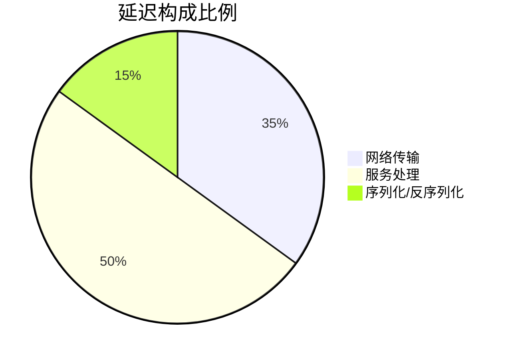
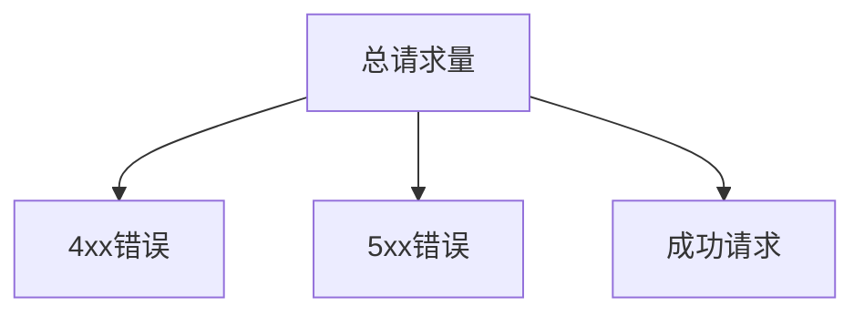

## 介绍

在分布式系统中，**关键性能指标（Key Performance Indicators, KPIs）**是衡量系统健康状态的核心参数。Jaeger作为分布式追踪工具，通过收集和分析这些指标帮助开发者快速定位性能瓶颈。本文将介绍Jaeger中最常用的四类KPI及其实际应用场景。

:::tip 初学者提示
KPIs就像汽车的仪表盘——它们不会直接解决问题，但能告诉你"哪里可能出了问题"。
:::

## 1. 请求延迟(Latency)

### 概念解析
延迟指从请求发出到收到响应的时间差，通常以毫秒(ms)为单位。Jaeger会记录以下关键数据：



### 代码示例
通过Jaeger UI查询延迟百分位数：
```go
// 示例：记录HTTP请求延迟
func handleRequest(w http.ResponseWriter, r *http.Request) {
    start := time.Now()
    defer func() {
        latency := time.Since(start)
        trace.RecordLatency(latency.Milliseconds())
    }()
    // 处理逻辑...
}
```

:::note 典型值参考
- 优秀：`<200ms`
- 可接受：`200-500ms`
- 需优化：`>500ms`
:::

## 2. 错误率(Error Rate)

### 核心指标
- **HTTP错误码分布**（4xx/5xx）
- **业务逻辑错误**（如支付失败）
- **超时错误**



### 实际案例
电商系统中，当支付服务的错误率突增时：
1. Jaeger显示错误集中在`/api/payment`端点
2. 追踪发现是库存服务响应超时导致
3. 解决方案：增加库存服务实例

## 3. 吞吐量(Throughput)

### 关键指标
| 指标类型       | 描述                  | 单位   |
|----------------|-----------------------|--------|
| 请求速率       | 每秒请求数(QPS)       | req/s  |
| 数据吞吐       | 每秒处理数据量        | MB/s   |
| 并发连接数     | 同时活跃的连接数      | count  |

:::warning 注意
高吞吐量不一定代表系统健康，需结合错误率和延迟综合分析。
:::

## 4. 资源利用率(Resource Usage)

### 监控维度
1. **CPU使用率**：`container_cpu_usage_seconds_total`
2. **内存占用**：`container_memory_working_set_bytes`
3. **磁盘I/O**：`container_fs_reads_bytes_total`

```bash
# Prometheus查询示例
sum(rate(container_cpu_usage_seconds_total[1m])) by (pod_name)
```

## 实战：订单系统分析

假设发现订单提交延迟升高：
1. 查看**P99延迟**从150ms升至800ms
2. **错误率**稳定在0.2%未波动
3. **吞吐量**从50 QPS降至30 QPS
4. 资源监控显示**数据库CPU**达到90%

结论：数据库成为瓶颈，需优化查询或扩容。

## 总结

| 指标类型       | 监控重点              | 工具集成          |
|----------------|-----------------------|-------------------|
| 延迟           | P90/P99百分位         | Prometheus        |
| 错误率         | 错误分类统计          | Grafana           |
| 吞吐量         | 流量趋势分析          | Jaeger UI         |
| 资源使用       | 阈值告警              | AlertManager      |

## 延伸学习

1. **实践练习**：在Jaeger中设置一个包含以下条件的仪表盘：
   - 当P99延迟 > 500ms **且** 错误率 > 1%时触发告警
   - 对比日/周同比流量变化

2. **推荐阅读**：
   - 《分布式系统观测：从指标到洞察》
   - Jaeger官方文档中的"Performance Tuning"章节

:::caution 记住
永远不要孤立地看待单个指标！系统的真实状态需要多维度指标交叉验证。
:::