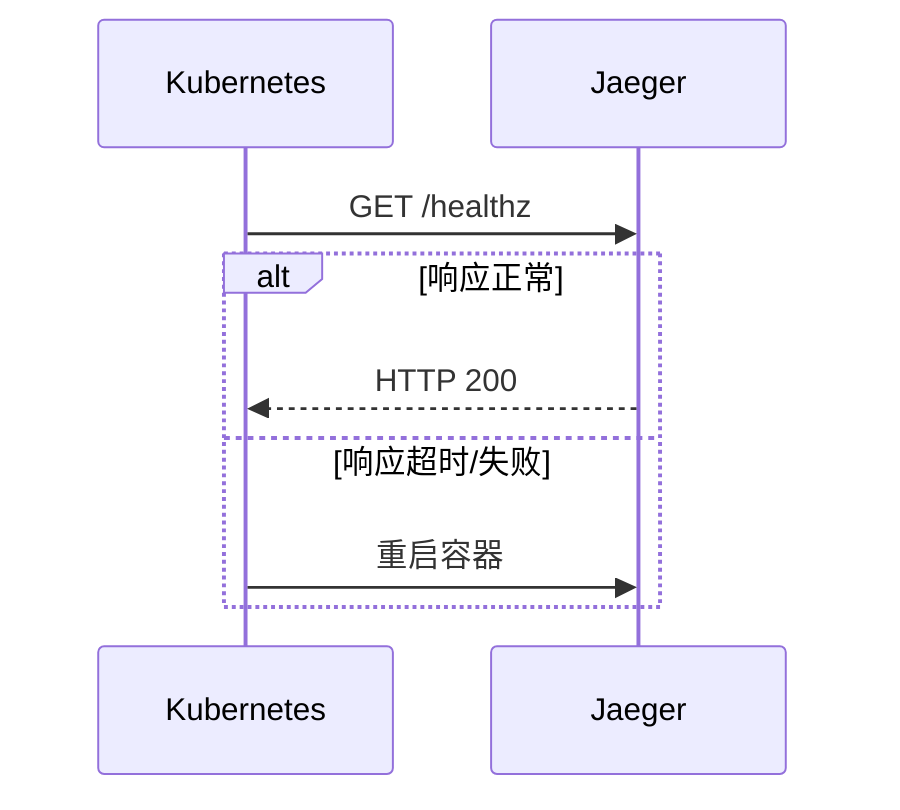

## 介绍

健康检查指标是监控分布式系统的重要组成部分，它们帮助开发者快速判断服务是否正常运行。在 Jaeger（一个开源的分布式追踪系统）中，健康检查指标用于验证各个组件（如 Collector、Query、Agent）的状态，确保它们能够正确处理请求和数据。

对于初学者来说，理解健康检查指标就像学习如何检查汽车的油压和水温——它们是系统“健康”的第一道防线。

## 为什么需要健康检查指标？

在微服务架构中，服务可能因为网络问题、资源耗尽或代码缺陷而不可用。健康检查指标通过定期探测服务的关键功能（如数据库连接、内存使用率），提供以下价值：
- **快速故障检测**：在用户受影响前发现问题
- **自动化恢复**：配合编排工具（如 Kubernetes）实现自动重启
- **运维可见性**：通过仪表盘集中展示系统状态

## Jaeger 的健康检查端点

Jaeger 组件默认提供 HTTP 健康检查端点（通常为 `/healthz`），返回简单的 JSON 响应。例如查询 Jaeger-Query 的健康状态：

```bash
curl http://localhost:16687/healthz
```

响应示例：
```json
{
  "status": "UP",
  "components": {
    "db": {
      "status": "UP",
      "details": {
        "backend": "memory"
      }
    }
  }
}
```

关键字段说明：
- `status: "UP"` 表示服务健康
- `components` 显示子组件状态（如数据库连接）

## 核心健康检查指标

Jaeger 的健康检查通常关注以下指标类型：

### 1. 存活检查（Liveness）
检测服务是否崩溃，需要重启。例如：


### 2. 就绪检查（Readiness）
检测服务是否准备好接收流量。以下代码展示如何在 Go 中实现自定义检查：

```go
// 示例：自定义存储后端健康检查
func readinessHandler(w http.ResponseWriter, r *http.Request) {
    if storageBackend.Ping() != nil {
        w.WriteHeader(http.StatusServiceUnavailable)
        return
    }
    w.WriteHeader(http.StatusOK)
}
```

### 3. 关键依赖检查
验证数据库、消息队列等依赖项：

```json
// 健康响应示例（包含依赖项）
{
  "status": "DOWN",
  "details": {
    "redis": {
      "status": "DOWN",
      "error": "connection timeout"
    }
  }
}
```

## 实际应用案例

**场景**：电商平台发现 Jaeger 追踪数据突然缺失<br />

**排查步骤**：
1. 检查 Collector 健康状态：`curl -s collector:14269/healthz | jq .`
2. 发现响应中 `"kafka": "DOWN"`
3. 确认 Kafka 集群磁盘已满
4. 扩容后指标恢复 `"status": "UP"`

:::tip 生产环境建议
- 为健康检查设置独立端口（避免与业务流量竞争）
- 添加延迟阈值（避免服务启动时的误报）
- 监控历史数据（如 Prometheus 收集 `health_check_status`）
:::

## 总结

健康检查指标是 Jaeger 监控体系的基础设施，通过本指南你已了解：
- 健康检查的 3 种主要类型
- 如何通过 HTTP 端点获取状态
- 实际故障排查中的使用方法

## 扩展练习
1. 使用 Docker 部署 Jaeger 并测试各组件健康端点
2. 编写脚本定期检查健康状态，失败时触发告警
3. 尝试在 Kubernetes 中配置 liveness/readiness 探针

## 附加资源
- [Jaeger 官方文档](https://www.jaegertracing.io/docs/)
- [Kubernetes 健康检查模式](https://kubernetes.io/docs/tasks/configure-pod-container/configure-liveness-readiness-startup-probes/)