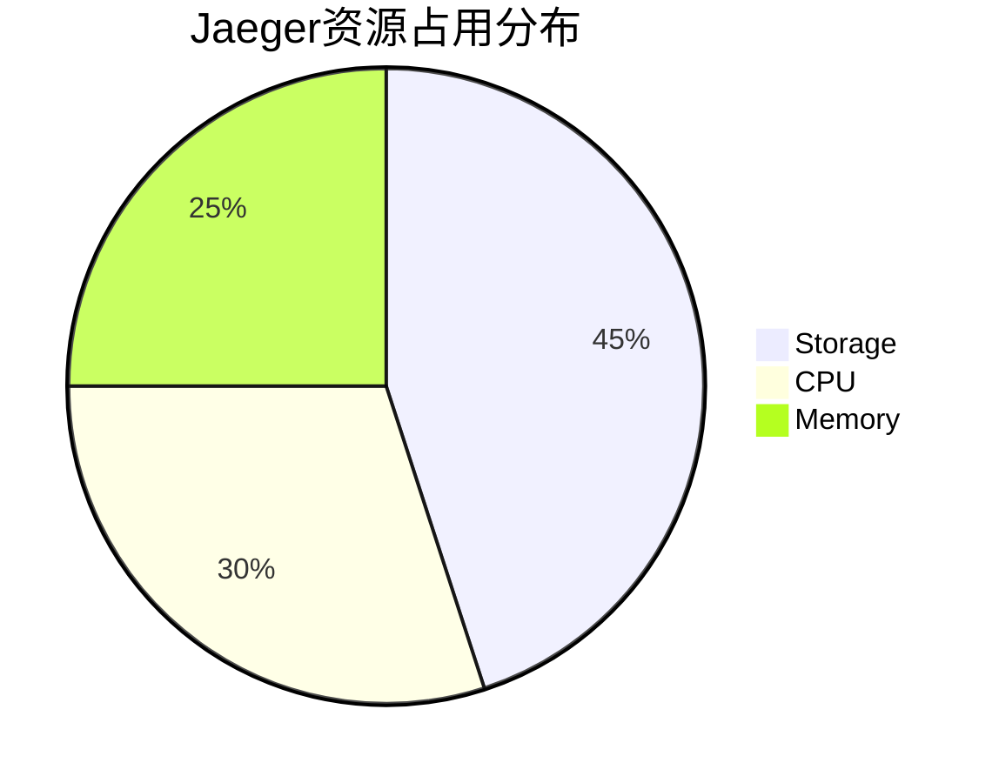

## 什么是容量监控？

容量监控是分布式追踪系统中确保资源高效利用的关键实践。在Jaeger中，它涉及监控存储空间、计算资源（如CPU/内存）以及吞吐量（如每秒追踪数），以防止系统因数据激增或配置不当而崩溃。

:::tip 为什么重要？
- 避免因存储耗尽导致追踪数据丢失。
- 优化资源分配，降低成本。
- 提前预警性能瓶颈。
:::

## 核心监控指标

Jaeger的容量监控主要关注以下指标：

1. **存储使用量**：追踪数据占用的磁盘/内存空间。
2. **吞吐量**：每秒处理的追踪数据量（Spans/second）。
3. **资源利用率**：Collector和Query服务的CPU/内存消耗。

### 示例：通过Prometheus查询存储用量

```promql
# Jaeger Collector的接收Spans速率
rate(jaeger_collector_spans_received_total[5m])

# Jaeger 存储后端（如Cassandra）的磁盘使用量
cassandra_storage_used_bytes
```

## 实战：配置告警规则

以下是一个Prometheus告警规则示例，当存储使用超过80%时触发警报：

```yaml
groups:
- name: jaeger-capacity
  rules:
  - alert: JaegerStorageCritical
    expr: cassandra_storage_used_bytes / cassandra_storage_total_bytes > 0.8
    for: 30m
    labels:
      severity: critical
    annotations:
      summary: "Jaeger storage usage exceeds 80%"
```

## 容量规划案例

假设你的应用每天生成 `1TB` 追踪数据，Jaeger配置如下：
- 采样率：10%（实际存储 `100GB/天`）
- 保留周期：7天
- 压缩率：50%（Cassandra/S3等）

**总存储需求**：
```
100GB/day * 7 days * 0.5 = 350GB
```

:::caution 注意
实际需求需考虑副本因子（如Cassandra默认3副本）：
`350GB * 3 = 1.05TB`
:::

## 可视化监控面板

使用Grafana绘制关键指标（示例Mermaid图表）：



## 总结与练习

**关键点**：
- 定期监控存储、吞吐量和资源指标。
- 根据业务增长调整采样率和保留策略。
- 为关键指标设置告警。

**练习**：
1. 部署Prometheus并导入Jaeger的监控指标。
2. 编写一个告警规则，当Span接收速率超过10k/s时通知团队。
3. 计算你的Jaeger实例在30天保留期下的存储需求。

**扩展阅读**：
- [Jaeger官方文档：生产建议](https://jaegertracing.io/docs/latest/deployment/)
- 《分布式系统观测：理论与实践》