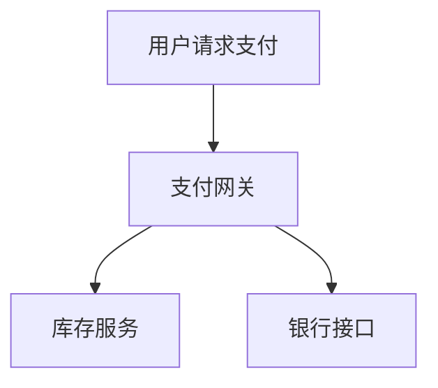

# 错误率监控

## 介绍

在分布式系统中，错误率（Error Rate）是衡量系统健康状态的关键指标之一。它表示在特定时间范围内失败的请求占总请求的比例。通过监控错误率，开发者可以快速发现并修复问题，从而提升系统的可靠性和用户体验。Jaeger作为一款流行的分布式追踪工具，提供了强大的错误率监控能力，帮助开发者分析请求链路中的异常情况。

## 什么是错误率？

错误率通常以百分比形式表示，计算公式如下：

```
错误率 = (失败的请求数 / 总请求数) × 100%
```

例如，如果一个服务在1分钟内处理了1000个请求，其中20个失败，那么错误率为：

```
(20 / 1000) × 100% = 2%
```

:::tip
错误率不仅包括HTTP 5xx错误，还可能包含业务逻辑错误（如HTTP 4xx）或超时等异常情况，具体定义取决于系统需求。
:::

## 在Jaeger中监控错误率

Jaeger通过追踪数据（Traces）和跨度（Spans）收集错误信息。以下是一个典型的Span标记错误的示例（使用OpenTelemetry SDK）：

```go
import (
    "go.opentelemetry.io/otel/trace"
)

func processRequest(ctx context.Context) {
    span := trace.SpanFromContext(ctx)
    defer span.End()

    if err := doSomething(); err != nil {
        // 标记Span为错误状态
        span.SetStatus(codes.Error, "operation failed")
        span.RecordError(err) // 记录具体错误
    }
}
```

当这样的Span被Jaeger收集后，可以通过以下方式查询错误率：

1. 在Jaeger UI中筛选`error=true`的Span
2. 使用Prometheus等监控工具聚合错误率指标

## 错误率的实际应用场景

### 案例：电商网站支付服务

假设一个电商网站的支付服务突然出现错误率上升：



通过Jaeger追踪发现：
- 错误集中在`银行接口`调用超时（60%错误）
- 其余错误来自`库存服务`的并发冲突（40%错误）

解决方案：
1. 对银行接口增加重试机制
2. 优化库存服务的锁策略

## 错误率告警设置

合理的告警阈值可以帮助团队快速响应问题。例如：

```yaml
# Prometheus告警规则示例
groups:
- name: error_rate
  rules:
  - alert: HighErrorRate
    expr: sum(rate(traces_errors_total{service="payment"}[5m])) by (service) / sum(rate(traces_total{service="payment"}[5m])) by (service) > 0.05
    for: 10m
    labels:
      severity: critical
    annotations:
      summary: "High error rate detected in {{ $labels.service }}"
      description: "Error rate is {{ $value }} (threshold: 0.05)"
```

:::warning
避免设置过于敏感的阈值（如`<1%`），否则可能导致告警疲劳。建议根据基线数据动态调整。
:::

## 总结

错误率监控是分布式系统可观测性的重要组成部分。通过Jaeger：
- 可以直观地追踪错误来源
- 结合其他指标（如延迟、吞吐量）进行综合分析
- 建立有效的告警机制

## 延伸学习

1. 练习：在本地Jaeger实例中模拟错误请求，观察错误率变化
2. 进阶阅读：
   - [Distributed Tracing in Practice](https://opentracing.io/docs/overview/)
   - [SRE错误预算概念](https://sre.google/workbook/implementing-slos/)
3. 工具推荐：
   - 使用Grafana可视化Jaeger错误率
   - 尝试OpenTelemetry的自动错误统计功能