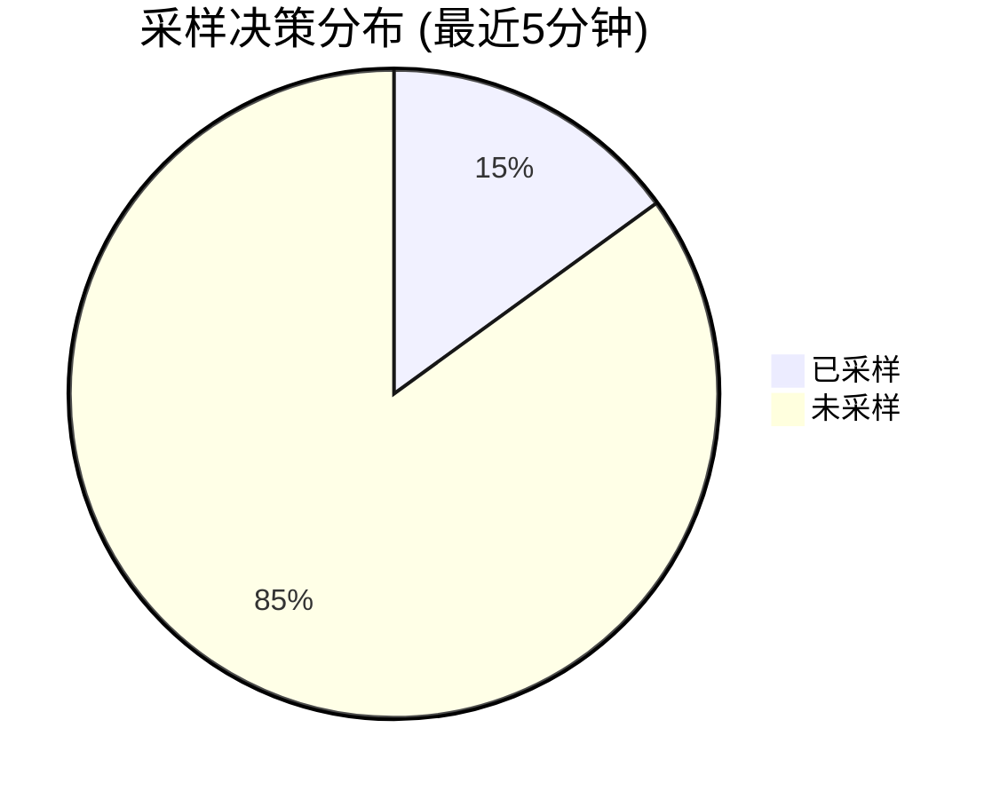

# 采样率监控

## 介绍

在分布式追踪系统中，**采样率（Sampling Rate）**决定了哪些请求的追踪数据会被收集和分析。过高的采样率可能导致存储和性能开销，而过低的采样率可能遗漏关键问题。通过Jaeger监控采样率，可以优化这一平衡。

采样率监控的核心目标：
- 确保采样策略符合预期（如固定采样率或动态采样）。
- 识别采样率异常（如因配置错误导致的0采样）。
- 验证追踪数据的代表性（如错误请求是否被足够采样）。

---

## 采样率基础

### 采样类型
Jaeger支持以下常见采样策略：
1. **固定采样（Probabilistic）**：按固定概率采样（如 `0.1` 表示10%的请求被追踪）。
2. **速率限制（Rate Limiting）**：每秒最多采样N条追踪。
3. **动态采样（Adaptive）**：根据业务规则动态调整（如对错误请求提高采样率）。

### 关键指标
监控采样率时需关注：
- `jaeger_sampler_sampling_decision_total`：总采样决策数（`sampled` 和 `not_sampled` 标签）。
- `jaeger_sampler_rate`：当前配置的采样率。

---

## 代码示例

### 配置固定采样率
以下是通过Jaeger客户端（以Go为例）设置固定采样率的代码：

```go
package main

import (
	"github.com/uber/jaeger-client-go"
	"github.com/uber/jaeger-client-go/config"
)

func main() {
	cfg := config.Configuration{
		Sampler: &config.SamplerConfig{
			Type:  jaeger.SamplerTypeProbabilistic,
			Param: 0.1, // 10%采样率
		},
	}
	// 初始化Tracer...
}
```

**输出验证**：
- 若发送100个请求，预期约10条追踪数据（可能存在统计波动）。

---

## 监控实践

### 通过Prometheus查询采样率
Jaeger暴露的指标可通过Prometheus监控。例如，查询实际采样率：

```promql
sum(rate(jaeger_sampler_sampling_decision_total{sampled="true"}[5m])) 
/ 
sum(rate(jaeger_sampler_sampling_decision_total[5m]))
```

### Mermaid可视化


---

## 实际案例

### 场景：动态调整采样率
某电商网站在大促期间因流量激增，固定采样率导致存储压力。解决方案：
1. 使用动态采样，对高价值路径（如支付）保持100%采样。
2. 对其他路径降低至1%。
3. 通过监控确认采样分布是否符合预期。

:::tip
动态采样需结合业务标签（如 `http.status_code=500`）优先捕获错误请求。
:::

---

## 总结

- 采样率监控是平衡数据质量与系统开销的关键。
- 通过Jaeger指标实时验证采样策略有效性。
- 动态采样适合流量波动或高价值场景。

### 扩展练习
1. 在本地Jaeger中配置不同采样策略，观察指标变化。
2. 尝试编写PromQL查询，对比不同服务的采样率差异。

### 附加资源
- [Jaeger官方文档：采样配置](https://jaegertracing.io/docs/latest/sampling/)
- 《分布式追踪：原理与实践》第6章