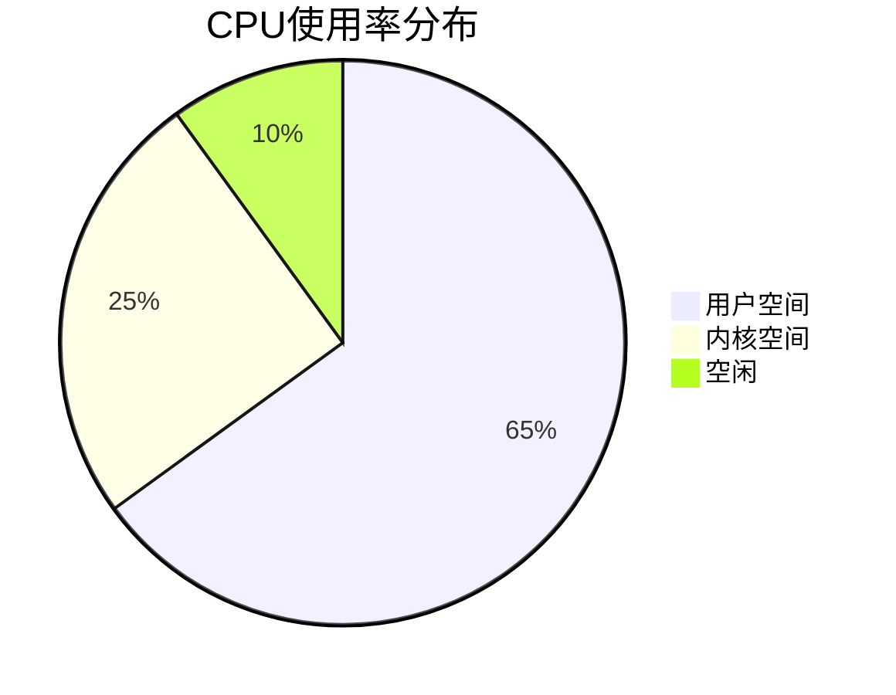

# 系统资源监控

## 介绍

系统资源监控是分布式系统可观测性的重要组成部分，它帮助我们了解应用程序运行时的资源消耗情况。通过监控CPU、内存、磁盘I/O和网络等关键指标，我们可以：

1. 识别性能瓶颈
2. 预测资源需求
3. 及时发现异常情况
4. 优化资源分配

在Jaeger的上下文中，系统资源监控可以与分布式追踪数据关联，提供更全面的系统健康状况视图。

## 关键监控指标

### 1. CPU使用率

CPU使用率是最基础的系统指标之一，表示处理器处理任务的繁忙程度。



#### 监控示例

```go
package main

import (
    "github.com/shirou/gopsutil/cpu"
    "time"
)

func main() {
    // 获取CPU使用率
    percent, _ := cpu.Percent(time.Second, false)
    println("CPU使用率:", percent[0], "%")
}
```

**输出示例**:
```
CPU使用率: 23.5 %
```

### 2. 内存使用情况

内存监控包括已用内存、可用内存、交换空间使用情况等。

:::tip 内存类型
- **物理内存**: 实际安装在机器上的RAM
- **虚拟内存**: 物理内存+交换空间(swap)
:::

### 3. 磁盘I/O

磁盘监控关注读写速度、IOPS(每秒输入输出操作数)和磁盘空间使用情况。

```bash
# Linux下查看磁盘使用情况示例
df -h
```

### 4. 网络流量

网络监控包括带宽使用、连接数、数据包错误率等。

## Jaeger 中的资源监控集成

Jaeger本身不直接收集系统指标，但可以与Prometheus等监控系统集成：

1. **配置Prometheus收集系统指标**
2. **在Jaeger UI中展示相关指标**
3. **关联追踪数据与资源使用情况**

### 示例配置

```yaml
# prometheus.yml 示例配置
scrape_configs:
  - job_name: 'node'
    static_configs:
      - targets: ['localhost:9100']  # node-exporter地址
```

## 实际应用案例

**场景**: 电商网站大促期间性能问题排查

1. 发现订单处理延迟增加
2. 通过Jaeger追踪发现某些服务响应变慢
3. 查看对应时间段的系统资源监控
4. 发现某节点内存使用率持续高于90%
5. 结论: 内存不足导致频繁GC，影响性能
6. 解决方案: 垂直扩展(增加内存)或优化内存使用

## 总结

系统资源监控是:

- 性能优化的基础
- 容量规划的依据
- 故障排查的重要线索

将资源监控与分布式追踪结合，可以提供更全面的系统视图，帮助我们更好地理解和优化分布式系统。

## 延伸学习

1. **实践练习**:
   - 在本地环境中部署node-exporter
   - 配置Prometheus收集指标
   - 在Grafana中创建资源监控仪表盘

2. **推荐工具**:
   - Prometheus + Grafana (监控与可视化)
   - node-exporter (系统指标收集)
   - cAdvisor (容器监控)

3. **进阶主题**:
   - 自动化告警配置
   - 基于机器学习的异常检测
   - 容量预测与自动扩展