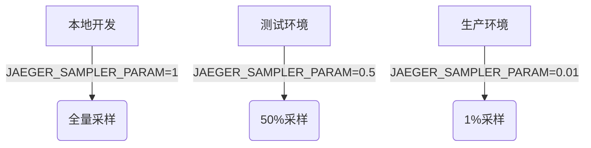

# Jaeger 高级环境变量配置

## 介绍

环境变量是配置Jaeger分布式追踪系统的重要方式之一。对于初学者而言，理解这些变量能帮助您在不修改代码的情况下灵活调整Jaeger的行为。本文将介绍最常用的高级环境变量及其实际应用。

:::tip 为什么使用环境变量？
- 无需重新编译代码即可改变配置
- 便于在不同环境（开发/生产）间切换
- 符合12要素应用原则
:::

## 核心环境变量分类

### 1. 采样率配置

控制Jaeger收集追踪数据的频率：

```bash
JAEGER_SAMPLER_TYPE=const
JAEGER_SAMPLER_PARAM=1  # 1=收集全部，0=不收集
```

实际应用场景：
```bash
# 开发环境 - 收集全部数据
export JAEGER_SAMPLER_TYPE=const
export JAEGER_SAMPLER_PARAM=1

# 生产环境 - 仅收集10%的数据
export JAEGER_SAMPLER_TYPE=probabilistic
export JAEGER_SAMPLER_PARAM=0.1
```

### 2. 上报配置

控制如何发送追踪数据到收集器：

```bash
JAEGER_AGENT_HOST=localhost
JAEGER_AGENT_PORT=6831
JAEGER_ENDPOINT=http://jaeger-collector:14268/api/traces
```

:::caution 注意
同时设置`JAEGER_AGENT_*`和`JAEGER_ENDPOINT`时，后者优先级更高
:::

### 3. 标签配置

为所有span添加全局标签：

```bash
JAEGER_TAGS=environment=prod,cluster=west-1
```

## 高级配置示例

### 多环境配置方案



### 实战案例：Kubernetes部署

在Kubernetes deployment中配置：

```yaml
env:
- name: JAEGER_SERVICE_NAME
  value: "order-service"
- name: JAEGER_AGENT_HOST
  value: "jaeger-agent.default.svc"
- name: JAEGER_SAMPLER_TYPE
  value: "probabilistic"
- name: JAEGER_SAMPLER_PARAM
  value: "0.05"
```

## 调试技巧

检查当前生效的配置：

```bash
# 查看Jaeger客户端初始化日志
export JAEGER_DEBUG=true

# 示例输出
# DEBUG: Initialized Jaeger Tracer with config: {...}
```

## 总结

通过环境变量配置Jaeger提供了极大的灵活性：

- 采样率控制帮助平衡系统开销和可观测性
- 上报配置适应不同网络环境
- 全局标签增强追踪数据的可读性

## 扩展练习

1. 尝试在本地设置只收集错误请求的采样策略
2. 为你的服务添加`version`和`region`标签
3. 比较直接上报收集器和使用agent的差异

## 附加资源

- [Jaeger官方配置文档](https://www.jaegertracing.io/docs/latest/client-features/)
- [环境变量最佳实践](https://12factor.net/config)