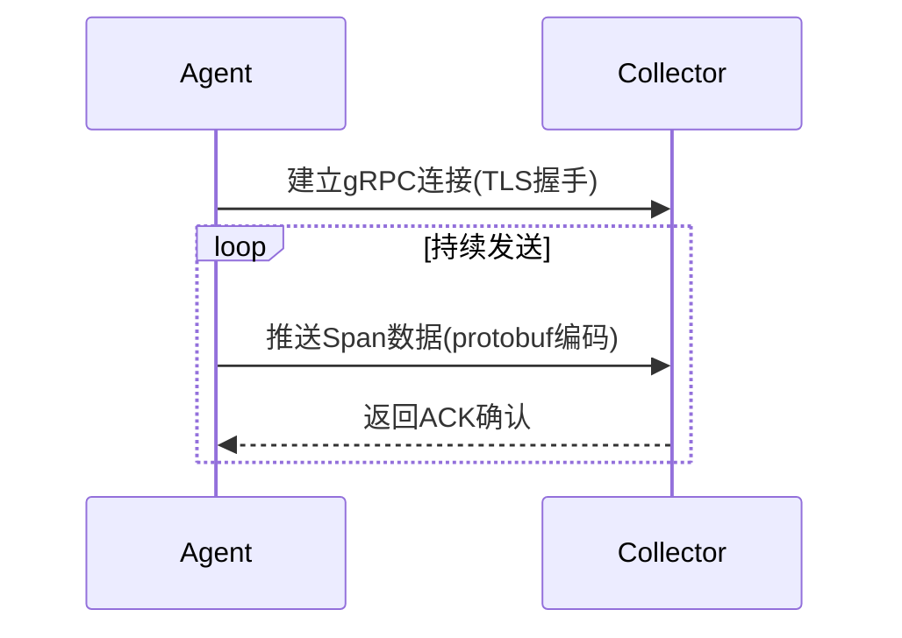

# gRPC配置

## 介绍

gRPC是Jaeger中用于组件间通信的高性能协议，采用HTTP/2作为传输层，支持双向流和协议缓冲。在分布式追踪场景中，gRPC能显著提升Collector与Agent之间的数据传输效率。本文将从零开始讲解如何在Jaeger中配置gRPC协议。

:::note 为什么选择gRPC？
- 比传统REST更低的延迟
- 自动生成客户端/服务端代码
- 支持多种编程语言
- 内置流式传输能力
:::

## 基础配置

### 1. 启用gRPC通信

在Jaeger的配置文件（通常为`jaeger-config.yaml`）中添加以下基础配置：

```yaml
collector:
  grpc:
    host-port: ":14250"
    max-connection-age: 30m
    max-connection-age-grace: 5m
```

### 2. 关键参数说明

| 参数 | 默认值 | 说明 |
|------|--------|------|
| `host-port` | `:14250` | 监听地址和端口 |
| `max-message-size` | `4MB` | 单次消息最大尺寸 |
| `max-connection-age` | `无限` | 连接最大存活时间 |
| `tls.enabled` | `false` | 是否启用TLS加密 |

## 实战配置示例

### 案例1：基础安全配置

```yaml
agent:
  grpc:
    host-port: "jaeger-collector:14250"
    tls:
      enabled: true
      cert: "/path/to/cert.pem"
      key: "/path/to/key.pem"
```

### 案例2：性能调优配置

```yaml
collector:
  grpc:
    max-recursion-depth: 10
    max-workers: 100
    queue-size: 2000
```

:::tip 生产环境建议
- 始终启用TLS加密
- 根据业务流量调整`queue-size`
- 监控`grpc.server.handled`指标
:::

## 通信流程解析



## 常见问题排查

### 连接失败检查步骤

1. 验证端口可达性：
   ```bash
   telnet jaeger-collector 14250
   ```

2. 检查TLS证书有效性：
   ```bash
   openssl s_client -connect jaeger-collector:14250 -showcerts
   ```

3. 查看Jaeger日志：
   ```bash
   journalctl -u jaeger-collector -f
   ```

## 总结与进阶

### 关键要点
- gRPC是Jaeger组件间通信的高效协议
- 合理配置连接参数可提升系统稳定性
- TLS加密是生产环境必备选项

### 扩展练习
1. 尝试在本地部署启用gRPC的Jaeger集群
2. 使用Wireshark抓包分析gRPC通信过程
3. 编写自定义gRPC中间件实现流量控制

### 附加资源
- [Jaeger官方gRPC配置文档](https://jaegertracing.io/docs/latest/deployment/#gRPC-configuration)
- [gRPC官方性能调优指南](https://grpc.io/docs/guides/performance/)