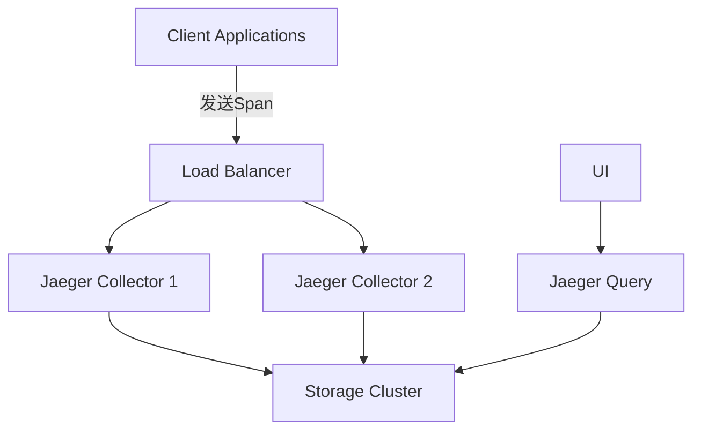

# 高可用性配置

## 介绍

高可用性（High Availability, HA）是分布式系统的核心特性之一，它确保服务在部分组件故障时仍能持续运行。对于Jaeger这样的分布式追踪系统，高可用性配置尤为重要，因为其数据通常用于诊断生产环境中的关键问题。

本文将介绍如何为Jaeger配置高可用性，包括架构设计、存储后端选择和实际配置示例。

## Jaeger 高可用性架构

Jaeger的高可用性主要通过以下方式实现：

1. **组件冗余**：关键组件（如Collector）多实例部署
2. **存储冗余**：使用支持集群模式的存储后端
3. **负载均衡**：在组件间实现请求分发

典型的Jaeger高可用架构如下：



## 存储后端配置

Jaeger支持多种存储后端，以下是适合高可用性的选择：

### 1. Elasticsearch集群

```yaml
# jaeger-collector配置示例
storage:
  elasticsearch:
    servers: ["http://es-node1:9200", "http://es-node2:9200", "http://es-node3:9200"]
    sniffer: false
    max-span-age: 72h
```

### 2. Cassandra集群

```yaml
# jaeger-collector配置示例
storage:
  cassandra:
    servers: ["cassandra1", "cassandra2", "cassandra3"]
    keyspace: jaeger_v1
    replication-factor: 3
```

:::note
生产环境中建议`replication-factor`至少为3，以确保数据冗余。
:::

## Collector高可用配置

Collector是Jaeger的关键组件，处理来自客户端的追踪数据。实现高可用的步骤：

1. 部署多个Collector实例
2. 配置负载均衡器（如Nginx）分发请求

```nginx
# Nginx配置示例
upstream jaeger_collectors {
    server collector1:14268;
    server collector2:14268;
    server collector3:14268;
}

server {
    listen 14268;
    location / {
        proxy_pass http://jaeger_collectors;
    }
}
```

## Query服务高可用

Query服务也需要多实例部署：

```yaml
# jaeger-query配置示例
query:
  base-path: /jaeger
  static-files: /opt/jaeger-ui/
  port: 16686
  metrics:
    backend: prometheus
    http-route: /metrics
```

:::tip
使用Kubernetes时，可以通过Deployment和Service轻松实现Query服务的多实例部署和负载均衡。
:::

## 实际案例：电商平台配置

某电商平台使用以下配置实现Jaeger高可用：

1. **3个Collector实例**：处理日均10亿span
2. **Elasticsearch集群**：5节点，每个索引3个副本
3. **Nginx负载均衡**：轮询分发请求

```yaml
# 生产环境配置示例
collector:
  num-workers: 50
  queue-size: 2000
  tags:
    environment: production
  metrics:
    backend: prometheus
```

## 监控与告警

高可用系统需要完善的监控：

1. Collector/Query的CPU/内存使用率
2. 存储后端健康状态
3. 请求延迟和错误率

```bash
# Prometheus查询示例
rate(jaeger_collector_spans_received_total[1m]) > 10000
```

## 总结

实现Jaeger高可用性的关键点：

- 多实例部署关键组件
- 选择支持集群模式的存储后端
- 合理配置负载均衡
- 设置完善的监控

## 附加资源

1. [Jaeger官方文档 - 生产建议](https://www.jaegertracing.io/docs/latest/deployment/)
2. [Elasticsearch集群配置指南](https://www.elastic.co/guide/en/elasticsearch/reference/current/high-availability.html)
3. [Cassandra生产配置](https://cassandra.apache.org/doc/latest/cassandra/operating/hardware.html)

## 练习

1. 使用Docker Compose部署一个包含2个Collector和3节点Elasticsearch的Jaeger环境
2. 模拟一个Collector节点故障，观察系统行为
3. 配置Prometheus监控Jaeger组件的关键指标