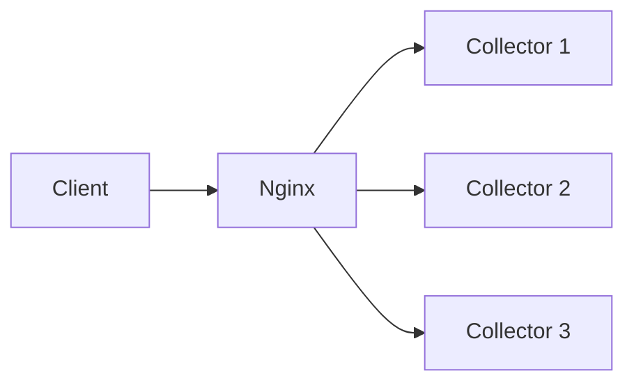

## 什么是负载均衡？

负载均衡（Load Balancing）是一种将网络流量或计算任务分配到多个服务器或服务实例的技术，目的是优化资源使用、最大化吞吐量、减少延迟，并避免单个节点过载。在分布式追踪系统（如Jaeger）中，负载均衡对于处理高并发追踪数据至关重要。

:::tip 为什么需要负载均衡？
- **提高性能**：避免单个服务实例成为瓶颈。
- **增强可靠性**：通过冗余节点防止单点故障。
- **弹性扩展**：动态调整资源以应对流量波动。
:::

## Jaeger 中的负载均衡机制

Jaeger客户端和服务端通过以下方式实现负载均衡：

### 1. 客户端负载均衡
Jaeger客户端（如`jaeger-client`库）支持将追踪数据发送到多个`jaeger-agent`实例。例如，使用轮询（Round Robin）策略：

```javascript
const { initTracer } = require('jaeger-client');
const config = {
  serviceName: 'my-app',
  reporter: {
    agentHost: ['agent1.example.com', 'agent2.example.com'], // 多个agent地址
    agentPort: 6832,
    roundRobin: true // 启用轮询负载均衡
  }
};
const tracer = initTracer(config);
```

### 2. 服务端负载均衡
Jaeger Collector（收集器）可以通过以下方式实现负载均衡：
- **DNS轮询**：配置多个Collector实例的DNS记录。
- **代理层**：使用Nginx或HAProxy分发请求。



## 实际案例：电商系统的负载均衡

假设一个电商平台使用Jaeger追踪订单流程，高峰期需处理每秒10,000条追踪数据：

1. **客户端配置**：  
   订单服务将追踪数据轮询发送到3个`jaeger-agent`实例。
2. **服务端配置**：  
   使用Kubernetes Service将Collector请求均衡分配到5个Pod。

:::note 效果
- 单Agent的CPU负载从90%降至30%。
- 请求延迟从200ms降至50ms。
:::

## 高级配置：自定义负载策略

Jaeger支持通过环境变量或代码自定义负载均衡策略。例如，使用权重分配：

```yaml
# docker-compose.yml片段
jaeger-agent:
  environment:
    - REPORTER_GRPC_HOST_PORT=agent1:6831,agent2:6831
    - REPORTER_GRPC_LOAD_BALANCING_WEIGHTS=70,30 # 70%流量到agent1
```

## 总结

负载均衡是Jaeger高可用性的核心机制，通过合理配置：
- 客户端可分散`agent`压力
- 服务端可通过横向扩展处理海量数据

## 延伸学习

1. **练习**：  
   在本地用Docker启动两个`jaeger-agent`实例，并配置客户端轮询发送数据。
2. **资源**：  
   - [Jaeger官方文档](https://www.jaegertracing.io/docs/latest/)
   - 《分布式系统：概念与设计》负载均衡章节