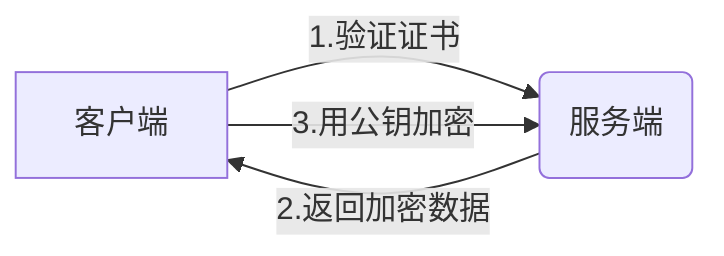
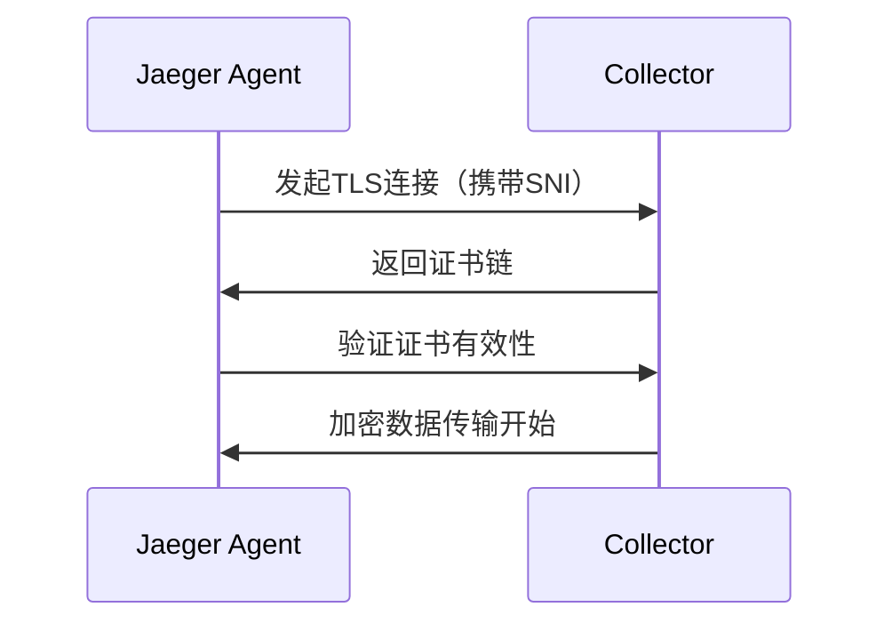

# TLS安全配置

## 简介

TLS（Transport Layer Security）是保障网络通信安全的核心协议。在Jaeger中配置TLS可以加密组件间通信（如Agent ↔ Collector），防止敏感追踪数据被窃取或篡改。本文将逐步指导初学者完成完整配置。

:::note 为什么需要TLS？
- 防止**中间人攻击**（如数据窃听）
- 验证服务身份（避免伪装服务器）
- 满足企业安全合规要求
:::

## 基础概念

### 核心术语
- **证书（Certificate）**：包含公钥和身份信息的数字文件
- **私钥（Private Key）**：必须保密的加密密钥
- **CA（Certificate Authority）**：签发证书的可信机构



## 配置步骤

### 1. 准备证书文件
假设已有CA证书和签名过的服务证书：

```bash
# 文件结构示例
├── ca-cert.pem       # CA根证书
├── jaeger-key.pem    # 服务端私钥
└── jaeger-cert.pem   # 服务端证书
```

### 2. Jaeger Collector配置

修改`collector`的启动参数（以Docker为例）：

```yaml
# docker-compose.yml片段
services:
  jaeger-collector:
    command:
      - --collector.grpc.tls.enabled=true
      - --collector.grpc.tls.cert=/etc/certs/jaeger-cert.pem
      - --collector.grpc.tls.key=/etc/certs/jaeger-key.pem
      - --collector.grpc.tls.client-ca=/etc/certs/ca-cert.pem
    volumes:
      - ./certs:/etc/certs
```

:::caution 注意
- 生产环境应使用**卷挂载**而非直接包含密钥文件
- 文件权限需设置为`600`（仅所有者可读写）
:::

### 3. Jaeger Agent配置

对应修改Agent配置以建立安全连接：

```bash
# 环境变量方式配置
JAEGER_AGENT_GRPC_SERVER_HOST=collector.example.com
JAEGER_AGENT_GRPC_TLS_ENABLED=true
JAEGER_AGENT_GRPC_TLS_CA=/etc/certs/ca-cert.pem
```

## 验证配置

使用`openssl`测试TLS握手：

```bash
openssl s_client -connect collector.example.com:14250 \
  -CAfile ca-cert.pem -showcerts
```

成功时会显示：

```
Verify return code: 0 (ok)
```

## 实际案例：微服务环境

假设有一个Kubernetes集群，通过Cert-Manager自动管理证书：



对应Helm values配置：

```yaml
# values.yaml片段
collector:
  tls:
    enabled: true
    auto:
      enabled: true  # 自动生成证书
agent:
  tls:
    enabled: true
    ca: "/var/run/secrets/kubernetes.io/serviceaccount/ca.crt"
```

## 常见问题

:::warning 证书过期
- 监控证书有效期（推荐使用`openssl x509 -enddate -noout -in cert.pem`）
- 设置自动续期（如Let's Encrypt的90天周期）
:::

## 总结

通过本文你学会了：
- TLS在Jaeger中的核心作用
- 手动配置证书的完整流程
- 自动化证书管理方案
- 验证连接安全性的方法

**延伸学习**：
1. [OpenSSL官方文档](https://www.openssl.org/docs/)
2. Jaeger官方文档中的[TLS配置章节](https://jaegertracing.io/docs/latest/deployment/#tls-support)
3. 练习：尝试用`mkcert`工具生成本地测试证书

```bash
# 练习示例
mkcert -install
mkcert jaeger.local 127.0.0.1 ::1