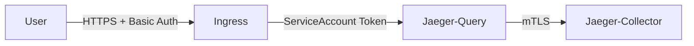

# 认证与授权

## 介绍

在分布式系统中，**认证（Authentication）**和**授权（Authorization）**是保障安全性的两大核心机制。  
- **认证**：验证用户或服务的身份（如用户名/密码、API密钥）。  
- **授权**：确定已认证的用户或服务是否有权限执行特定操作（如访问某个追踪数据）。  

Jaeger默认不启用认证与授权，但在生产环境中必须配置这些功能以防止未授权访问。本文将介绍如何通过Jaeger的组件（如Collector和Query）实现基础认证与授权。

---

## 1. 基础认证配置

Jaeger支持通过以下方式实现认证：  
- **HTTP基本认证**（Basic Auth）  
- **Bearer Token**（如JWT）  
- **TLS客户端证书**  

### 示例：启用HTTP基本认证
在Jaeger Collector或Query服务的启动配置中添加环境变量：  

```yaml
# docker-compose.yml 示例
services:
  jaeger-query:
    environment:
      - BASIC_AUTH_USERNAME=admin
      - BASIC_AUTH_PASSWORD=securepassword
```

验证配置：  
访问Jaeger UI时，浏览器会弹出登录窗口，输入上述用户名和密码即可。

:::note  
生产环境中请使用`htpasswd`生成密码哈希，避免明文存储。  
:::

---

## 2. 基于角色的授权

Jaeger可以与外部授权系统（如Open Policy Agent或自定义中间件）集成，实现细粒度权限控制。  

### 示例：通过Open Policy Agent（OPA）授权
1. 定义OPA策略（`policy.rego`）：  
```rego
package jaeger.authz

default allow = false

allow {
    input.method == "GET"
    input.path = ["api", "traces"]
    input.user.roles[_] == "viewer"
}
```

2. 在Jaeger Query服务中配置OPA：  
```yaml
environment:
  - QUERY_BEARER_TOKEN_PROPAGATION=true
  - AUTHORIZATION_HTTP_URL=http://opa:8181/v1/data/jaeger/authz
```

:::tip  
角色`viewer`的用户只能查询追踪数据，不能执行删除或配置操作。  
:::

---

## 3. 实际案例：Kubernetes中的Jaeger安全配置

在Kubernetes中，可以通过Ingress和ServiceAccount实现端到端安全：  



1. **Ingress配置**：  
```yaml
# Kubernetes Ingress 示例
annotations:
  nginx.ingress.kubernetes.io/auth-type: basic
  nginx.ingress.kubernetes.io/auth-secret: jaeger-basic-auth
```

2. **ServiceAccount授权**：  
```yaml
apiVersion: rbac.authorization.k8s.io/v1
kind: Role
rules:
- apiGroups: [""]
  resources: ["traces"]
  verbs: ["get", "list"]
```

---

## 4. 常见问题与调试

- **问题1**：认证失败导致`401 Unauthorized`  
  **解决**：检查环境变量（如`BASIC_AUTH_USERNAME`）是否传递到容器。  

- **问题2**：授权策略未生效  
  **解决**：通过OPA的`/v1/data`接口验证策略是否加载：  
  ```bash
  curl http://opa:8181/v1/data/jaeger/authz -d '{"input": {"user": {"roles": ["viewer"]}}}'
  ```

---

## 总结

| 机制          | 适用场景                  | 工具示例               |
|---------------|--------------------------|-----------------------|
| HTTP基本认证  | 内部团队简单访问控制      | Nginx, Docker         |
| JWT/OAuth2    | 多租户或第三方集成        | Keycloak, Auth0       |
| mTLS          | 服务间通信                | Istio, Linkerd        |

**附加资源**：  
- [Jaeger官方文档 - 安全模型](https://jaegertracing.io/docs/latest/security/)  
- Open Policy Agent [官方示例](https://www.openpolicyagent.org/docs/latest/jaeger-authorization/)  

**练习**：  
1. 在本地Docker中部署带Basic Auth的Jaeger Query服务。  
2. 通过`curl -u admin:securepassword http://localhost:16686`测试访问。