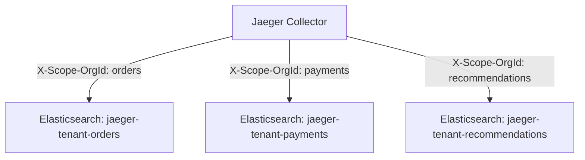

# 多租户配置

## 介绍

多租户（Multi-tenancy）是分布式追踪系统中的一个重要概念，它允许同一个Jaeger实例为多个独立的团队或项目（称为"租户"）提供服务，同时保持各自数据的隔离性。对于初学者来说，可以将其想象为一栋公寓大楼：每个租户拥有自己的独立空间，共享相同的基础设施（如水电），但彼此的数据和资源互不干扰。

在Jaeger中实现多租户通常需要以下组件协同工作：
1. 租户标识（如HTTP请求头）
2. 存储后端支持（如Elasticsearch索引或Cassandra键空间）
3. 查询服务的路由逻辑

:::tip 何时需要多租户？
- 多个团队共享同一个Jaeger实例
- 需要满足不同部门的数据隔离需求
- 实现基于项目的访问控制
:::

## 基础配置

### 1. 基于HTTP头的租户识别

Jaeger可以通过检查传入请求的HTTP头来确定租户。最常见的做法是使用 `X-Scope-OrgId` 头：

```yaml
# jaeger-collector 配置示例
query:
  multi-tenancy:
    enabled: true
    header: "X-Scope-OrgId"
```

### 2. 存储后端配置

不同的存储后端需要不同的多租户配置方式：

#### Elasticsearch 方案

```yaml
storage:
  type: elasticsearch
  elasticsearch:
    index-prefix: "jaeger-tenant-"
    multi-tenancy:
      enabled: true
```

这会为每个租户创建独立的索引，例如：
- `jaeger-tenant-teamA-*`
- `jaeger-tenant-teamB-*`

#### Cassandra 方案

```yaml
storage:
  type: cassandra
  cassandra:
    keyspace: "jaeger_tenant_{tenant}"
```

## 实际案例

### 场景：电商平台的多团队追踪

假设一个电商平台有三个团队：
1. 订单服务团队
2. 支付服务团队
3. 推荐系统团队



每个团队在发送追踪数据时，需要在请求头中添加自己的租户标识：

```go
// Go语言示例
func createTraces() {
    req, _ := http.NewRequest("POST", jaegerCollectorURL, bytes.NewBuffer(traceData))
    req.Header.Set("X-Scope-OrgId", "payments") // 支付团队标识
    client := &http.Client{}
    resp, _ := client.Do(req)
    // 处理响应...
}
```

## 高级配置

### 租户特定的采样策略

可以为不同租户配置不同的采样率：

```yaml
sampling:
  strategies:
    - service: "payment-service"
      type: probabilistic
      param: 0.1
      tenant: "payments"
    - service: "order-service"
      type: probabilistic
      param: 0.5
      tenant: "orders"
```

### 跨租户查询（管理员功能）

:::caution 注意
跨租户查询需要特殊权限，通常只应授予管理员
:::

```yaml
query:
  multi-tenancy:
    admin-access:
      enabled: true
      header: "X-Admin-Access"
```

## 总结

多租户配置是Jaeger在企业环境中部署的关键功能，它能够：
- 实现数据隔离与安全
- 优化资源利用率
- 简化多团队协作管理

## 扩展学习

1. 实践练习：
   - 在本地Jaeger实例中配置两个租户
   - 使用不同租户标识发送追踪数据
   - 验证数据是否被正确隔离

2. 进一步阅读：
   - Jaeger官方文档中的多租户章节
   - OpenTelemetry中的租户标识最佳实践
   - 分布式追踪系统的访问控制模型

3. 常见问题排查：
   - 确保所有组件（collector/query/agent）使用相同的租户配置
   - 验证存储后端是否支持所需的隔离级别
   - 检查HTTP头是否被中间件意外移除