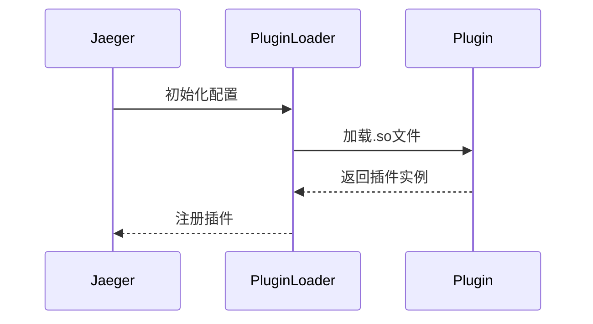

# Jaeger 插件系统

## 介绍

Jaeger的插件系统允许开发者通过模块化方式扩展其核心功能。插件可以用于添加新的存储后端、自定义采样策略或集成第三方服务。本指南将带你了解插件系统的基本原理、配置方法和实际应用场景。

## 插件系统基础

Jaeger的插件机制基于Go语言的插件架构（`plugin`包），支持动态加载预编译的.so文件。主要组件包括：

1. **插件接口**：定义标准化的扩展点
2. **插件实现**：具体功能实现
3. **插件加载器**：运行时动态加载机制

:::note
Jaeger v1.22+ 开始全面支持Go插件系统，要求插件必须使用**完全相同**的Go版本编译
:::

## 配置插件系统

### 1. 基本配置示例

在Jaeger Collector配置文件中添加插件配置：

```yaml
plugin:
  elasticsearch:
    server-urls: http://localhost:9200
  custom-plugin:
    enabled: true
    path: /etc/jaeger/plugins/myplugin.so
```

### 2. 插件加载流程



## 开发自定义插件

### 示例：简单存储插件

```go
package main

import (
    "github.com/jaegertracing/jaeger/plugin/storage/grpc/shared"
    "github.com/jaegertracing/jaeger/storage/spanstore"
)

type MyStoragePlugin struct {
    // 实现必要的接口
}

func (p *MyStoragePlugin) SpanReader() spanstore.Reader {
    return &MyReader{}
}

func (p *MyStoragePlugin) SpanWriter() spanstore.Writer {
    return &MyWriter{}
}

func main() {
    plugin := &MyStoragePlugin{}
    shared.ServeStoragePlugin(plugin)
}
```

编译命令：
```bash
go build -buildmode=plugin -o myplugin.so plugin.go
```

## 实际应用案例

### 案例1：集成AWS X-Ray

```yaml
plugin:
  aws-xray:
    enabled: true
    region: us-west-2
    sampling-rule-arn: arn:aws:xray:us-west-2:123456789012:sampling-rule/MyRule
```

### 案例2：自定义采样插件

```go
type MySampler struct {
    defaultSampler sampling.Sampler
}

func (s *MySampler) OnCreateSpan(span *Span) SamplingDecision {
    if span.OperationName == "special-op" {
        return {Sample: true, Retryable: false}
    }
    return s.defaultSampler.OnCreateSpan(span)
}
```

## 常见问题解决

:::caution
插件加载失败时检查：
1. Go版本是否匹配
2. 插件路径是否正确
3. 依赖库版本是否冲突
:::

## 总结

Jaeger插件系统提供了强大的扩展能力，通过本指南你学会了：
- 插件系统的基本架构
- 如何配置和加载插件
- 开发自定义插件的流程
- 实际应用场景示例

## 扩展学习

推荐练习：
1. 尝试实现一个将trace数据写入CSV文件的存储插件
2. 创建一个基于请求头值的自定义采样插件

附加资源：
- Jaeger官方插件开发文档
- Go插件系统规范
- gRPC插件接口定义