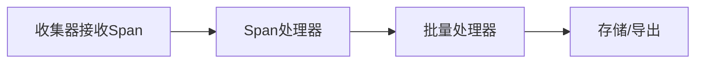

# 自定义处理器

## 介绍

在Jaeger中，**自定义处理器**允许开发者通过编程方式修改或增强追踪数据的行为。处理器是Jaeger管道中的关键组件，负责在数据被导出前进行最后的处理。通过自定义处理器，你可以实现以下功能：

- 修改Span标签或日志
- 过滤特定Span
- 添加自定义业务逻辑
- 集成外部系统

本指南将带你逐步了解如何创建和使用自定义处理器。

## 基础概念

Jaeger处理器分为两种主要类型：

1. **Span处理器**：处理单个Span
2. **批量处理器**：处理一批Span



## 创建自定义Span处理器

下面是一个简单的Span处理器示例，它会为所有Span添加一个自定义标签：

```go
package main

import (
    "go.opentelemetry.io/collector/component"
    "go.opentelemetry.io/collector/consumer"
    "go.opentelemetry.io/collector/model/pdata"
)

type customSpanProcessor struct {
    nextConsumer consumer.Traces
}

func newCustomSpanProcessor(nextConsumer consumer.Traces) component.TracesProcessor {
    return &customSpanProcessor{
        nextConsumer: nextConsumer,
    }
}

func (c *customSpanProcessor) ConsumeTraces(ctx context.Context, td pdata.Traces) error {
    // 处理所有Span
    for i := 0; i < td.ResourceSpans().Len(); i++ {
        rs := td.ResourceSpans().At(i)
        for j := 0; j < rs.InstrumentationLibrarySpans().Len(); j++ {
            ils := rs.InstrumentationLibrarySpans().At(j)
            for k := 0; k < ils.Spans().Len(); k++ {
                span := ils.Spans().At(k)
                // 添加自定义标签
                span.Attributes().InsertString("custom.processor", "jaeger-advanced")
            }
        }
    }
    return c.nextConsumer.ConsumeTraces(ctx, td)
}
```

:::note
确保你的处理器实现了 `component.TracesProcessor` 接口的所有必要方法。
:::

## 注册处理器

创建处理器后，需要在Jaeger收集器中注册它：

```go
import (
    "go.opentelemetry.io/collector/component"
    "go.opentelemetry.io/collector/service"
)

func components() (component.Factories, error) {
    factories, err := component.MakeDefaultFactories()
    if err != nil {
        return nil, err
    }
    
    // 注册自定义处理器
    factories.Processors["custom"] = NewProcessorFactory()
    
    return factories, nil
}

func main() {
    factories, _ := components()
    svc, _ := service.New(service.CollectorSettings{
        Factories: factories,
    })
    _ = svc.Run()
}
```

## 配置处理器

在Jaeger配置文件中启用你的处理器：

```yaml
processors:
  custom:
    # 这里可以添加处理器特定的配置参数
    some_option: value

service:
  pipelines:
    traces:
      processors: [custom]
      exporters: [jaeger]
```

## 实际应用案例

### 案例1：敏感数据过滤

```go
func (c *customSpanProcessor) ConsumeTraces(ctx context.Context, td pdata.Traces) error {
    for i := 0; i < td.ResourceSpans().Len(); i++ {
        rs := td.ResourceSpans().At(i)
        for j := 0; j < rs.InstrumentationLibrarySpans().Len(); j++ {
            ils := rs.InstrumentationLibrarySpans().At(j)
            for k := 0; k < ils.Spans().Len(); k++ {
                span := ils.Spans().At(k)
                // 移除包含敏感信息的标签
                if span.Attributes().HasKey("password") {
                    span.Attributes().Remove("password")
                }
            }
        }
    }
    return c.nextConsumer.ConsumeTraces(ctx, td)
}
```

### 案例2：业务指标提取

```go
func (c *customSpanProcessor) ConsumeTraces(ctx context.Context, td pdata.Traces) error {
    var totalSpans int
    var errorSpans int
    
    for i := 0; i < td.ResourceSpans().Len(); i++ {
        rs := td.ResourceSpans().At(i)
        for j := 0; j < rs.InstrumentationLibrarySpans().Len(); j++ {
            ils := rs.InstrumentationLibrarySpans().At(j)
            totalSpans += ils.Spans().Len()
            for k := 0; k < ils.Spans().Len(); k++ {
                span := ils.Spans().At(k)
                if span.Status().Code() == pdata.StatusCodeError {
                    errorSpans++
                }
            }
        }
    }
    
    // 将指标发送到监控系统
    metrics.Record(ctx, totalSpans.Measurement(totalSpans))
    metrics.Record(ctx, errorSpans.Measurement(errorSpans))
    
    return c.nextConsumer.ConsumeTraces(ctx, td)
}
```

## 性能考虑

:::caution
自定义处理器会增加Jaeger收集器的处理负载，特别是在处理大量Span时。考虑以下优化策略：
:::

1. **批量处理**：尽可能使用批量处理器而非单个Span处理器
2. **并行处理**：利用Go协程处理不依赖顺序的Span
3. **缓存**：对频繁访问的外部数据使用本地缓存

## 总结

自定义处理器为Jaeger提供了强大的扩展能力，允许你根据特定需求定制追踪数据处理流程。通过本文，你学会了：

- 自定义处理器的基本概念和类型
- 如何创建和注册Span处理器
- 实际应用场景和示例代码
- 性能优化的基本策略

## 进一步学习

1. 尝试创建一个处理器，基于特定条件过滤Span
2. 探索如何将处理器与外部系统（如数据库或消息队列）集成
3. 研究Jaeger官方文档中的处理器示例

:::tip
练习：创建一个处理器，为所有持续时间超过1秒的Span添加"slow"标签。
:::