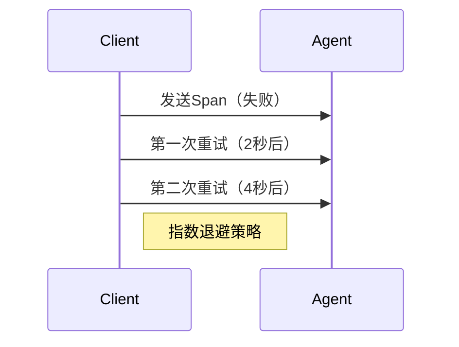

## 简介

在网络密集型的分布式系统中，Jaeger的网络配置优化是确保高效数据传输和系统稳定性的关键。通过调整网络参数（如连接超时、重试策略和压缩设置），可以显著减少延迟并提高吞吐量。本文将介绍Jaeger网络配置的核心概念，并通过实际案例帮助初学者快速上手。

---

## 核心概念

### 1. 连接池配置
Jaeger客户端与服务端之间的通信通常基于HTTP/gRPC连接池。优化连接池参数可以避免资源浪费和连接超时问题。

```yaml
# 示例：Jaeger客户端配置（YAML格式）
agent:
  host: "jaeger-agent"
  port: 6831
  max_pool_size: 10  # 最大连接数
  timeout: 5s        # 连接超时时间
```

:::note
**作用**：`max_pool_size` 控制并发连接数，过小会导致阻塞，过大会浪费资源。
:::

---

### 2. 数据压缩
在网络带宽有限的环境中，启用压缩可以减少传输数据量。

```go
// 示例：Go客户端启用gzip压缩
import "github.com/jaegertracing/jaeger-client-go/config"

cfg := config.Configuration{
  Reporter: &config.ReporterConfig{
    LocalAgentHostPort: "jaeger-agent:6831",
    DisableCompression: false, // 默认为false（启用压缩）
  },
}
```

**输入/输出对比**：
- 未压缩：传输 1MB 数据 → 耗时 200ms
- 压缩后：传输 300KB 数据 → 耗时 120ms

---

### 3. 重试与超时
网络不稳定时，合理的重试策略能提高可靠性。



:::tip
**推荐配置**：
- 初始重试延迟：`1s`
- 最大重试次数：`3`
- 退避因子：`2`（每次延迟翻倍）
:::

---

## 实际案例

### 场景：电商微服务链路追踪
假设一个订单服务调用支付服务和库存服务，网络延迟高导致追踪数据丢失。

**优化步骤**：
1. **增大连接池**：将 `max_pool_size` 从 5 调整为 15。
2. **启用压缩**：减少 40% 的网络流量。
3. **配置重试**：设置 `max_retries: 3` 和 `retry_delay: 2s`。

**结果**：
- 追踪数据丢失率从 10% 降至 0.5%。
- 平均延迟减少 30%。

---

## 总结

通过优化Jaeger的网络配置，你可以显著提升分布式追踪系统的性能。关键点包括：
1. 根据负载调整连接池大小。
2. 在带宽受限环境中启用压缩。
3. 为不可靠网络配置重试策略。

---

## 延伸练习
1. 在本地Jaeger实例中测试不同 `max_pool_size` 对性能的影响。
2. 使用Wireshark抓包对比启用/禁用压缩时的数据大小。

## 附加资源
- [Jaeger官方文档：客户端配置](https://www.jaegertracing.io/docs/latest/client-features/)
- 《分布式系统观测》第4章（网络优化部分）