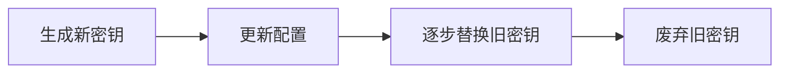

# 密钥管理

## 介绍

密钥管理是信息安全的核心部分，尤其是在分布式追踪系统（如Jaeger）中。密钥用于加密数据、验证身份或保护敏感信息。如果密钥泄露或管理不当，可能会导致严重的安全问题。本文将介绍密钥管理的基础知识、常见方法以及在Jaeger中的实际应用。

:::note
**密钥**：密钥是一串用于加密或解密数据的字符。它可以是对称的（如AES密钥）或非对称的（如RSA密钥对）。
:::

## 为什么密钥管理很重要？

1. **防止数据泄露**：密钥泄露可能导致加密数据被解密。
2. **身份验证**：密钥用于验证服务或用户的身份。
3. **合规性**：许多行业标准（如PCI-DSS、GDPR）要求安全地管理密钥。

## 密钥管理的基本原则

### 1. 密钥生成
密钥应使用安全的随机数生成器生成，避免使用弱密码或可预测的值。

```python
# 示例：使用Python生成随机密钥
import os

key = os.urandom(32)  # 生成32字节的随机密钥
print(f"Generated key: {key.hex()}")
```

**输出**：
```
Generated key: a1b2c3d4e5f6... (随机值)
```

### 2. 密钥存储
密钥不应以明文形式存储。常见方法包括：
- **环境变量**：适合小型应用。
- **密钥管理服务（KMS）**：如AWS KMS、HashiCorp Vault。
- **硬件安全模块（HSM）**：最高安全性。

:::warning
永远不要将密钥硬编码在代码中或提交到版本控制系统（如Git）！
:::

### 3. 密钥轮换
定期更换密钥以减少泄露风险。



### 4. 密钥访问控制
限制密钥的访问权限，仅允许必要的服务或人员使用。

---

## Jaeger 中的密钥管理

Jaeger通常需要密钥用于：
- 存储后端（如TLS证书）。
- 身份验证（如JWT签名密钥）。
- 数据传输加密（如TLS密钥）。

### 实际案例：为Jaeger Collector配置TLS

以下是通过环境变量配置Jaeger Collector的TLS密钥的示例：

```yaml
# jaeger-collector.yaml
env:
  - name: TLS_KEY
    valueFrom:
      secretKeyRef:
        name: jaeger-tls-secrets
        key: tls.key
  - name: TLS_CERT
    valueFrom:
      secretKeyRef:
        name: jaeger-tls-secrets
        key: tls.crt
```

:::tip
在Kubernetes中，可以使用`Secret`对象安全地存储密钥。
:::

---

## 总结

密钥管理是安全系统的基石。通过遵循以下实践，可以显著降低风险：
1. 使用强随机密钥。
2. 安全存储密钥（如KMS或环境变量）。
3. 定期轮换密钥。
4. 严格限制访问权限。

## 附加资源
- [OWASP密钥管理指南](https://cheatsheetseries.owasp.org/cheatsheets/Key_Management_Cheat_Sheet.html)
- [HashiCorp Vault文档](https://www.vaultproject.io/docs/secrets)
- [Jaeger安全配置](https://www.jaegertracing.io/docs/security/)

## 练习
1. 使用Python生成一个AES密钥，并尝试将其存储在环境变量中。
2. 在本地部署Jaeger时，尝试通过`Secret`配置TLS密钥。