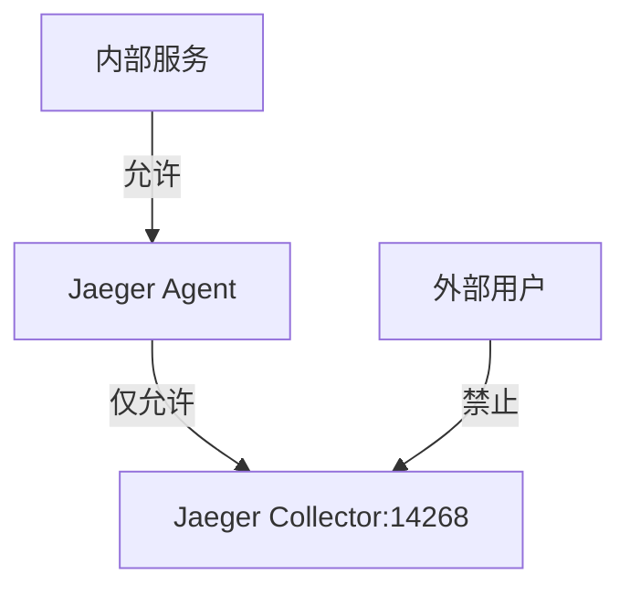
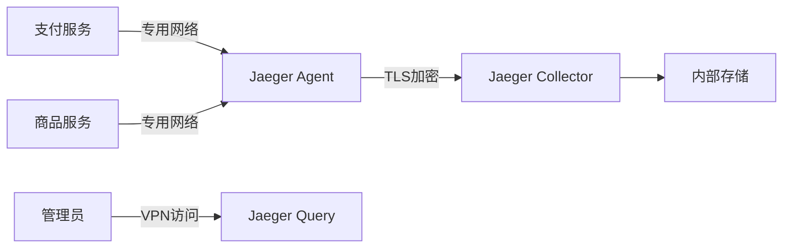

# 网络隔离

## 介绍

网络隔离（Network Isolation）是一种通过限制网络通信范围来增强系统安全性的技术。它的核心思想是将系统组件划分到不同的网络区域，并严格控制区域间的通信权限。在分布式追踪系统如Jaeger中，网络隔离能有效减少攻击面，防止未授权访问敏感数据。

## 为什么需要网络隔离？

1. **安全性**：限制潜在攻击者的横向移动能力。
2. **故障隔离**：防止局部故障扩散到整个系统。
3. **合规性**：满足数据保护法规（如GDPR）的要求。

## 基础实现方式

### 1. 物理隔离
完全独立的网络硬件设备，适用于高安全需求场景。

### 2. 逻辑隔离（常用）
通过软件配置实现的隔离，例如：

```bash
# 使用iptables限制Jaeger Collector只接收来自特定网段的请求
iptables -A INPUT -p tcp --dport 14268 -s 10.0.1.0/24 -j ACCEPT
iptables -A INPUT -p tcp --dport 14268 -j DROP
```

### 3. 虚拟网络
现代容器化环境中的典型方案：



## Jaeger 中的网络隔离实践

### 场景配置
假设我们有以下组件需要隔离：
- Jaeger Agent（部署在应用服务器）
- Jaeger Collector（中央收集节点）
- Jaeger Query（查询界面）

```yaml
# docker-compose网络配置示例
networks:
  tracing-net:
    driver: bridge
    internal: true  # 禁止外部访问
  frontend-net:
    driver: bridge

services:
  jaeger-collector:
    networks:
      - tracing-net
  application:
    networks:
      - tracing-net
      - frontend-net  # 双网卡配置
```

:::tip 最佳实践
建议为Jaeger组件创建专用VLAN，并使用防火墙规则限制：
- Collector只接受Agent的14268/tcp
- Query UI只开放给管理网络
:::

## 实际案例：电商平台隔离

某电商平台部署架构：



实现要点：
1. 支付网络与其他业务网络隔离
2. Agent到Collector使用双向TLS认证
3. Query服务不暴露在公网

## 常见误区

:::caution 注意避免
1. 过度隔离导致运维困难
2. 忘记隔离管理接口（如16686端口）
3. 忽略容器间的默认通信
:::

## 总结

网络隔离是Jaeger安全部署的关键环节，通过合理划分网络边界和严格控制通信路径，可以显著降低安全风险。初学者应从以下步骤开始实践：

1. 识别敏感组件（如Collector）
2. 制定最小化通信策略
3. 选择适合的隔离技术（VLAN/防火墙/命名空间）

## 延伸学习

- 练习：在本地使用Docker创建两个隔离网络并配置Jaeger组件通信
- 进阶：研究Kubernetes NetworkPolicy的实现
- 工具学习：`iptables`、`firewalld`或云平台安全组配置
