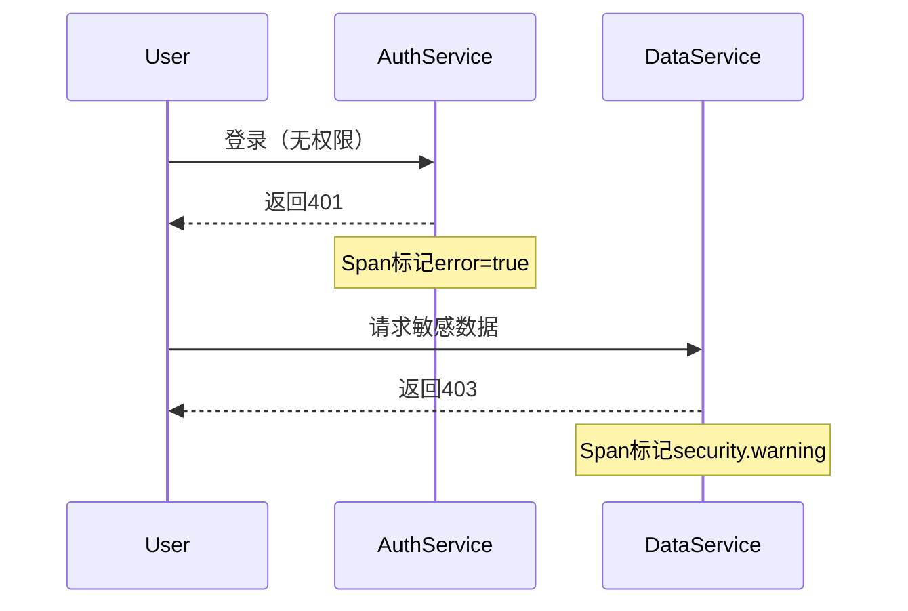

# 安全监控

## 介绍

安全监控是分布式系统可观测性的重要组成部分，它帮助开发者和运维团队实时追踪系统中的潜在安全风险，例如异常访问、未授权操作或数据泄露。Jaeger作为一款开源的分布式追踪系统，不仅可以用于性能分析，还能通过追踪数据的上下文信息（如用户身份、操作类型）增强安全性。

:::note
**为什么需要安全监控？**  
分布式系统中，一次请求可能跨越多个服务，传统的日志监控难以关联全局行为。Jaeger的追踪能力可以还原完整的请求链路，帮助识别异常模式。
:::

---

## 核心概念

### 1. 追踪与安全上下文的关联
Jaeger的Span（追踪的最小单元）可以携带安全相关的标签（tags），例如：
- `user.id`: 操作发起者
- `http.status_code`: 请求状态
- `error`: 是否发生错误

```go
// 示例：在Go中为Span添加安全标签
span := tracer.StartSpan("login")
span.SetTag("user.id", "admin")
span.SetTag("auth.method", "oauth2")
defer span.Finish()
```

### 2. 异常检测规则
通过分析Span数据，可以定义安全规则，例如：
- **高频失败登录**：短时间内同一IP的多个`/login` Span返回`401`。
- **敏感操作追踪**：访问`/admin`路径的Span未携带`role=admin`标签。

---

## 实战案例

### 案例：检测未授权访问
假设有一个用户服务，我们需要监控未经授权的数据访问。

1. **配置Jaeger收集数据**：
   ```yaml
   # docker-compose.yml片段
   services:
     jaeger:
       image: jaegertracing/all-in-one
       ports:
         - "16686:16686"
   ```

2. **在代码中标记敏感操作**：
   ```python
   # Flask示例
   from opentracing_instrumentation.request_context import get_current_span

   @app.route('/private-data')
   def private_data():
       span = get_current_span()
       if not user.has_role('admin'):
           span.set_tag('security.warning', 'unauthorized_access_attempt')
           return "Forbidden", 403
   ```

3. **在Jaeger UI中查询警告**：
   ```sql
   # Jaeger 查询语句
   tags.security.warning="unauthorized_access_attempt"
   ```

---

## 可视化分析



---

## 总结与练习

### 总结
- Jaeger通过Span标签传递安全上下文。
- 结合业务规则（如角色检查）主动标记可疑行为。
- 利用追踪数据聚合分析攻击模式。

### 练习
1. 在本地Jaeger中模拟一个包含错误标签的Span。
2. 编写查询，找出所有携带`security.warning`的Span。
3. （进阶）使用Jaeger的API自动报警异常请求。

:::tip
**扩展阅读**  
- [Jaeger官方文档](https://www.jaegertracing.io/docs/)
- 《分布式系统安全监控实践》
:::