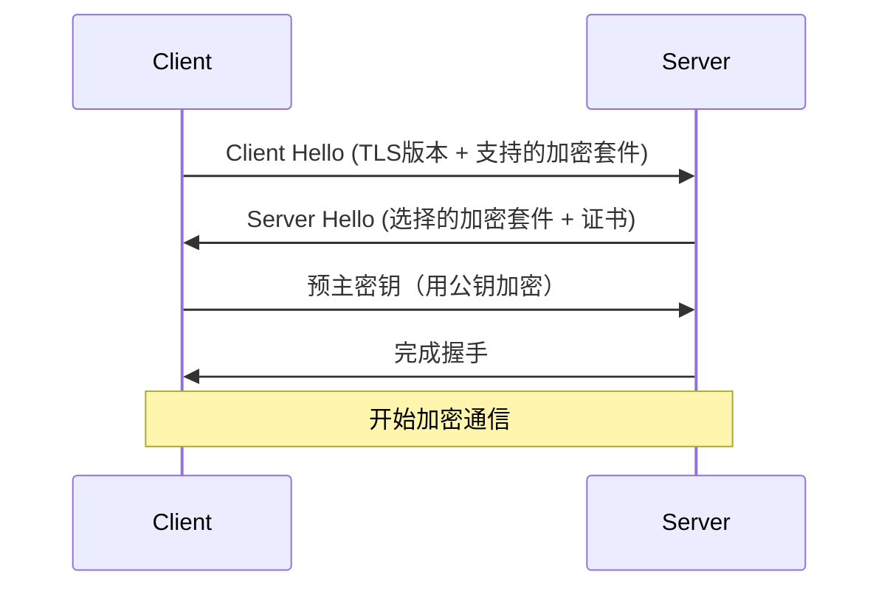

# TLS加密

## 简介

TLS（Transport Layer Security，传输层安全协议）是一种广泛使用的加密协议，用于在计算机网络中提供通信安全。它通过在客户端和服务器之间建立加密连接，确保数据传输的**机密性**、**完整性**和**身份验证**。在Jaeger等分布式追踪系统中，TLS加密是保护敏感追踪数据的关键技术。

:::note 关键术语
- **机密性**：防止未授权方读取数据。
- **完整性**：确保数据在传输过程中未被篡改。
- **身份验证**：确认通信双方的身份真实性。
:::

---

## TLS工作原理

TLS通过以下步骤建立安全连接（称为“握手”）：

1. **客户端Hello**：客户端向服务器发送支持的TLS版本和加密算法列表。
2. **服务器Hello**：服务器选择加密算法并返回数字证书（包含公钥）。
3. **密钥交换**：客户端验证证书，生成会话密钥并用公钥加密后发送给服务器。
4. **加密通信**：双方使用会话密钥加密后续数据传输。



---

## 代码示例：为Jaeger启用TLS

以下是一个为Jaeger Collector配置TLS的示例（使用YAML配置文件）：

```yaml
tls:
  enabled: true
  cert: /path/to/server.crt
  key: /path/to/server.key
  clientCA: /path/to/ca.crt  # 可选：启用客户端证书验证
```

**输入**：将上述配置添加到Jaeger Collector的部署文件中。<br />
**输出**：Jaeger Collector将仅接受通过TLS加密的连接。

:::caution 注意
- 证书文件（`.crt`）和私钥文件（`.key`）必须提前生成并妥善保管。
- 生产环境中建议使用可信证书颁发机构（CA）签名的证书。
:::

---

## 实际应用场景

### 场景：保护微服务间的追踪数据
在Kubernetes集群中，Jaeger Agent需要将追踪数据发送到Collector。若未启用TLS，攻击者可能窃取或篡改这些数据。通过TLS加密：
1. **数据保密**：拦截的流量无法被解密。
2. **身份验证**：Collector仅接受来自合法Agent的连接。

---

## 总结

TLS加密是保障Jaeger及其他分布式系统通信安全的基石。通过证书验证和密钥交换，它有效防止了中间人攻击和数据泄露。

### 延伸练习
1. 使用OpenSSL生成自签名证书并配置到Jaeger。
2. 通过Wireshark抓包工具对比TLS加密前后的流量差异。

### 附加资源
- [TLS RFC文档](https://tools.ietf.org/html/rfc8446)
- [Jaeger官方安全指南](https://www.jaegertracing.io/docs/security/)