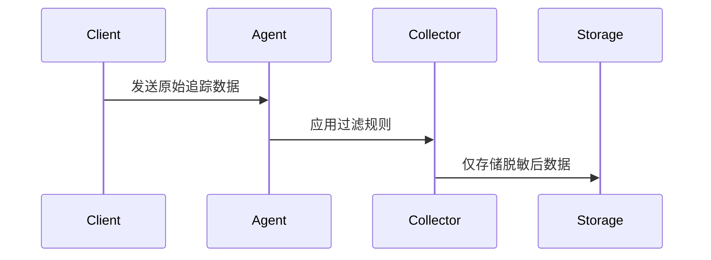

# 敏感数据处理

在分布式追踪系统中，敏感数据（如密码、API密钥或个人身份信息）可能会意外出现在日志、标签或追踪信息中。Jaeger作为流行的分布式追踪工具，需要特别注意此类数据的安全性。本文将介绍如何在Jaeger中识别、处理和保护敏感数据。

## 什么是敏感数据？

敏感数据是指任何可能被滥用或导致安全问题的信息，包括但不限于：
- 用户凭证（如密码、OAuth令牌）
- 金融信息（如信用卡号）
- 个人身份信息（如姓名、地址、身份证号）
- 系统机密（如数据库连接字符串、API密钥）

:::warning
未处理的敏感数据可能导致严重的安全漏洞，包括数据泄露和未授权访问。
:::

## Jaeger 中的敏感数据处理技术

### 1. 数据脱敏（Redaction）

数据脱敏是指将敏感信息替换为无害的占位符（如`****`）。Jaeger客户端库通常提供过滤机制：

```go
// 示例：使用Jaeger Go客户端过滤敏感标签
import (
	"github.com/opentracing/opentracing-go"
	"github.com/uber/jaeger-client-go"
)

func sanitizeTags(tags map[string]string) map[string]string {
	sensitiveKeys := []string{"password", "credit_card", "ssn"}
	for _, key := range sensitiveKeys {
		if _, ok := tags[key]; ok {
			tags[key] = "****"
		}
	}
	return tags
}
```

**输入/输出示例：**
```
原始标签: {"user": "alice", "password": "qwerty"}
处理后标签: {"user": "alice", "password": "****"}
```

### 2. 采样策略排除

通过配置采样策略，避免记录包含敏感数据的追踪：

```yaml
# jaeger-agent配置示例
sampling:
  strategies:
    - service: "payment-service"
      type: probabilistic
      param: 0.01  # 对支付服务仅采样1%的请求
```

### 3. 处理器层过滤

在数据到达存储之前进行过滤：



## 实际案例：电子商务平台

**场景**：某电商平台发现Jaeger追踪中泄露了用户的支付信息。

**解决方案**：
1. 识别敏感字段：`payment_method`, `card_number`, `cvv`
2. 在客户端库中添加自动脱敏逻辑
3. 配置采样策略降低支付相关服务的采样率
4. 添加后处理过滤器确保存储前的最终检查

```python
# Python示例：后处理过滤器
def sanitize_span(span):
    sensitive_fields = ['card_number', 'cvv']
    for tag in span.tags:
        if tag.key in sensitive_fields:
            tag.value = '[REDACTED]'
```

## 总结

处理敏感数据的关键步骤：
1. **识别**：确定系统中的敏感数据字段
2. **拦截**：在数据收集的各个阶段（客户端、代理、服务端）实施过滤
3. **验证**：定期审计存储的追踪数据

:::tip 最佳实践
- 默认拒绝所有数据，明确允许非敏感字段
- 实现自动化测试验证过滤规则
- 定期审查采样策略
:::

## 扩展学习

1. [Jaeger官方安全指南](https://www.jaegertracing.io/docs/security/)
2. OWASP数据脱敏规范
3. 练习：在本地Jaeger实例中配置一个过滤信用卡号的处理器