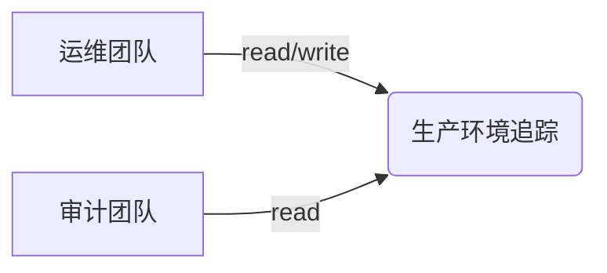

# 访问控制

## 简介

访问控制是安全体系中的核心概念，它决定了谁（用户或系统）能够访问特定资源以及可以执行哪些操作。在 **Jaeger**（分布式追踪系统）中，访问控制用于保护敏感的追踪数据，确保只有授权用户才能查看或修改数据。

## 访问控制基础

访问控制通常分为以下三种类型：

1. **自主访问控制 (DAC)**：资源所有者直接管理权限（如文件系统中的读写权限）。
2. **强制访问控制 (MAC)**：系统通过安全策略强制限制访问（如军事分级系统）。
3. **基于角色的访问控制 (RBAC)**：通过角色分配权限（如 Jaeger 中的管理员、开发者等角色）。

Jaeger 主要依赖 **RBAC** 和 **ABAC**（基于属性的访问控制）实现细粒度的权限管理。

---

## Jaeger 中的访问控制实现

### 1. 基本认证与授权
Jaeger 支持通过以下方式集成访问控制：
- **OpenID Connect (OAuth 2.0)**：与身份提供商（如 Keycloak）集成。
- **自定义插件**：通过实现 `grpc.Plugin` 接口扩展权限逻辑。

#### 示例：启用基础认证
```yaml
# jaeger-config.yaml
auth:
  enabled: true
  plugin: "basic"
  options:
    username: "admin"
    password: "securepassword"
```

---

### 2. RBAC 配置
通过 YAML 定义角色和权限：
```yaml
access_control:
  enabled: true
  admin:
    permissions: ["read", "write", "delete"]
    users: ["admin@example.com"]
  viewer:
    permissions: ["read"]
    users: ["dev@example.com"]
```

---

### 3. 实际案例：保护生产环境追踪数据
假设一个电商平台使用 Jaeger，需限制不同团队的访问权限：
- **运维团队**：需要 `read/write` 权限以诊断生产问题。
- **第三方审计**：仅允许 `read` 权限。



---

## 代码示例：验证访问权限

以下是一个模拟 Jaeger 权限检查的 Go 代码片段：

```go
func CheckPermission(user string, action string) bool {
    roles := map[string][]string{
        "admin":  {"read", "write", "delete"},
        "viewer": {"read"},
    }
    userRole := getUserRole(user) // 假设此函数返回用户角色
    for _, perm := range roles[userRole] {
        if perm == action {
            return true
        }
    }
    return false
}
```

**输入/输出示例**：
```plaintext
CheckPermission("admin@example.com", "delete") → true
CheckPermission("dev@example.com", "delete")  → false
```

---

## 常见问题与注意事项

:::warning
1. **不要硬编码凭证**：始终使用环境变量或密钥管理工具（如 Vault）。
2. **最小权限原则**：仅授予必要权限。
3. **审计日志**：记录所有敏感操作。
:::

---

## 总结

访问控制是 Jaeger 安全性的基石，通过合理配置 RBAC 和集成企业身份系统，可以有效防止数据泄露。关键步骤包括：
1. 明确角色和权限需求
2. 选择适当的认证协议（如 OIDC）
3. 定期审查权限分配

## 扩展练习
1. 在本地 Jaeger 实例中启用 Basic Auth。
2. 尝试通过 Keycloak 设置 OIDC 集成。
3. 设计一个三角色（admin/developer/auditor）的权限矩阵。

:::tip
Jaeger 官方文档提供了完整的 [安全配置指南](https://jaegertracing.io/docs/latest/security/)。
:::