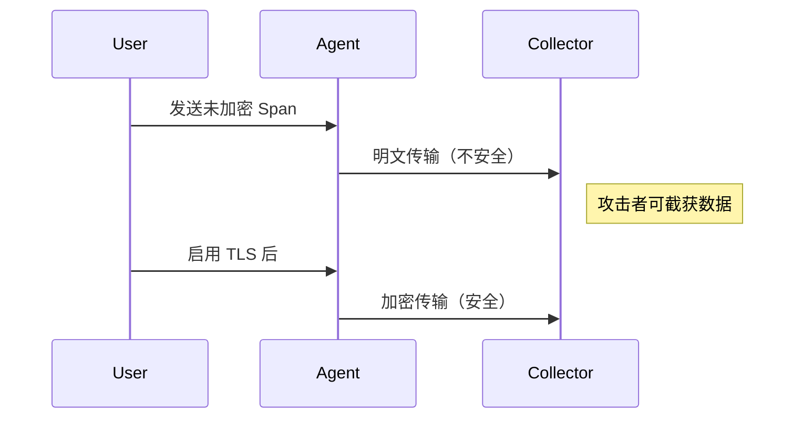

# 漏洞防护

## 介绍

在分布式系统中，Jaeger 作为一款流行的追踪工具，可能面临多种安全威胁，如数据泄露、未授权访问或注入攻击。本文将介绍 Jaeger 中常见的漏洞类型及其防护措施，帮助初学者构建更安全的追踪系统。

:::note 关键概念
漏洞防护是指通过技术或策略手段，预防、检测和修复系统中可能被恶意利用的弱点。
:::

---

## 常见漏洞及防护措施

### 1. 未授权访问

**问题**：默认配置下，Jaeger UI 和 API 可能允许未经验证的访问。

**防护方案**：
- 启用身份认证（如 OAuth2、JWT）。
- 示例配置（使用 `jaeger-query` 的 `--query.bearer-token-propagation=true` 参数）：
  ```bash
  jaeger-query --query.bearer-token-propagation=true
  ```

### 2. 数据泄露

**问题**：追踪数据可能包含敏感信息（如 HTTP 头部的 API 密钥）。

**防护方案**：
- 使用数据清洗过滤器：
  ```go
  // 示例：过滤敏感头部的 Span 处理器
  processor := jaeger.NewChainedProcessor(
    jaeger.NewBinaryAnnotationFilter("auth-token", "[REDACTED]"),
  )
  ```

### 3. 注入攻击

**问题**：恶意用户可能通过 Span 标签注入恶意代码。

**防护方案**：
- 对输入数据进行转义：
  ```javascript
  // 前端示例：转义 HTML 标签
  function sanitize(input) {
    return input.replace(/</g, "&lt;").replace(/>/g, "&gt;");
  }
  ```

---

## 实际案例

### 案例：未加密通信导致凭证泄露

**场景**：某公司 Jaeger Agent 与 Collector 之间使用明文传输数据，攻击者截获了包含数据库密码的 Span。

**解决方案**：
1. 启用 TLS 加密：
   ```yaml
   # collector-config.yaml
   tls:
     enabled: true
     cert: /path/to/cert.pem
     key: /path/to/key.pem
   ```
2. 使用网络隔离策略，限制 Jaeger 组件的网络访问。



---

## 总结

| 漏洞类型       | 防护措施                          | 工具/技术               |
|----------------|-----------------------------------|-------------------------|
| 未授权访问     | 身份认证、RBAC                   | OAuth2, JWT             |
| 数据泄露       | 数据清洗、加密存储               | TLS, 正则过滤           |
| 注入攻击       | 输入验证、输出编码               | HTML 转义库             |

:::tip 最佳实践
- 定期审计 Jaeger 组件的权限配置。
- 使用最小权限原则运行 Jaeger 服务。
- 监控异常查询模式（如高频全量数据导出）。
:::

---

## 扩展资源

1. [Jaeger 官方安全指南](https://jaegertracing.io/docs/latest/security/)
2. OWASP 注入攻击防护手册
3. 练习：尝试在本地 Jaeger 实例中配置 TLS 加密通信