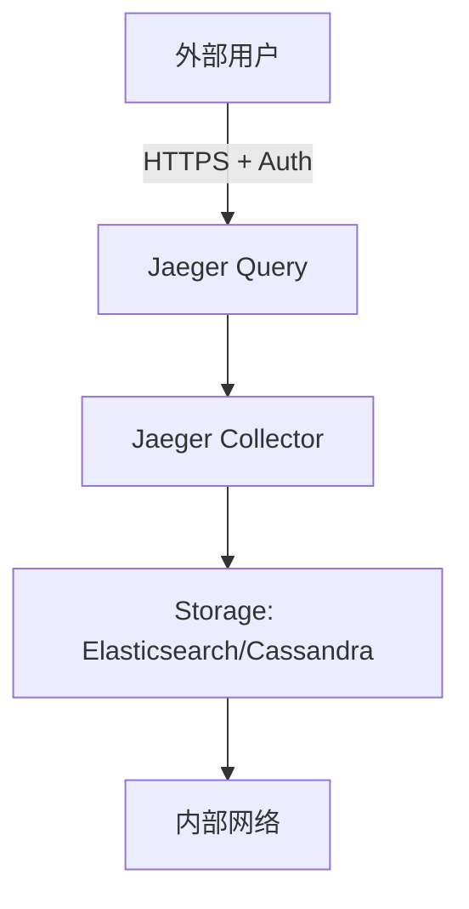
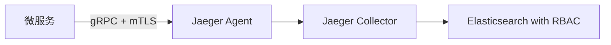

# Jaeger 安全性：安全最佳实践

## 介绍

Jaeger 是一个开源的分布式追踪系统，用于监控和排查微服务架构中的问题。随着分布式系统的复杂性增加，确保追踪数据的安全性变得至关重要。本文将介绍 Jaeger 的安全最佳实践，帮助您保护敏感数据并防止未授权访问。

## 1. 启用身份验证和授权

Jaeger 默认不提供内置的身份验证机制，因此需要依赖外部工具或配置来保护其组件。

### 使用反向代理（如 Nginx）进行基础认证

```bash
# Nginx 配置示例
server {
    listen 80;
    server_name jaeger.example.com;

    location / {
        auth_basic "Restricted Access";
        auth_basic_user_file /etc/nginx/.htpasswd;
        proxy_pass http://jaeger-query:16686;
    }
}
```

### 集成 OpenID Connect (OAuth 2.0)

对于生产环境，建议使用 OAuth 2.0 或 OpenID Connect 进行身份验证。Jaeger 可以与 Keycloak、Auth0 或 Google Identity Platform 等身份提供商集成。

:::tip
始终为 Jaeger UI 和 API 启用 HTTPS，以防止凭据在传输过程中被窃取。
:::

## 2. 数据脱敏

追踪数据可能包含敏感信息（如 HTTP 头、数据库查询）。Jaeger 提供以下方式来保护数据：

### 在客户端过滤敏感数据

```go
// OpenTelemetry Go SDK 示例 - 过滤敏感头信息
processor := filter.New(
    filter.Span(
        filter.Attribute("http.request.header.authorization", filter.Remove()),
    ),
)
```

### 使用 Jaeger 的 `--es.tags-as-fields.include` 选项

限制哪些标签会被索引到 Elasticsearch 中：

```bash
--es.tags-as-fields.include=environment,version,service.name
```

## 3. 网络隔离

### 推荐架构



关键原则：
- Jaeger Collector 不应暴露在公网
- 存储后端（如 Elasticsearch）应配置防火墙规则
- 使用服务网格（如 Istio）控制服务间通信

## 4. 存储安全

### Elasticsearch 安全配置

```yaml
# elasticsearch.yml
xpack.security.enabled: true
xpack.security.authc.api_key.enabled: true
```

### Cassandra 访问控制

```sql
CREATE ROLE jaeger_user WITH PASSWORD 'secure_password' AND LOGIN = true;
GRANT SELECT ON KEYSPACE jaeger TO jaeger_user;
```

## 5. 审计日志

启用 Jaeger 组件的审计日志：

```bash
# 启动 Jaeger Collector 时
--log-level=debug
```

## 实际案例：电子商务平台的安全追踪

某电商平台使用 Jaeger 追踪用户下单流程，他们实施了以下安全措施：

1. 所有 `/checkout` 相关的追踪数据自动移除支付信息
2. Jaeger UI 仅限 VPN 访问
3. 存储保留策略设置为 7 天
4. 使用如下架构：



## 总结

实施 Jaeger 安全最佳实践的关键点：

- 始终启用身份验证和加密传输
- 对敏感数据进行脱敏处理
- 通过网络隔离限制访问
- 保护存储后端的安全
- 记录并监控访问日志

## 附加资源

1. [Jaeger 官方安全文档](https://www.jaegertracing.io/docs/security/)
2. [OpenTelemetry 安全最佳实践](https://opentelemetry.io/docs/concepts/security/)
3. 练习：配置 Nginx 基础认证保护本地 Jaeger 实例

:::caution
在生产环境中部署 Jaeger 前，务必进行全面的安全评估。分布式追踪系统可能意外暴露敏感的业务逻辑和数据结构。
:::