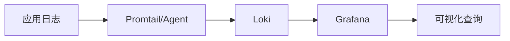

# Loki 简介

Grafana Loki是一个开源的**水平可扩展、高可用性、多租户**的日志聚合系统，专为云原生环境设计。它通过独特的索引方式和存储优化，实现了低成本的大规模日志管理。与传统的ELK（Elasticsearch、Logstash、Kibana）栈相比，Loki更注重**简单性**和**效率**。

## 核心设计理念

Loki的设计遵循三个关键原则：

1. **不对日志内容建立索引**  
   仅索引日志的元数据（如时间戳、标签），大幅降低存储需求
2. **原生支持Grafana**  
   与Grafana深度集成，提供统一的观测体验
3. **云原生友好**  
   天然支持Kubernetes等容器编排系统



## 核心组件

### 1. Loki服务器
负责日志的接收、存储和查询处理，包含多个子组件：
- `ingester`：处理写入请求
- `querier`：处理查询请求
- `distributor`：分发日志到ingester

### 2. Promtail
日志收集代理，通常部署在日志源机器上，功能包括：
- 发现目标日志文件
- 附加标签（labels）
- 推送日志到Loki

### 3. Grafana
可视化平台，提供LogQL查询界面和仪表板展示

## 基本工作流程

1. **日志收集**：Promtail收集应用日志并添加标签
2. **日志传输**：通过HTTP/gRPC发送到Loki
3. **日志存储**：Loki将日志压缩后存入对象存储（如S3、GCS）
4. **日志查询**：用户通过Grafana执行LogQL查询

:::tip 标签的重要性
Loki使用标签（labels）来组织和索引日志，这与Prometheus的指标标签系统完全兼容。合理的标签设计能显著提升查询效率。
:::

## 实际应用示例

假设我们有一个Kubernetes集群，需要监控Nginx容器的访问日志：

1. **Promtail配置示例**：
```yaml
scrape_configs:
- job_name: nginx
  kubernetes_sd_configs:
    - role: pod
  relabel_configs:
    - source_labels: [__meta_kubernetes_pod_label_app]
      action: keep
      regex: nginx
    - source_labels: [__meta_kubernetes_pod_name]
      target_label: pod
```

2. **LogQL查询示例**：
```logql
{app="nginx"} |= "404" | logfmt | rate(5m)
```
这个查询会：
- 过滤`app=nginx`的日志
- 只包含"404"的条目
- 解析logfmt格式
- 计算5分钟内的错误率

## 为什么选择Loki？

| 特性                | Loki                     | 传统方案(如ELK)         |
|---------------------|--------------------------|------------------------|
| **存储效率**        | 极高（仅索引元数据）     | 较低（全文索引）        |
| **查询语言**        | LogQL（类PromQL语法）    | 专用查询语法            |
| **部署复杂度**      | 简单                     | 较复杂                  |
| **云原生支持**      | 原生支持                 | 需要额外适配            |

## 总结

Loki为云原生环境提供了轻量级、高性价比的日志解决方案，特别适合：
- 已经使用Grafana/Prometheus的团队
- 需要处理海量日志但预算有限的场景
- Kubernetes环境下的日志管理

## 延伸学习

1. 官方文档：[grafana.com/docs/loki/latest](https://grafana.com/docs/loki/latest)
2. 实践练习：
   - 使用Docker Compose部署Loki单机版
   - 配置Promtail收集本地系统日志
   - 在Grafana中创建简单的日志查询仪表板

:::note 下一步
建议继续学习「Loki架构详解」章节，深入了解各组件的工作原理和调优方法。
:::