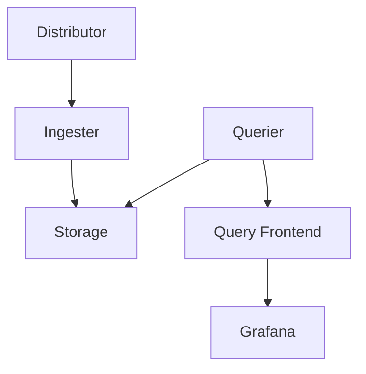

# Loki 架构概述

Grafana Loki是一个开源的日志聚合系统，专为高效存储和查询日志而设计。与传统的日志系统不同，Loki通过仅索引元数据（如标签）而非日志内容本身来实现高性能和低成本。本文将深入解析Loki的核心架构组件及其交互方式。

## 核心组件

Loki的架构由以下关键组件构成：



### 1. Distributor（分发器）
- **作用**：接收客户端发送的日志流（如通过Promtail、Fluentd等代理），验证数据并分发给Ingester。
- **关键特性**：
  - 支持多租户隔离
  - 通过哈希环（Hash Ring）实现负载均衡
  - 数据复制（通常3副本）

:::tip 实际场景
当你的应用服务器通过Promtail发送日志时，Distributor会根据日志的租户ID和标签决定将其路由到哪个Ingester节点。
:::

### 2. Ingester（摄入器）
- **作用**：临时存储日志数据（默认3小时），压缩后写入长期存储。
- **工作流程**：
  1. 接收日志并构建内存中的"块（chunk）"
  2. 定期刷新到存储后端
  3. 处理查询请求时返回最新数据

```go
// 示例：Loki的日志数据模型（简化）
{
  "stream": {
    "job": "api-server",
    "level": "error",
    "pod": "api-xyz123"
  },
  "values": [
    ["timestamp", "log line content"],
    ["2023-01-01T12:00:00Z", "Failed to connect to DB"]
  ]
}
```

### 3. Querier（查询器）
- **作用**：执行日志查询，合并Ingester内存数据和存储中的历史数据。
- **查询过程**：
  1. 解析LogQL查询语句
  2. 从存储和Ingester获取匹配的日志
  3. 去重和排序结果

### 4. 存储层
Loki支持多种存储后端：
- **对象存储**：AWS S3、GCS、Azure Blob（推荐生产使用）
- **本地存储**：文件系统（适合测试）
- **索引存储**：BoltDB、Cassandra、Bigtable

## 数据流示例

让我们跟踪一条日志的完整生命周期：

1. **采集**：Promtail收集Kubernetes Pod日志
   ```yaml
   # promtail配置示例
   scrape_configs:
     - job_name: kubernetes-pods
       kubernetes_sd_configs: [...]
       pipeline_stages:
         - docker: {}
   ```

2. **传输**：通过HTTP发送到Distributor
   ```
   POST /loki/api/v1/push HTTP/1.1
   Content-Type: application/json
   ```

3. **存储**：Ingester将日志压缩后写入S3
4. **查询**：用户通过Grafana界面查询`{job="api-server"}`

## 为什么选择这种架构？

Loki的独特设计带来以下优势：

| 特性 | 说明 |
|------|------|
| 低成本 | 不索引日志内容，仅存储原始日志 |
| 高性能 | 标签索引使查询快速 |
| 云原生 | 水平扩展，无状态组件 |
| 与Grafana集成 | 统一的可观测性体验 |

:::caution 注意
Loki不适合需要全文索引的场景。如果你需要频繁搜索日志内容，可能需要Elasticsearch等解决方案。
:::

## 总结

Loki的微服务架构通过分离读写路径实现了高扩展性：
- 写入路径：Distributor → Ingester → Storage
- 读取路径：Querier ←→ Storage/Ingester

关键要点：
- 标签（Labels）是Loki组织和查询日志的核心
- 存储设计优化了压缩率和查询性能
- 所有组件都可以独立扩展

## 延伸学习

推荐练习：
1. 部署单节点Loki体验基本功能
2. 使用LogQL查询`{container="nginx"}` 
3. 比较不同存储后端的性能差异

官方资源：
- [Loki设计文档](https://grafana.com/docs/loki/latest/fundamentals/architecture/)
- [Production部署建议](https://grafana.com/docs/loki/latest/installation/)