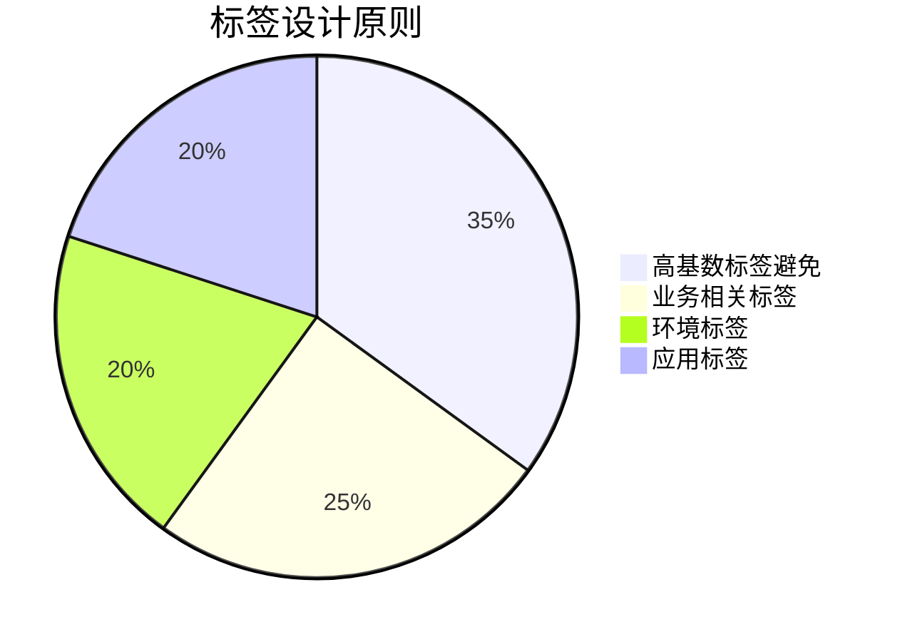
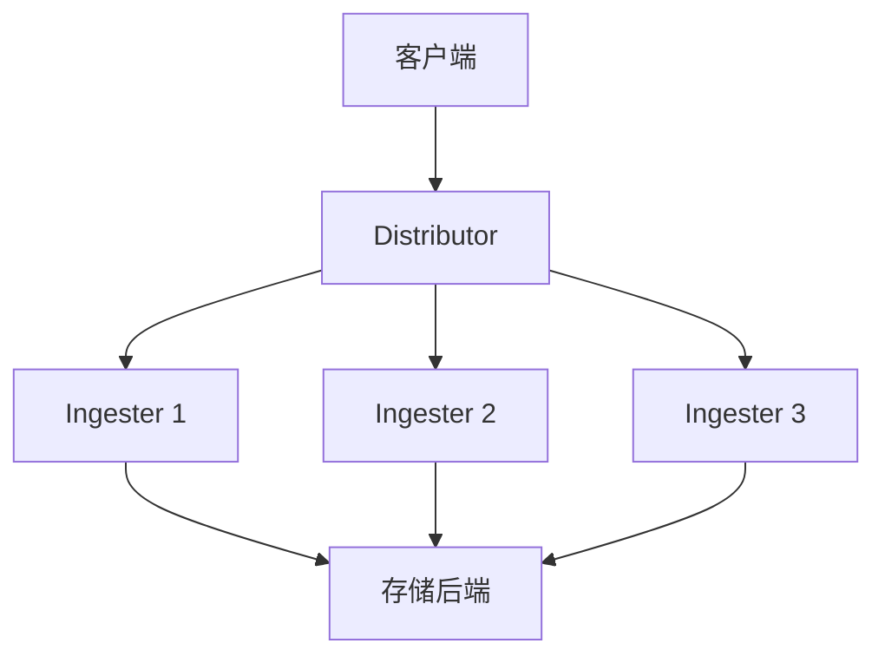

# Loki 性能考量

## 简介

Grafana Loki是一个高效的日志聚合系统，专为大规模日志数据处理而设计。为了充分发挥其潜力，理解并优化Loki的性能至关重要。本节将介绍影响Loki性能的关键因素，并提供优化建议。

## 存储性能优化

Loki的性能很大程度上依赖于存储后端的配置。以下是主要考量点：

### 1. 选择合适的存储后端

Loki支持多种存储后端，包括：
- 本地文件系统（适合小规模部署）
- Amazon S3
- Google Cloud Storage
- Azure Blob Storage
- Cassandra

:::tip
对于生产环境，建议使用云存储服务（如S3）或分布式数据库（如Cassandra），它们能提供更好的可扩展性和可靠性。
:::

### 2. 索引优化

Loki使用两种类型的索引：
- **倒排索引**：快速查找日志流
- **块索引**：定位日志数据

优化索引性能的方法：
```yaml
schema_config:
  configs:
    - from: 2020-10-24
      store: boltdb-shipper
      object_store: s3
      schema: v11
      index:
        prefix: index_
        period: 24h
```

## 查询性能优化

### 1. 日志标签设计

合理的标签设计能显著提高查询效率：



### 2. 查询范围限制

总是限制查询时间范围：
```logql
{app="nginx"} |= "error" | logfmt | duration > 500ms
```

加上时间范围：
```logql
{app="nginx"} |= "error" | logfmt | duration > 500ms [15m]
```

## 集群配置优化

### 1. 组件资源分配

典型Loki集群包含：
- Distributor
- Ingester
- Querier
- Query Frontend

:::note
为每个组件分配适当资源：
- Ingester: 需要更多内存处理日志流
- Querier: 需要更多CPU处理查询
:::

### 2. 水平扩展策略



## 实际案例

### 电商平台日志系统优化

**问题**：黑色星期五期间日志量激增，查询响应变慢

**解决方案**：
1. 将存储从本地SSD迁移到S3
2. 增加Ingester节点数量
3. 优化标签结构，减少高基数标签
4. 配置查询前端缓存

优化后结果：
- 写入吞吐量提升300%
- 查询延迟降低60%

## 总结

优化Loki性能需要综合考虑存储、查询和集群配置：
1. 选择适合规模的存储后端
2. 设计高效的标签结构
3. 合理分配资源给不同组件
4. 根据负载水平扩展

## 附加资源

**进一步学习**：
- [Loki官方性能调优指南](https://grafana.com/docs/loki/latest/operations/)
- 《云原生日志系统实践》电子书

**练习**：
1. 部署一个小型Loki集群，测试不同存储后端的性能差异
2. 设计一个包含业务相关标签的日志收集方案
3. 使用LogQL编写一个高效查询，统计某应用的错误率