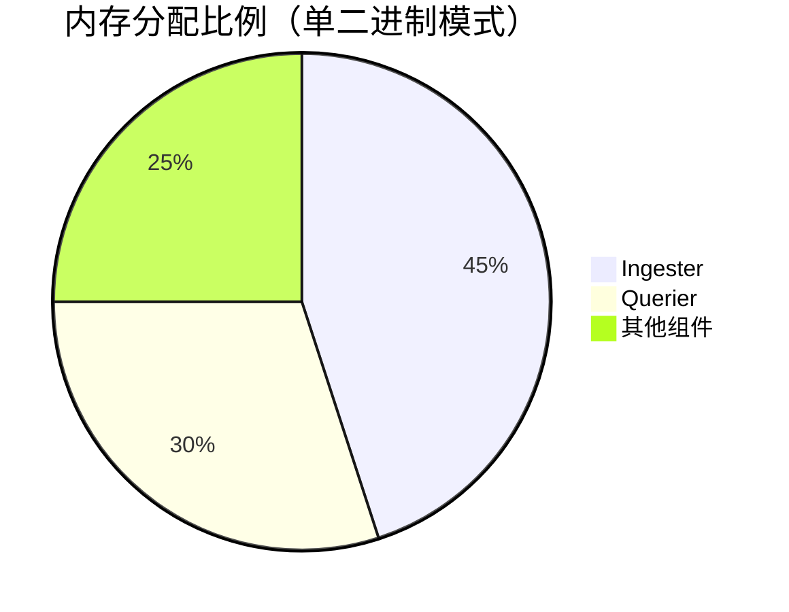

# Loki 资源需求

## 介绍

Grafana Loki是一个高效的日志聚合系统，专为大规模日志处理设计。理解Loki的资源需求对于部署和优化性能至关重要。本节将详细介绍Loki运行所需的基础资源（CPU、内存、存储），以及如何根据实际日志量调整资源配置。

---

## 核心资源类型

Loki的运行依赖三类主要资源：

### 1. CPU需求
- **微服务模式**：各组件（如`ingester`、`querier`）需要独立分配CPU
- **单二进制模式**：共享CPU资源
- **建议基准**：
  - 小型部署（`<100GB`日志/天）：`2-4核`
  - 中型部署（`1TB`日志/天）：`4-8核`

:::tip
使用`-target=combo`模式时，CPU需求比分离部署减少约30%
:::

### 2. 内存需求
内存占用主要来自：
- **索引缓存**：加速查询性能
- **日志压缩处理**：`ingester`组件内存消耗与日志接收速率成正比



### 3. 存储需求
Loki采用独特的存储模型：
- **索引存储**：通常使用BoltDB或Cassandra
- **日志块存储**：对象存储（如S3、GCS）
- **计算公式**：
  ```
  总存储 ≈ 原始日志量 × (1 + 副本数) × 压缩比(0.3-0.5)
  ```

---

## 配置示例

### 基础资源配置文件（`loki-config.yaml`）

```yaml
limits_config:
  ingestion_rate_mb: 10
  ingestion_burst_size_mb: 15

ingester:
  lifecycler:
    ring:
      replication_factor: 3
  chunk_idle_period: 30m
  max_transfer_retries: 0

storage_config:
  boltdb_shipper:
    active_index_directory: /loki/index
    cache_location: /loki/cache
  filesystem:
    directory: /loki/chunks
```

:::note
生产环境建议将`replication_factor`设置为至少`3`以保证高可用
:::

---

## 实际案例

### 场景：电商平台日志系统
- **日志量**：每天500GB应用日志
- **资源配置**：
  - **CPU**：8核（主要处理查询和压缩）
  - **内存**：16GB（重点分配`ingester`）
  - **存储**：使用S3存储，保留策略配置为：
    ```yaml
    retention_period: 720h # 30天
    ```
- **优化措施**：
  - 启用日志压缩：`chunk_encoding: snappy`
  - 调整查询并行度：`parallelise_shardable_queries: true`

---

## 监控与调优

关键监控指标：
1. `loki_ingester_memory_chunks`：当前内存中的日志块数量
2. `process_cpu_seconds_total`：CPU使用率
3. `loki_ingester_chunk_utilization`：存储块利用率

使用Grafana监控模板：
```bash
wget https://raw.githubusercontent.com/grafana/loki/main/production/ksonnet/loki-mixin/dashboards/
```

---

## 总结

关键要点：
- Loki资源需求与日志吞吐量直接相关
- 内存是主要瓶颈，需重点监控`ingester`组件
- 存储成本可通过压缩和保留策略优化

## 延伸学习

推荐练习：
1. 使用`/loki/api/v1/status/buildinfo`端点检查资源使用
2. 通过压力测试工具模拟不同日志量：
   ```bash
   logcli --addr=http://localhost:3100 analyze-log-queries
   ```

附加资源：
- [官方资源规划文档](https://grafana.com/docs/loki/latest/operations/storage/)
- [生产环境调优指南](https://grafana.com/docs/loki/latest/operations/optimization/)