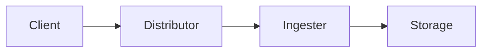
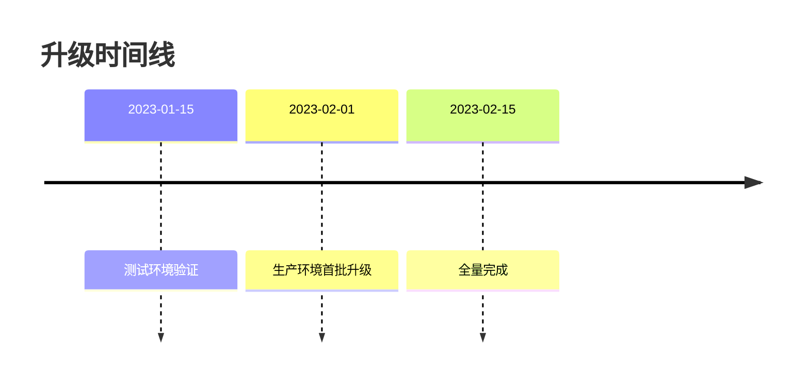

## 介绍

Grafana Loki是一个开源的日志聚合系统，专为云原生环境设计。了解Loki的版本历史能帮助您：
- 掌握核心功能的演进路线
- 规划生产环境的升级策略
- 识别特定版本中的关键特性

:::note 版本命名规则
Loki采用语义化版本控制(SemVer)：
`主版本.次版本.修订版`（如2.8.1）
主版本变更表示重大架构调整
:::

## 主要版本里程碑

### 1.0.0 (2019-12)
Loki的首个稳定版本，核心特性包括：
- 基于标签的日志索引
- 与Prometheus相似的查询语言(LogQL)
- 原生Grafana集成

```shell
# 示例：1.x版本的LogQL基础查询
{job="api-server"} |= "error"
```

### 2.0.0 (2020-12)
重大架构改进：
- 引入日志流(Log Stream)概念
- 查询性能提升300%
- 支持多租户隔离



:::caution 升级注意
2.x版本需要重新构建索引，建议先在测试环境验证
:::

### 2.4.0 (2021-04)
重要功能增强：
- 新增日志解析器(`| json`)
- 支持查询结果缓存
- 改进的压缩算法减少存储占用30%

```shell
# JSON日志解析示例
{app="frontend"} | json | latency > 500ms
```

### 2.7.0 (2022-01)
企业级特性引入：
- 日志保留策略(Retention)
- 基于角色的访问控制(RBAC)
- 与OpenTelemetry集成

## 当前稳定版本 (3.x)

3.0系列的主要革新：
- 完全兼容Prometheus标签体系
- 分布式查询执行引擎
- 支持Parquet列式存储格式

```go
// 示例：使用Go客户端查询
query := `sum by (level) (count_over_time({job="myapp"} | logfmt | level != "info"[5m]))`
result, err := loki.Query(query).Exec(context.Background())
```

## 版本升级策略

推荐采用滚动升级方式：
1. 先升级查询组件(Querier)
2. 然后升级摄入组件(Ingester)
3. 最后升级分发组件(Distributor)

:::tip 最佳实践
- 生产环境保持N-1版本策略
- 利用Loki的版本兼容性保证
- 监控`/ready`端点健康状态
:::

## 实际案例：电商平台升级实战

某电商平台从1.6升级到2.3的步骤：
1. 在预发布环境测试查询兼容性
2. 分批次升级工作节点
3. 验证新版本的高基数限制功能
4. 监控内存使用率变化



## 总结与资源

### 关键要点
- Loki每6个月发布次版本更新
- 长期支持(LTS)版本维护12个月
- 版本差异主要体现在存储引擎和查询优化

### 延伸学习
1. [官方版本说明](https://github.com/grafana/loki/releases)
2. 使用`loki-build-image`工具测试不同版本
3. 在Katacoda上体验版本对比实验

### 练习建议
1. 在本地Docker环境部署1.8和2.6版本
2. 对比相同查询在不同版本的执行计划
3. 模拟从1.x到2.x的数据迁移过程