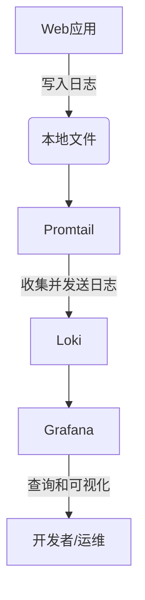

# Loki 安装方法

Grafana Loki是一个轻量级的日志聚合系统，专为云原生环境设计。它通过索引日志标签而不是内容本身来实现高效存储和查询。本文将指导您完成Loki的安装过程，涵盖从本地开发到生产环境的不同部署方式。

## 前置条件

在开始安装前，请确保您的系统满足以下要求：
- 至少2GB内存（生产环境推荐8GB+）
- 50GB可用磁盘空间（根据日志量调整）
- Docker或Kubernetes环境（可选）
- 基本的命令行操作知识

## 安装方法概览

Loki支持多种安装方式，主要包括：
1. 本地运行（适合开发测试）
2. Docker容器
3. Kubernetes部署
4. 二进制包安装

## 1. 本地运行（开发模式）

最简单的入门方式是使用Loki的本地开发模式，它会自动配置所有必要组件。

```bash
# 下载并运行Loki（需要安装Docker）
docker run -p 3100:3100 grafana/loki:latest -config.file=/etc/loki/local-config.yaml
```

:::tip
开发模式使用预配置的 `local-config.yaml`，只适合测试环境。生产环境需要自定义配置。
:::

## 2. Docker容器部署

对于更正式的Docker部署，建议使用docker-compose管理Loki和相关服务：

```yaml
# docker-compose.yaml 示例
version: "3"

services:
  loki:
    image: grafana/loki:latest
    ports:
      - "3100:3100"
    volumes:
      - ./loki-config.yaml:/etc/loki/local-config.yaml
    command: -config.file=/etc/loki/local-config.yaml

  promtail:
    image: grafana/promtail:latest
    volumes:
      - ./promtail-config.yaml:/etc/promtail/config.yml
      - /var/log:/var/log
    command: -config.file=/etc/promtail/config.yml
```

创建对应的配置文件后，运行：
```bash
docker-compose up -d
```

## 3. Kubernetes部署

对于Kubernetes环境，可以使用Helm chart进行部署：

```bash
# 添加Grafana Helm仓库
helm repo add grafana https://grafana.github.io/helm-charts
helm repo update

# 安装Loki
helm upgrade --install loki grafana/loki-stack \
  --namespace=loki \
  --create-namespace \
  --set promtail.enabled=true
```

## 4. 二进制安装

对于需要直接控制的情况，可以从[Loki发布页面](https://github.com/grafana/loki/releases)下载预编译的二进制文件：

```bash
# 下载Loki
wget https://github.com/grafana/loki/releases/download/v2.7.3/loki-linux-amd64.zip
unzip loki-linux-amd64.zip

# 运行Loki
./loki-linux-amd64 -config.file=loki-config.yaml
```

## 配置文件示例

无论采用哪种安装方式，都需要配置Loki。以下是基础配置示例：

```yaml
# loki-config.yaml
auth_enabled: false

server:
  http_listen_port: 3100

common:
  path_prefix: /tmp/loki
  storage:
    filesystem:
      chunks_directory: /tmp/loki/chunks
      rules_directory: /tmp/loki/rules
  replication_factor: 1
  ring:
    instance_addr: 127.0.0.1
    kvstore:
      store: inmemory

schema_config:
  configs:
    - from: 2020-10-24
      store: boltdb-shipper
      object_store: filesystem
      schema: v11
      index:
        prefix: index_
        period: 24h
```

## 验证安装

安装完成后，可以通过以下方式验证Loki是否正常运行：

```bash
# 检查Loki健康状态
curl http://localhost:3100/ready
```

预期输出：
```
ready
```

## 实际应用场景

假设您需要监控一个Web应用的日志，典型的部署架构如下：



## 常见问题解决

:::caution
如果遇到端口冲突，请检查3100端口是否被其他程序占用：
```bash
netstat -tuln | grep 3100
```
:::

## 总结

本文介绍了Loki的多种安装方法，从最简单的开发模式到生产级的Kubernetes部署。选择适合您环境的安装方式后，下一步可以配置日志收集器（如Promtail）和Grafana进行日志可视化。

## 扩展学习

- [官方安装文档](https://grafana.com/docs/loki/latest/installation/)
- [Loki配置参考](https://grafana.com/docs/loki/latest/configuration/)
- [Promtail配置指南](https://grafana.com/docs/loki/latest/clients/promtail/configuration/)

练习建议：
1. 尝试在本地使用Docker运行Loki和Promtail
2. 配置Promtail收集系统日志并发送到Loki
3. 在Grafana中添加Loki数据源并创建简单查询