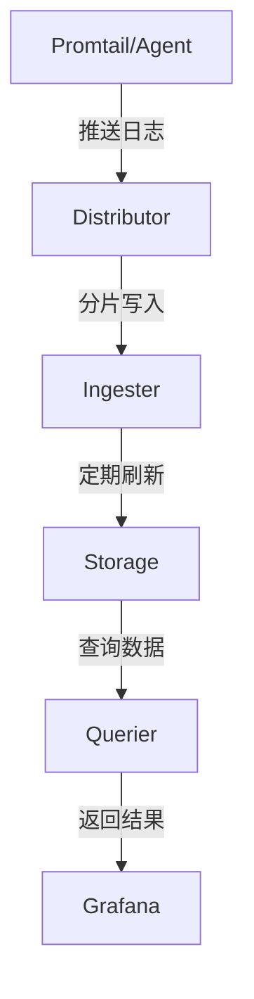
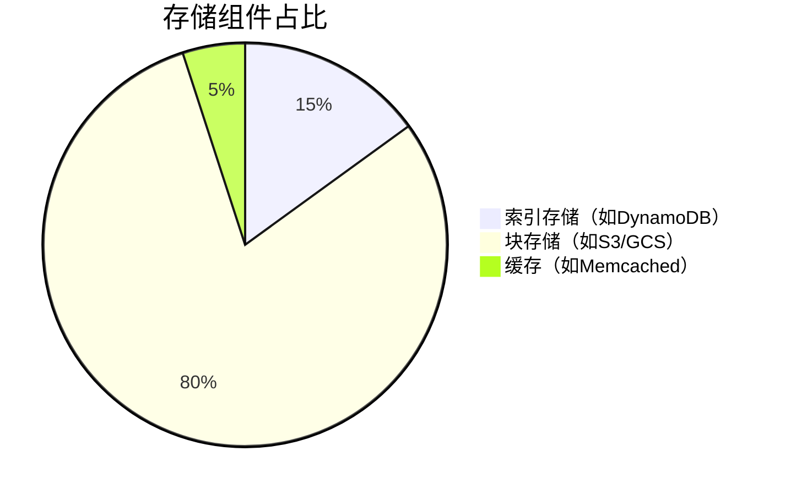

# Loki 核心概念

## 介绍

Grafana Loki是一个**水平可扩展**、**高可用性**的多租户日志聚合系统，专为**效率**而设计。与传统的日志系统不同，Loki通过仅索引元数据（标签）而不是日志内容本身，实现了**低成本**的大规模日志存储方案。

:::tip 设计哲学
Loki遵循"日志即标签"的理念，其核心思想是：**只索引标签，不索引内容**，这使得它比完全索引的系统（如ELK）更轻量高效
:::

## 核心架构组件



### 1. 标签（Labels）

Loki使用与Prometheus相同的标签系统来组织日志流：
- 每个日志流由一组**键值对标签**唯一标识
- 标签组合示例：`{job="api-server", env="production", pod="api-123"}`

```bash
# 日志写入时的标签示例
{app="order-service", env="staging", region="us-west"}
```

### 2. 日志流（Log Stream）

具有**相同标签集**的日志条目序列构成一个日志流：
- 每个流独立存储和索引
- 流内日志按时间顺序排列

:::note 实际案例
一个Kubernetes Pod的日志通常构成一个流：
```
{container="nginx", pod="web-5df8b7cb5d-2lkp4", namespace="default"}
```
:::

### 3. 数据模型

Loki的数据层次结构：
1. **租户（Tenant）** > 2. **标签集（Labels）** > 3. **日志流（Stream）** > 4. **日志条目（Entry）**

```go
// 日志条目结构示意
type Entry struct {
    Timestamp time.Time
    Line      string  // 实际日志内容
}
```

### 4. 核心服务组件

#### Distributor（分发器）
- 接收日志写入请求
- 验证数据并分发给Ingester
- 支持多租户认证

#### Ingester（摄取器）
- 在内存中构建日志块
- 定期刷新到长期存储
- 处理查询请求

#### Querier（查询器）
- 执行LogQL查询
- 从Ingester和存储中获取数据
- 聚合结果返回

## 存储设计

Loki采用**分层存储**架构：



1. **索引存储**：仅保存标签到日志块的映射关系
2. **块存储**：压缩后的日志内容（通常采用对象存储）
3. **缓存层**：加速常用查询

:::caution 重要限制
Loki **不**适合以下场景：
- 需要全文检索日志内容
- 需要复杂的事件关联分析
- 日志量极小（`<100GB/天`）的场景可能体现不出优势
:::

## 实际应用示例

电商平台的日志收集方案：
1. 使用Promtail收集所有微服务日志
2. 按服务/环境/严重级别打标签
3. 在Grafana中创建按错误级别过滤的仪表板

```bash
# 查询生产环境payment服务的ERROR日志
{app="payment-service", env="production"} |= "ERROR"
```

## 总结

关键要点：
- Loki通过**标签索引**实现高效存储
- **水平扩展**架构适合云原生环境
- 与Grafana深度集成提供可视化能力
- **LogQL**是专用的查询语言

## 延伸学习

推荐练习：
1. 在本地使用Docker Compose启动Loki栈
2. 配置Promtail收集Nginx日志
3. 尝试用不同标签组合进行查询
