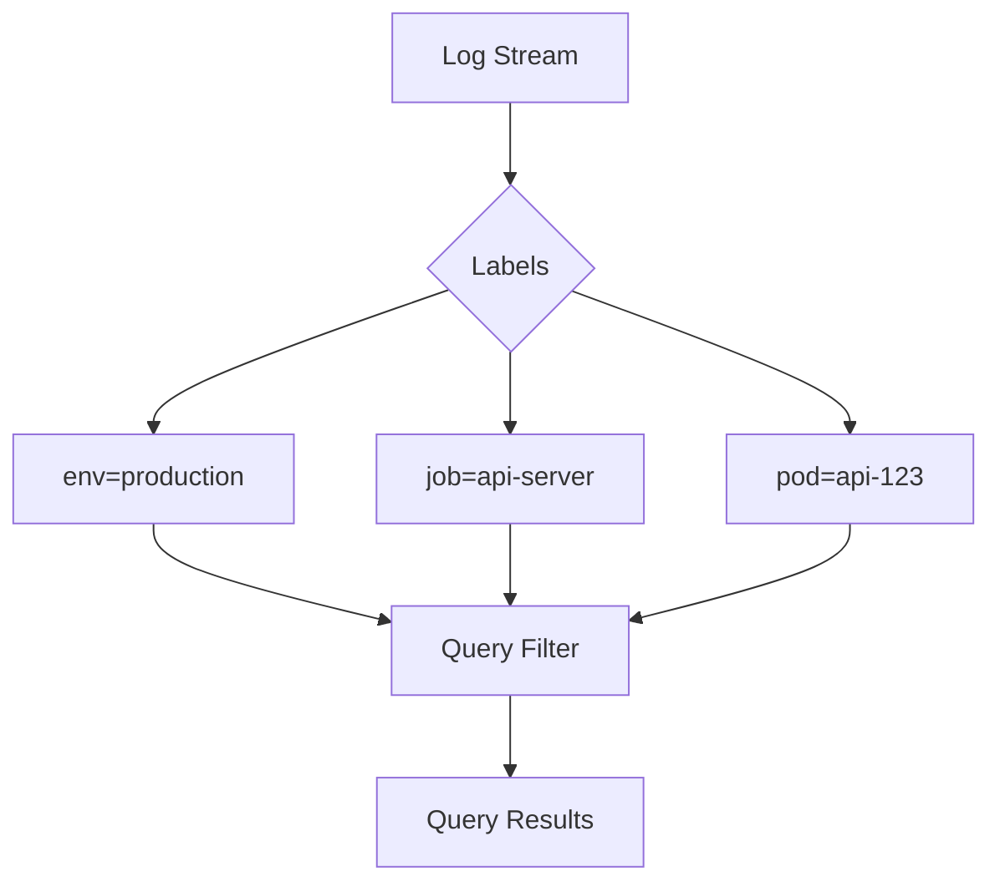

# Loki 标签系统

## 介绍

Loki的标签系统是其日志查询和存储的核心机制。标签（Labels）是键值对形式的元数据，附加到日志流上，用于高效地索引和过滤日志数据。与传统的全文索引不同，Loki通过标签系统实现了低存储开销和高查询性能的平衡。

:::tip 关键特性
- **低存储开销**：仅索引标签，不索引日志内容
- **高效查询**：通过标签快速缩小搜索范围
- **Prometheus兼容**：使用与Prometheus相同的标签语法
:::

## 标签基础

### 标签语法规则

Loki标签遵循以下规则：
1. 键和值都是字符串
2. 键可以包含ASCII字母、数字和下划线
3. 值可以包含任何UTF-8字符
4. 标签对形式为 `key="value"`

示例标签集：
```text
job="api-server"
env="production"
pod="api-123456"
```

### 保留标签

Loki有一些保留标签有特殊含义：
- `__name__`：日志流的名称
- `__error__`：处理日志时的错误信息
- `__error_details__`：错误详情

## 标签实践

### 日志收集时添加标签

使用Promtail配置添加标签（`promtail.yaml`片段）：
```yaml
scrape_configs:
  - job_name: system
    static_configs:
      - targets:
          - localhost
        labels:
          job: "syslog"
          env: "dev"
          __path__: "/var/log/syslog"
```

### 查询时使用标签

在LogQL查询中通过标签过滤：
```logql
{job="api-server", env="production"} |= "error"
```

这将返回所有 `job` 为 `api-server` 且 `env` 为 `production` 的日志中包含 `"error"` 的条目。

## 标签设计最佳实践

### 推荐策略

1. **保持标签基数可控**：避免使用高基数字段（如用户ID）作为标签
2. **使用静态标签**：尽量使用部署时已知的值作为标签
3. **组合使用**：将低基数标签与过滤器结合使用

### 反模式示例

❌ 高基数标签（可能导致性能问题）：
```text
user_id="12345"
request_id="a1b2c3d4"
```

✅ 更好的替代方案：
```text
service="user-profile"
log_type="http_request"
```

## 实际案例

### 微服务环境标签设计

假设有一个微服务架构包含：
- 3个环境（dev/staging/prod）
- 5个服务（api/auth/db/cache/worker）

推荐标签方案：
```text
env="prod"
service="api"
instance="api-xyz"
```

查询特定服务的错误日志：
```logql
{env="prod", service="api"} |= "error" | logfmt
```

### 多租户系统

对于多租户系统，可以添加租户标签：
```text
tenant="acme-corp"
app="billing"
```

查询特定租户的日志：
```logql
{tenant="acme-corp"} |= "timeout"
```

## 可视化标签关系



## 总结

Loki的标签系统是其高效日志查询的核心。合理设计标签可以：
- 显著提高查询性能
- 降低存储需求
- 简化日志管理

记住关键原则：**保持标签基数低，使用静态已知值**。

## 延伸学习

1. 练习：尝试为你的应用设计一个标签方案
2. 进一步阅读：
   - [Loki官方文档 - 标签最佳实践](https://grafana.com/docs/loki/latest/best-practices/labels/)
   - [LogQL查询语言详解](https://grafana.com/docs/loki/latest/logql/)

:::caution 注意
修改标签配置后，旧的日志数据不会自动更新标签。规划标签策略时需考虑长期需求。
:::