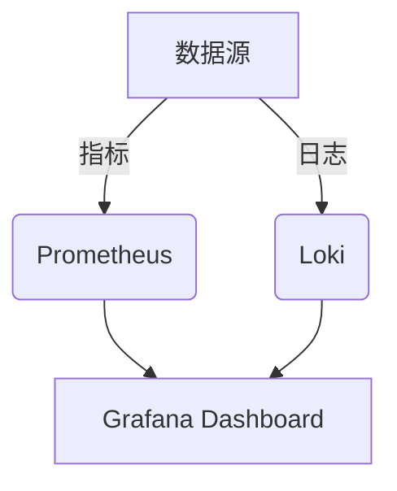

# Loki 与Prometheus比较

## 介绍

Grafana Loki和Prometheus都是云原生监控生态中的核心工具，但它们的定位和功能有显著差异。Loki专注于**日志聚合**，而Prometheus擅长**指标监控**。本文将对比两者的设计理念、数据模型、查询语言和典型使用场景，帮助初学者理解如何结合使用它们。

:::note 核心区别
- **Loki**：为日志设计，使用标签索引+压缩存储，查询语言为LogQL。
- **Prometheus**：为指标设计，使用时序数据库，查询语言为PromQL。
:::

## 数据模型对比

### Prometheus的指标模型
Prometheus存储多维时间序列数据，每个数据点包含：
- 指标名称（如 `http_requests_total`）
- 标签键值对（如 `method="GET", status="200"`）
- 时间戳和数值

示例指标：
```promql
http_requests_total{method="POST", handler="/api"} 42 @1654000000
```

### Loki 的日志模型
Loki存储日志流，每条日志包含：
- 标签键值对（如 `job="nginx", pod="frontend-123"`）
- 日志内容（如 `"GET /favicon.ico 404"`）
- 时间戳

示例日志条目：
```log
{job="nginx"} "2023-05-01T12:00:00Z GET /favicon.ico 404"
```



## 查询语言对比

### PromQL示例
计算5分钟内HTTP错误率：
```promql
sum(rate(http_requests_total{status=~"5.."}[5m])) 
/ 
sum(rate(http_requests_total[5m]))
```

### LogQL示例
查找包含"error"的Nginx日志：
```logql
{job="nginx"} |= "error"
```

:::tip 查询模式差异
- PromQL：基于数值计算、聚合和预测
- LogQL：基于文本搜索、过滤和模式匹配
:::

## 存储架构差异

| 特性         | Loki                  | Prometheus            |
|--------------|-----------------------|-----------------------|
| 索引方式     | 标签索引              | 倒排索引              |
| 存储内容     | 压缩日志              | 时序数据点            |
| 存储成本     | 较低（不索引日志内容）| 中等                  |
| 扩展性       | 水平扩展              | 单机为主              |

## 实际应用场景

### 典型组合方案
1. **应用监控**：
   - Prometheus收集指标（CPU/内存/请求量）
   - Loki收集应用日志
   - 在Grafana中关联查看指标和日志

2. **错误诊断流程**：
   ```mermaid
   flowchart LR
       A[Prometheus报警] --> B[查看相关指标]
       B --> C[用LogQL查询对应时间段的日志]
       C --> D[定位具体错误堆栈]
   ```

### 代码示例：关联查询
在Grafana中同时显示错误率和相关日志：
1. 创建Prometheus面板显示错误率
2. 添加Loki面板，使用变量引用时间范围：
   ```logql
   {job="myapp"} |= "error" 
   | json 
   | line_format "{{.timestamp}} {{.message}}"
   ```

## 总结

**何时选择Prometheus**：
- 需要数值监控和告警
- 涉及复杂的数学运算（如百分位计算）
- 资源使用量监控

**何时选择Loki**：
- 需要全文日志搜索
- 日志量巨大但预算有限
- 需要与指标关联分析

**最佳实践**：两者通常配合使用，Prometheus触发告警后，用Loki调查具体日志。

## 延伸学习

1. **动手练习**：
   - 在Kubernetes中同时部署Prometheus和Loki
   - 配置Grafana同时添加两个数据源
   - 创建一个包含指标和日志的仪表板

2. **推荐资源**：
   - Loki官方文档的[LogQL指南](https://grafana.com/docs/loki/latest/logql/)
   - Prometheus的[PromQL教程](https://prometheus.io/docs/prometheus/latest/querying/basics/)