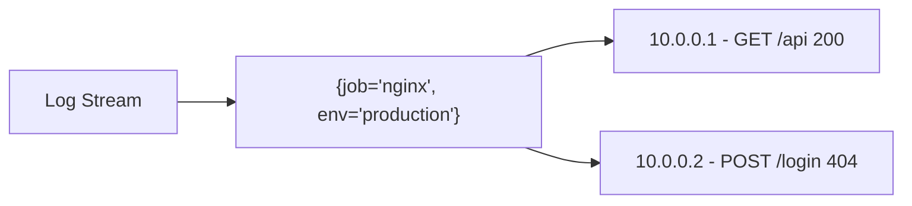
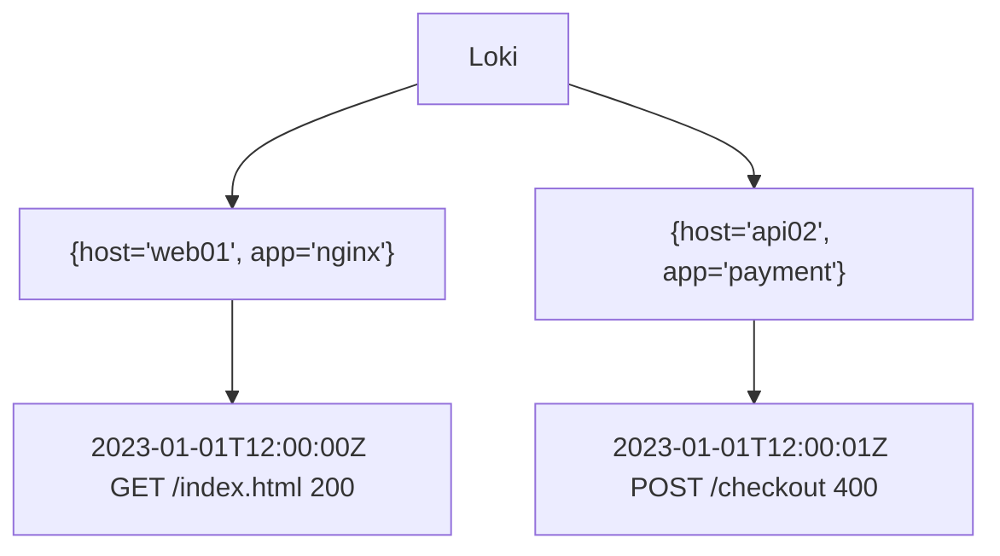

# Loki 数据模型

## 介绍

Grafana Loki是一个为日志聚合而设计的水平可扩展系统，其数据模型与传统日志系统（如ELK）有显著差异。Loki的数据模型围绕**标签（Labels）**和**日志流（Log Streams）**构建，这种设计使其能够高效存储和查询大规模日志数据。

:::tip 关键设计理念
Loki通过仅索引标签（而非日志内容）来降低存储开销，日志内容本身以压缩块形式存储。这种"索引轻量，存储密集"的模型是其高性能的核心。
:::

## 核心概念

### 1. 标签（Labels）

标签是键值对形式的元数据，用于描述和分类日志流。例如：

```plaintext
{job="nginx", env="production", region="us-west1"}
```

* **规则**：
  - 标签键只能包含字母、数字和下划线
  - 标签值可以是任意UTF-8字符
  - 单个流的标签组合必须唯一

:::caution 标签基数警告
避免高基数标签（如`user_id`或`ip_address`），这会导致性能下降。Loki最适合中等基数（`<1000`）的标签组合。
:::

### 2. 日志流（Log Streams）

具有相同标签集的日志条目组成一个**流**。例如，所有来自生产环境Nginx容器的日志：



### 3. 时间序列数据

Loki将每个日志流视为时间序列数据，每个条目包含：
- 时间戳（纳秒精度）
- 日志行内容
- 关联标签集

## 数据组织示例

假设我们有以下日志数据：

```plaintext
# 系统1
2023-01-01T12:00:00Z host="web01" app="nginx" "GET /index.html 200"

# 系统2
2023-01-01T12:00:01Z host="api02" app="payment" "POST /checkout 400"
```

在Loki中将被组织为：



## 查询模型

Loki使用LogQL查询语言，基于标签过滤日志：

```plaintext
{app="nginx"} |= "404"
```

这个查询会：
1. 通过标签`app="nginx"`找到所有相关流
2. 在这些流中搜索包含"404"的日志行

## 实际应用场景

### 案例：Kubernetes日志收集

典型的Kubernetes部署会产生如下标签：

```plaintext
{
  cluster="prod-us",
  namespace="default",
  pod="nginx-756d4dcb7-9fg2h",
  container="nginx"
}
```

查询特定Pod的错误日志：

```plaintext
{cluster="prod-us", namespace="default", pod="nginx-756d4dcb7-9fg2h"} |= "error"
```

### 案例：多服务日志关联

通过统一标签实现跨服务追踪：

```plaintext
# 前端服务
{service="frontend", trace_id="abc123"} "User login request"

# 后端服务
{service="backend", trace_id="abc123"} "Processing login for user123"
```

## 总结

Loki数据模型的关键特点：

1. **标签驱动**：所有查询和存储组织都基于标签
2. **流式存储**：相同标签的日志被分组存储
3. **内容不索引**：仅标签被索引，日志内容通过扫描查询
4. **时间序列导向**：日志作为带时间戳的事件处理

## 延伸学习

- 实践练习：尝试使用`docker-compose`搭建Loki实例，发送不同标签的日志并观察存储结构
- 进阶概念：研究Loki的`chunk`存储格式和TSDB索引
- 性能优化：学习如何设计有效的标签策略

:::note 最佳实践
生产环境中建议：
- 使用固定且有限的标签集
- 避免日志内容中出现敏感数据
- 为高频查询模式优化标签设计
:::