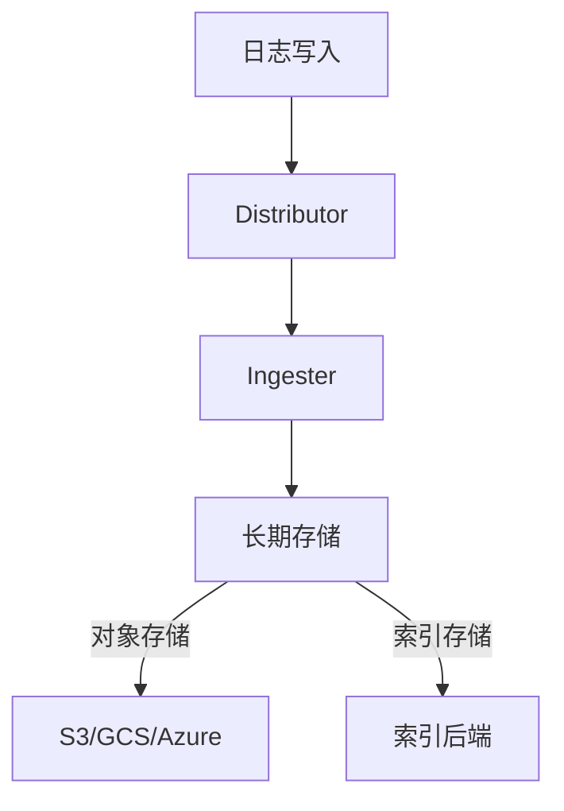

# Loki 日志存储

## 介绍

Grafana Loki是一个**水平可扩展、高可用、多租户**的日志聚合系统，专为存储和查询大规模日志数据而设计。与传统的ELK栈不同，Loki通过仅索引日志元数据（如标签）而非全文内容来优化存储效率，这使得它比传统方案更轻量且成本更低。

:::note 核心特点
- **标签索引**：仅索引日志流的元数据标签（如`job`, `pod`）
- **对象存储**：依赖S3/GCS等廉价存储后端
- **压缩分块**：日志以压缩块形式存储
:::

## 存储架构

Loki的存储分为两个关键部分：



1. **Distributor**：接收日志并验证数据
2. **Ingester**：将日志缓存在内存中，定期刷新到存储
3. **长期存储**：
   - 日志块：存储在对象存储中
   - 索引：存储在DynamoDB/Cassandra等

## 数据组织示例

假设我们有以下日志流：

```
{job="api", env="prod", pod="api-123"} "GET /users 200 12ms"
{job="api", env="prod", pod="api-456"} "POST /login 401 8ms"
```

Loki会：
1. 提取标签 `{job="api", env="prod", pod=~"api-.*"}`
2. 将日志内容压缩存储为块
3. 建立标签到存储位置的索引

## 实际操作

### 1. 配置存储后端

在`loki-config.yaml`中定义存储：

```yaml
storage_config:
  boltdb_shipper:
    active_index_directory: /loki/index
    shared_store: s3
  aws:
    s3: s3://loki-storage/us-east-1
```

### 2. 查询示例

使用LogQL查询特定标签的日志：

```sql
{job="api"} |= "error" | json | latency > 500ms
```

输出结果示例：
```
{"log":"...","stream":{"job":"api","pod":"api-123"},"time":"2023-01-01T12:00:00Z"}
```

## 实际应用场景

**电商平台监控**：
- 标签：`{service="checkout", region="us-east"}`
- 查询支付错误：
  ```sql
  {service="checkout"} |= "payment failed" | pattern `<ip> <method> <path> <status>`
  ```

## 性能优化技巧

:::tip 最佳实践
1. **合理使用标签**：避免高基数标签（如用户ID）
2. **日志格式统一**：使用JSON格式便于解析
3. **适当分块**：调整`chunk_block_size`（默认256KB）
:::

## 总结

Loki的存储设计通过以下方式实现高效：
- 分离索引与日志存储
- 利用廉价对象存储
- 基于标签的快速过滤

## 扩展学习

1. [官方存储文档](https://grafana.com/docs/loki/latest/storage/)
2. 练习：配置Loki使用本地MinIO作为存储后端
3. 比较：Loki与ELK的存储成本差异计算器