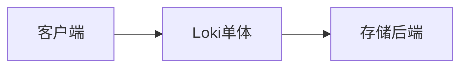
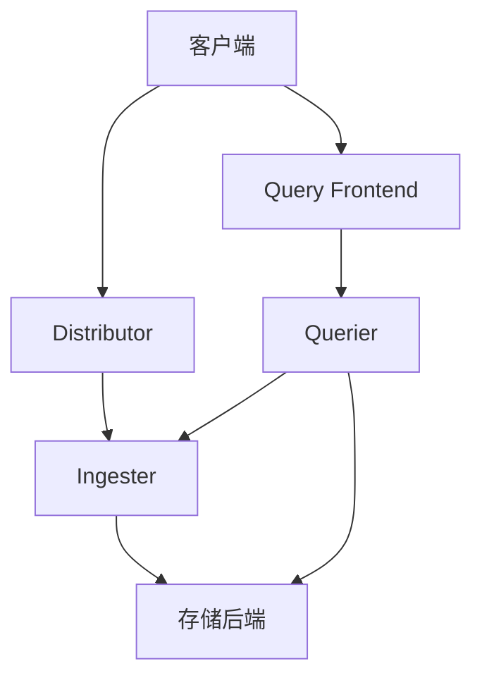
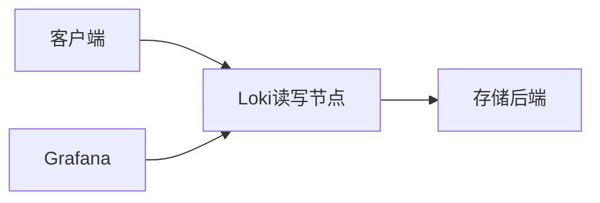
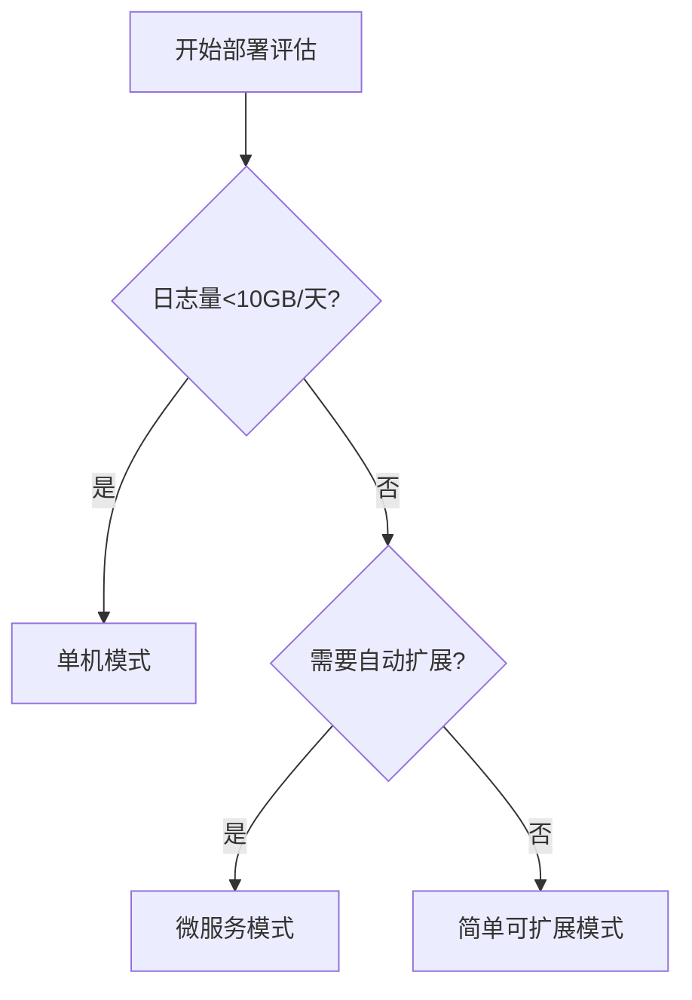

# Loki 部署方案概述

Grafana Loki是一个高效的日志聚合系统，专为云原生环境设计。与传统的日志系统相比，Loki通过仅索引元数据而非日志内容本身，显著降低了存储和计算开销。本章将介绍Loki的各种部署方案，帮助您根据实际需求选择最合适的架构。

## 为什么需要不同的部署方案？

Loki支持多种部署模式，主要基于以下考虑因素：
- **数据规模**：小规模日志处理与PB级日志的架构差异
- **可用性要求**：是否需要高可用容错机制
- **团队资源**：运维复杂度和硬件成本
- **环境特性**：云环境、本地数据中心或混合架构

:::tip 初学者建议
对于学习测试环境，推荐从单机模式开始；生产环境则应根据负载评估选择分布式方案。
:::

## 主要部署方案类型

### 1. 单机模式 (All-in-One)

最简单的部署方式，所有Loki组件运行在单个进程中：



**特点**：
- 使用`loki`二进制文件直接运行
- 内置Promtail（日志收集代理）
- 默认使用boltdb-shipper索引存储
- 适合开发、测试和小规模生产环境

**启动示例**：
```bash
./loki -config.file=loki-local-config.yaml
```

### 2. 微服务模式 (Microservices)

生产级部署方案，将组件拆分为独立服务：



**核心组件**：
- **Distributor**：处理日志写入请求
- **Ingester**：管理内存中的日志流
- **Querier**：执行日志查询
- **Query Frontend**：提供查询加速和缓存

**配置示例（Helm values.yaml片段）**：
```yaml
loki:
  distributed: true
  components:
    distributor:
      replicas: 2
    ingester:
      replicas: 3
    querier:
      replicas: 2
```

### 3. 简单可扩展模式 (Simple Scalable)

平衡复杂度和扩展性的折中方案：



**特点**：
- 读写操作通过同一组服务处理
- 可以水平扩展实例数量
- 比微服务模式更简单，比单机模式更可靠

## 存储后端选择

Loki支持多种存储后端，不同部署方案需要匹配相应的存储配置：

| 部署方案       | 推荐存储                     | 适用场景                 |
|----------------|----------------------------|-------------------------|
| 单机模式       | 本地文件系统                | 开发测试环境            |
| 微服务模式     | 对象存储(S3/GCS) + DynamoDB | 大规模生产环境          |
| 简单可扩展模式 | Cassandra或对象存储         | 中等规模生产环境        |

## 实际案例参考

**案例1：创业公司初期架构**
- 需求：低成本、易维护
- 方案：单机模式 + S3存储
- 配置：`loki`单进程运行在k8s Pod中，每日日志量约10GB

**案例2：电商平台日志系统**
- 需求：处理黑五期间100x流量增长
- 方案：微服务模式 + GCS存储
- 组件：10个Distributor实例，自动扩展Ingester集群

## 部署决策流程图



## 总结与下一步

通过本章学习，您应该已经了解：
- Loki三种主要部署架构的特点
- 不同规模场景下的方案选择依据
- 存储后端与部署方案的匹配关系

**推荐练习**：
1. 在本地Docker环境中尝试单机模式部署
2. 使用Helm chart部署微服务模式的最小化集群
3. 对比不同存储后端的查询性能差异

**延伸阅读**：
- Loki官方文档《Production Considerations》
- 《云原生日志系统设计模式》白皮书
- KubeCon演讲《Scaling Loki to PB-scale》

:::caution 注意事项
生产环境部署前务必进行：
- 负载测试
- 故障恢复演练
- 监控指标配置
:::