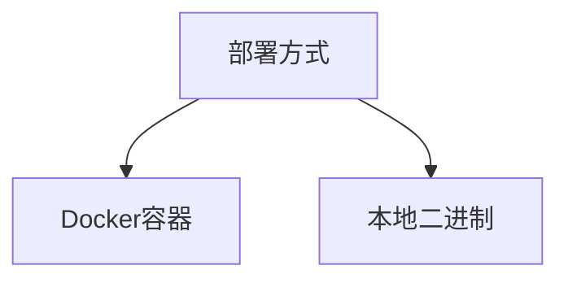
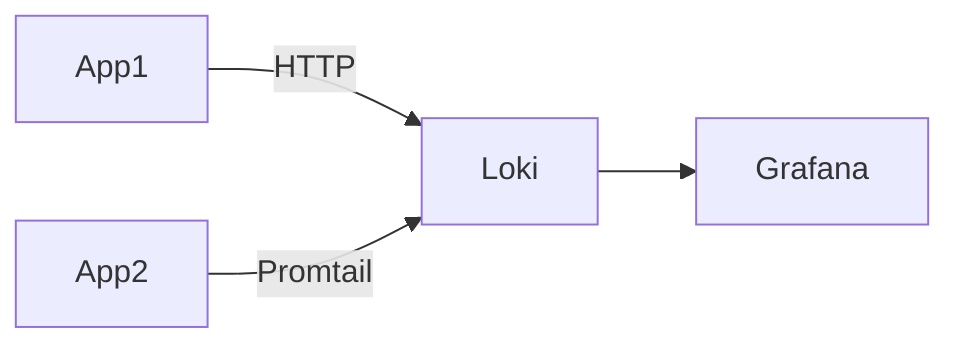

# Loki 单实例部署

Loki是Grafana实验室开发的水平可扩展、高可用性、多租户日志聚合系统。单实例部署模式适合开发测试环境，能快速验证功能而无需复杂配置。

## 为什么选择单实例部署？

单实例部署具有以下特点：
- **零依赖**：不需要分布式存储（如S3/GCS）
- **快速启动**：使用本地文件系统存储索引和日志
- **全功能**：支持所有查询操作（LogQL）
- **资源占用低**：适合本地开发机运行

:::note 生产环境警告
单实例部署不适用于生产环境，因为：
- 没有数据冗余
- 无法水平扩展
- 重启可能导致数据丢失
:::

## 部署准备

### 系统要求
- 2核CPU
- 2GB内存
- 10GB磁盘空间（取决于日志量）
- Docker或本地二进制

### 两种部署方式



## Docker部署方案

这是最简单的启动方式：

```bash
docker run -d --name loki \
  -v /path/to/config:/etc/loki \
  -v /path/to/storage:/loki \
  -p 3100:3100 \
  grafana/loki:latest \
  -config.file=/etc/loki/loki-config.yaml
```

### 配置文件示例

创建`loki-config.yaml`：

```yaml
auth_enabled: false

server:
  http_listen_port: 3100

common:
  path_prefix: /loki
  storage:
    filesystem:
      chunks_directory: /loki/chunks
      rules_directory: /loki/rules
  replication_factor: 1
  ring:
    instance_addr: 127.0.0.1
    kvstore:
      store: inmemory

schema_config:
  configs:
    - from: 2020-10-24
      store: boltdb-shipper
      object_store: filesystem
      schema: v11
      index:
        prefix: index_
        period: 24h

storage_config:
  boltdb_shipper:
    active_index_directory: /loki/boltdb-shipper-active
    cache_location: /loki/boltdb-shipper-cache
    cache_ttl: 24h
    shared_store: filesystem

limits_config:
  enforce_metric_name: false
  reject_old_samples: true
  reject_old_samples_max_age: 168h
```

## 本地二进制部署

### 下载Loki
从[Grafana官网](https://grafana.com/oss/loki/)下载对应平台的二进制文件，或使用以下命令：

```bash
# Linux
curl -O -L "https://github.com/grafana/loki/releases/download/v2.7.3/loki-linux-amd64.zip"
unzip loki-linux-amd64.zip
chmod a+x loki-linux-amd64
```

### 启动命令
```bash
./loki-linux-amd64 -config.file=loki-config.yaml
```

## 验证部署

检查服务状态：
```bash
curl http://localhost:3100/ready
```
预期输出：
```
ready
```

查询版本信息：
```bash
curl http://localhost:3100/loki/api/v1/status/buildinfo
```

## 连接Grafana

1. 在Grafana中添加数据源
2. 选择"Loki"类型
3. 配置URL为`http://localhost:3100`
4. 保存并测试连接

:::tip 快速测试
使用Grafana Explore界面尝试基础查询：
```
{container="your-container-name"}
```
:::

## 日志推送示例

使用Promtail或Loki的HTTP API推送日志：

```bash
echo '{"streams": [{"stream": {"label": "value"}, "values": [["'$(date +%s%N)'", "sample log line"]]}]}' | \
gzip | \
curl -v -H "Content-Type: application/json" -H "Content-Encoding: gzip" -X POST -s --data-binary @- http://localhost:3100/loki/api/v1/push
```

## 实际应用场景

**开发环境日志收集**：
- 本地Kubernetes（minikube/k3d）日志聚合
- 单机应用日志集中存储
- CI/CD流水线中的临时日志分析



## 总结

单实例Loki部署提供了：
- 快速上手的开发环境
- 完整的日志查询功能
- 本地存储的简易管理
- 与Grafana的无缝集成

## 后续学习

1. 尝试使用Promtail配置日志采集
2. 学习LogQL基础查询语法
3. 探索Loki的日志保留策略配置
4. 了解多实例Loki集群部署方案

:::caution 数据持久化
默认配置下，Docker容器删除会导致数据丢失。如需持久化，请确保：
- 正确挂载存储卷
- 定期备份`/loki`目录
:::