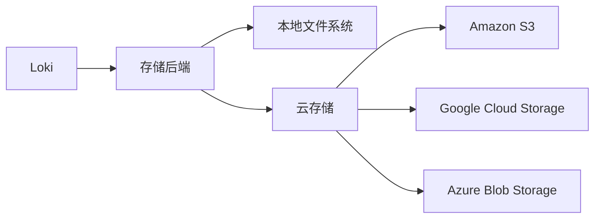

# Loki 启动参数

## 介绍

Grafana Loki的启动参数是控制其运行时行为的关键配置项。这些参数允许你自定义Loki的存储后端、日志摄取方式、查询性能等核心功能。对于初学者来说，理解这些参数能帮助你：

1. 快速搭建开发测试环境
2. 优化生产环境配置
3. 排查运行时问题

Loki支持两种参数传递方式：
- 命令行参数（本文重点）
- 配置文件（通常用于复杂配置）

:::tip
生产环境推荐结合使用配置文件，但开发时命令行参数更快捷。
:::

## 核心参数分类

### 1. 基本运行参数

| 参数 | 说明 | 示例值 |
|------|------|--------|
| `-config.file` | 指定配置文件路径 | `/etc/loki/local-config.yaml` |
| `-log.level` | 日志级别(debug/info/warn/error) | `info` |
| `-server.http-listen-port` | HTTP服务端口 | `3100` |
| `-server.grpc-listen-port` | gRPC服务端口 | `9095` |

示例启动命令：
```bash
./loki -config.file=/etc/loki/config.yaml -log.level=debug
```

### 2. 存储配置参数



关键参数：
- `-storage.filesystem.chunks-directory`: 本地块存储目录
- `-storage.s3.bucketnames`: S3存储桶名称
- `-storage.gcs.bucketname`: GCS存储桶名称

### 3. 分布式模式参数

当部署Loki集群时需要关注：
- `-memberlist.join`: 加入的集群成员地址
- `-distributor.replication-factor`: 日志副本数
- `-ingester.ring.replication-factor`: 写入副本数

:::caution
分布式部署需要额外配置Consul或Etcd等协调服务。
:::

## 实际案例

### 开发环境快速启动

```bash
./loki \
  -config.file=./loki-local-config.yaml \
  -log.level=debug \
  -storage.filesystem.chunks-directory=./chunks \
  -storage.filesystem.rules-directory=./rules
```

### 生产环境S3存储配置

```bash
./loki \
  -config.expand-env=true \
  -storage.s3.bucketnames=${LOKI_BUCKET} \
  -storage.s3.region=${AWS_REGION} \
  -storage.s3.access-key-id=${AWS_ACCESS_KEY} \
  -storage.s3.secret-access-key=${AWS_SECRET_KEY}
```

## 调试技巧

常用调试参数组合：
```bash
./loki \
  -log.level=debug \
  -debug.block-profile-rate=10 \
  -debug.mutex-profile-fraction=10
```

:::warning
调试参数会显著影响性能，仅限临时使用。
:::

## 总结

通过本文你学习了：
- Loki启动参数的基本分类和作用
- 开发与生产环境的典型配置
- 分布式部署的关键参数
- 性能调试的特殊参数

## 延伸学习

建议练习：
1. 尝试不同日志级别观察输出差异
2. 比较本地存储与云存储的启动参数区别
3. 使用`-help`参数查看完整参数列表

官方资源：
- [Loki命令行参数文档](https://grafana.com/docs/loki/latest/configuration/#arguments)
- [存储后端配置指南](https://grafana.com/docs/loki/latest/storage/)