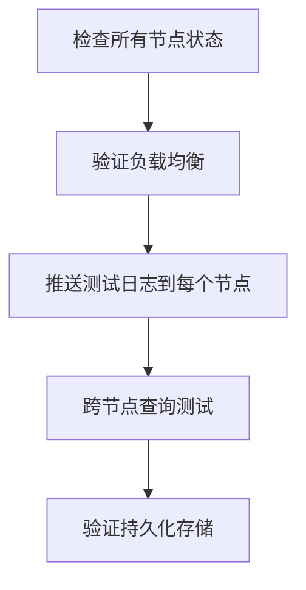

# Loki 部署验证

## 介绍

在完成Grafana Loki的部署后，验证其是否正常运行是至关重要的步骤。本章将指导您通过一系列检查来确认Loki组件是否按预期工作，包括服务健康状态检查、日志摄取测试和查询验证。我们还将介绍常见问题及其解决方案。

---

## 基础健康检查

### 1. 检查Loki服务状态

使用`systemctl`或`kubectl`（如果部署在Kubernetes中）验证服务状态：

```bash
# 使用systemctl（单机部署）
systemctl status loki

# 使用kubectl（Kubernetes部署）
kubectl get pods -n loki
```

预期输出应显示服务状态为`active (running)`或Pod状态为`Running`。

### 2. 访问Loki API

Loki提供健康检查API端点：

```bash
curl http://localhost:3100/ready
```

成功响应应为 `ready`。

:::tip
如果使用Kubernetes，可能需要通过端口转发访问服务：
```bash
kubectl port-forward -n loki service/loki 3100:3100
```
:::

---

## 日志摄取测试

### 1. 推送测试日志

使用Loki的Push API发送测试日志：

```bash
curl -v -H "Content-Type: application/json" -XPOST \
  -s "http://localhost:3100/loki/api/v1/push" \
  --data-raw '{"streams": [{ "stream": { "test": "true" }, "values": [ [ "'$(date +%s%N)'", "测试日志消息" ] ] }]}'
```

### 2. 验证日志存储

通过LogCLI或Grafana验证日志是否被正确存储：

```bash
logcli query '{test="true"}' --limit=1
```

预期输出应包含您发送的测试日志消息。

---

## 查询验证

### 1. 基础LogQL查询

在Grafana中或使用LogCLI执行简单查询：

```bash
logcli query '{job="varlogs"}' --limit=5
```

### 2. 指标查询

验证指标是否能正确计算：

```bash
logcli query 'rate({job="varlogs"} [5m])'
```

:::note
如果使用Docker或Kubernetes部署，`job`标签可能为`docker`或`kubernetes`。
:::

---

## 实际案例：验证生产部署

假设您已经部署了一个多节点的Loki集群，以下是完整的验证流程：



1. 检查每个节点的`/ready`端点
2. 通过多个客户端并发推送日志
3. 查询时应能获取所有节点的日志数据

---

## 常见问题排查

### 1. 连接被拒绝

错误示例：
```bash
curl: (7) Failed to connect to localhost port 3100: Connection refused
```

解决方案：
- 确认Loki进程正在运行
- 检查防火墙设置
- 验证配置文件中的`server.http_listen_port`

### 2. 查询返回空结果

可能原因：
- 日志未被正确标记
- 查询时间范围不正确
- 存储配置有问题

调试方法：
```bash
# 查看已存储的标签
logcli labels
```

---

## 总结

通过本章学习，您应该能够：
- 检查Loki服务的基本健康状态
- 验证日志摄取功能
- 执行基础查询测试
- 排查常见部署问题

## 延伸练习

1. 尝试部署一个包含3个Loki实例的微服务集群并验证高可用性
2. 配置日志保留策略并验证其效果
3. 模拟网络分区场景并观察系统行为

## 附加资源

- [Loki官方文档 - 部署验证](https://grafana.com/docs/loki/latest/operations/observability/)
- [LogCLI使用手册](https://grafana.com/docs/loki/latest/getting-started/logcli/)