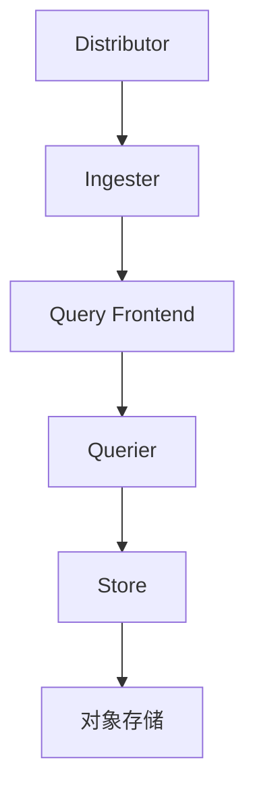
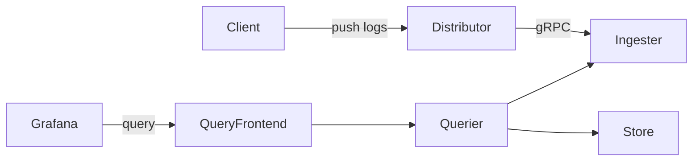

# Loki 微服务部署

## 介绍

Grafana Loki是一个水平可扩展、高可用的多租户日志聚合系统，专为微服务架构设计。与单体部署不同，**微服务部署模式**将Loki拆分为独立组件，每个组件专注于特定功能，适合生产环境的高负载需求。这种架构提供更好的扩展性、容错性和资源隔离。

:::note 关键特点
- 组件解耦：读写路径分离
- 独立扩展：按需扩展高负载组件
- 故障隔离：单个组件故障不影响整体
:::

## 核心组件

Loki微服务模式包含以下主要组件：



1. **Distributor**：日志入口，负责验证和分发日志
2. **Ingester**：处理日志流并写入存储
3. **Query Frontend**：查询请求的负载均衡和缓存
4. **Querier**：执行日志查询
5. **Store**：长期存储（通常使用对象存储）

## 部署步骤

### 1. 准备工作

确保已安装：
- Kubernetes集群（或Docker Swarm）
- `helm`（Kubernetes包管理器）
- 对象存储（如S3、GCS或MinIO）

### 2. Helm Chart配置

使用官方Loki Stack Chart：

```bash
helm repo add grafana https://grafana.github.io/helm-charts
helm repo update
```

创建`values-microservices.yaml`配置文件：

```yaml
loki:
  auth_enabled: false
  commonConfig:
    replication_factor: 3
  distributor:
    replicas: 2
  ingester:
    replicas: 3
    persistence:
      enabled: true
      size: 10Gi
  querier:
    replicas: 2
  queryFrontend:
    replicas: 2
  storage:
    bucketNames:
      chunks: loki-chunks
      ruler: loki-ruler
      admin: loki-admin
    type: s3
    s3:
      endpoint: minio.example.com
      region: us-east-1
      secretAccessKey: ""
      accessKeyId: ""
```

### 3. 部署到Kubernetes

执行部署命令：

```bash
helm install loki grafana/loki-stack \
  -n loki --create-namespace \
  -f values-microservices.yaml
```

验证部署状态：

```bash
kubectl -n loki get pods
```

预期输出应显示所有组件运行中：

```
NAME                            READY   STATUS    RESTARTS   AGE
loki-distributor-xxx            1/1     Running   0          2m
loki-ingester-xxx               1/1     Running   0          2m
loki-querier-xxx                1/1     Running   0          2m
```

### 4. 连接Grafana

在Grafana中添加Loki数据源：
1. 访问Grafana控制台
2. 导航到`Configuration > Data Sources`
3. 添加Loki数据源，URL设为`http://loki-query-frontend:3100`

## 配置详解

### 网络拓扑



### 关键参数说明

| 参数 | 描述 | 生产建议 |
|------|------|----------|
| `replication_factor` | 日志副本数 | ≥3 |
| `ingester.ring.replication_factor` | 写入副本数 | 与`replication_factor`一致 |
| `chunk_target_size` | 存储块大小 | 1MB-5MB |
| `retention_period` | 日志保留时间 | 根据存储容量设置 |

## 实际案例：电商平台日志系统

**场景需求**：
- 每日处理TB级日志
- 高峰时段突发流量处理
- 多团队共享日志系统

**解决方案**：
```yaml
# 定制化配置
queryFrontend:
  maxOutstandingPerTenant: 1000
  replicas: 4
distributor:
  rateLimit: 100MB/s
  replicas: 3
ingester:
  chunk_idle_period: 1h
  max_transfer_retries: 10
```

**效果**：
- 读写分离，避免查询影响日志摄入
- 自动扩展处理流量高峰
- 租户隔离保障多团队使用

## 常见问题

:::caution 注意
1. **时钟同步**：所有节点必须时间同步（使用NTP）
2. **存储配置**：确保对象存储权限正确
3. **资源限制**：为JVM设置合理内存限制（`-Xmx`参数）
:::

## 总结

微服务部署模式是Loki在生产环境中的推荐架构，它通过：
- 组件解耦实现独立扩展
- 读写分离优化性能
- 冗余设计提高可用性

## 扩展学习

**推荐练习**：
1. 尝试扩展Ingester组件并观察性能变化
2. 配置多租户认证
3. 测试故障转移机制

**官方资源**：
- [Loki微服务架构文档](https://grafana.com/docs/loki/latest/fundamentals/architecture/microservices/)
- [生产环境调优指南](https://grafana.com/docs/loki/latest/operations/tuning/)