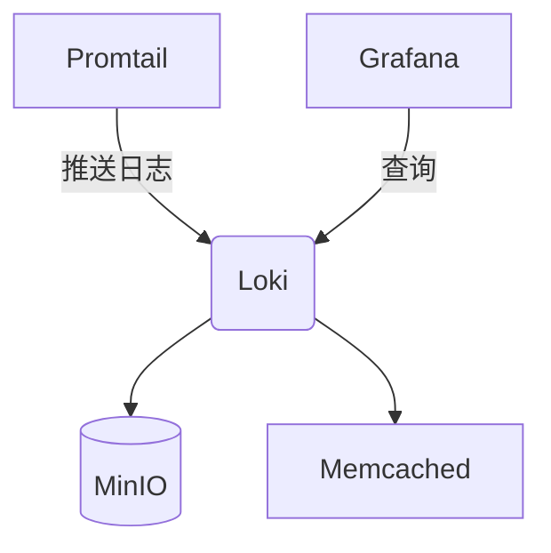

# Loki 容器化部署

容器化部署是现代基础设施管理的核心实践之一。Grafana Loki作为轻量级日志聚合系统，原生支持容器化部署方式。本章将指导您通过Docker完成Loki的容器化部署。

## 为什么选择容器化部署？

容器化部署为Loki带来以下优势：
- **环境一致性**：消除"在我机器上能运行"的问题
- **快速部署**：通过镜像快速启动服务
- **资源隔离**：避免与其他系统组件冲突
- **易于扩展**：配合编排系统实现弹性伸缩

## 前置准备

开始前请确保：
1. 已安装Docker引擎（版本20.10+）
2. 系统内存至少4GB（生产环境建议8GB+）
3. 磁盘空间10GB以上（根据日志量调整）

:::tip
测试环境可使用Docker Desktop，生产环境建议使用Docker Engine配合systemd管理
:::

## 单节点部署方案

最简单的部署方式是单节点模式，适合开发和测试环境。

### 1. 拉取Loki镜像

```bash
docker pull grafana/loki:2.8.0
docker pull grafana/promtail:2.8.0
```

### 2. 创建配置文件

创建`loki-config.yaml`：

```yaml
auth_enabled: false

server:
  http_listen_port: 3100
  grpc_listen_port: 9096

common:
  path_prefix: /tmp/loki
  storage:
    filesystem:
      chunks_directory: /tmp/loki/chunks
      rules_directory: /tmp/loki/rules
  replication_factor: 1
  ring:
    instance_addr: 127.0.0.1
    kvstore:
      store: inmemory

schema_config:
  configs:
    - from: 2020-10-24
      store: boltdb-shipper
      object_store: filesystem
      schema: v11
      index:
        prefix: index_
        period: 24h

ruler:
  alertmanager_url: http://localhost:9093
```

### 3. 启动Loki容器

```bash
docker run -d --name loki \
  -v $(pwd)/loki-config.yaml:/etc/loki/local-config.yaml \
  -p 3100:3100 \
  grafana/loki:2.8.0 \
  -config.file=/etc/loki/local-config.yaml
```

### 4. 验证部署

检查服务状态：

```bash
curl http://localhost:3100/ready
```
应返回：
```
ready
```

## 分布式部署方案

生产环境建议采用分布式架构，主要组件包括：
- Loki：主服务器
- Promtail：日志收集代理
- MinIO：对象存储
- Memcached：缓存



### 1. 编写docker-compose.yml

```yaml
version: '3'

services:
  loki:
    image: grafana/loki:2.8.0
    ports:
      - "3100:3100"
    command: -config.file=/etc/loki/config.yaml
    volumes:
      - ./loki-config.yaml:/etc/loki/config.yaml
    depends_on:
      - minio
      - memcached

  promtail:
    image: grafana/promtail:2.8.0
    volumes:
      - ./promtail-config.yaml:/etc/promtail/config.yaml
      - /var/log:/var/log
    command: -config.file=/etc/promtail/config.yaml

  minio:
    image: minio/minio
    environment:
      MINIO_ROOT_USER: loki
      MINIO_ROOT_PASSWORD: supersecret
    command: server /data
    ports:
      - "9000:9000"
      - "9001:9001"

  memcached:
    image: memcached:1.6-alpine
    ports:
      - "11211:11211"
```

### 2. 修改Loki配置

更新`loki-config.yaml`的存储部分：

```yaml
storage:
  boltdb_shipper:
    shared_store: s3
    active_index_directory: /tmp/loki/boltdb-shipper-active
    cache_location: /tmp/loki/boltdb-shipper-cache
  aws:
    s3: http://minio:9000
    s3forcepathstyle: true
    insecure: true
    access_key_id: loki
    secret_access_key: supersecret
```

### 3. 启动集群

```bash
docker-compose up -d
```

## 实际应用案例

**电商平台日志收集**：
1. 每个微服务容器部署Promtail边车(sidecar)
2. Loki集群收集所有服务日志
3. Grafana展示交易链路日志
4. 设置告警规则监控支付异常

## 常见问题解决

:::caution 内存不足
如果看到`too many open files`错误，需要调整系统限制：
```bash
sudo sysctl -w fs.file-max=2097152
```
:::

:::warning 数据持久化
默认配置使用临时存储，重启会丢失数据。生产环境必须：
1. 挂载持久化卷
2. 配置外部对象存储
:::

## 总结与进阶

您已经学会了：
- Loki单节点容器化部署
- 分布式生产级部署架构
- 基本问题排查方法

**延伸学习**：
1. 尝试集成Grafana可视化
2. 研究Kubernetes中的Loki Operator
3. 探索日志保留策略配置

练习建议：
1. 部署Promtail收集Nginx日志
2. 配置基于日志的告警规则
3. 测试不同压缩算法对性能的影响