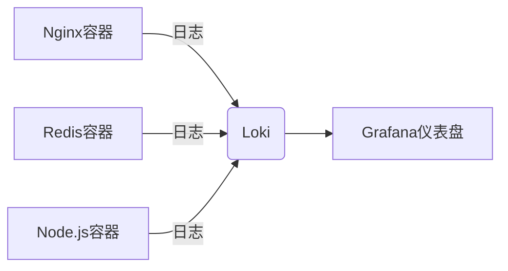

# Loki 与Docker集成

## 介绍

Grafana Loki是一个轻量级的日志聚合系统，专为容器化环境设计。与Docker集成后，Loki可以高效地收集、存储和查询容器日志，帮助开发者快速定位问题。本章将指导您完成Loki与Docker的集成步骤，并通过实际案例展示其应用场景。

## 前置条件

1. 已安装Docker和Docker Compose。
2. 了解基础的Docker命令和概念。
3. 熟悉Grafana Loki的基本架构（如Distributor、Ingester等组件）。

---

## 步骤1：配置Docker日志驱动

Docker默认将日志存储在本地文件中，但可以通过配置日志驱动（Logging Driver）将日志直接发送到Loki。

### 修改Docker守护进程配置

编辑 `/etc/docker/daemon.json` 文件（若不存在则创建），添加Loki作为日志驱动：

```json
{
  "log-driver": "loki",
  "log-opts": {
    "loki-url": "http://localhost:3100/loki/api/v1/push",
    "loki-batch-size": "400"
  }
}
```

重启Docker服务以应用配置：

```bash
sudo systemctl restart docker
```

:::tip
若需为特定容器单独配置Loki驱动，可在运行容器时使用 `--log-driver` 参数：

```bash
docker run --log-driver=loki --log-opt loki-url="http://localhost:3100/loki/api/v1/push" nginx
```
:::

---

## 步骤2：使用Docker Compose部署Loki

以下是一个包含Loki和Promtail的 `docker-compose.yml` 示例，用于完整日志收集：

```yaml
version: "3"

services:
  loki:
    image: grafana/loki:latest
    ports:
      - "3100:3100"
    command: -config.file=/etc/loki/local-config.yaml

  promtail:
    image: grafana/promtail:latest
    volumes:
      - /var/lib/docker/containers:/var/lib/docker/containers:ro
      - /var/run/docker.sock:/var/run/docker.sock
    command: -config.file=/etc/promtail/docker-config.yaml
```

:::note
`promtail` 是Loki的日志收集代理，负责读取Docker容器日志并推送到Loki。
:::

---

## 步骤3：验证日志收集

1. 启动一个测试容器并生成日志：

```bash
docker run --name test-container busybox echo "Hello, Loki!"
```

2. 查询Loki中的日志：

使用Grafana的Explore界面或直接调用Loki API：

```bash
curl -G "http://localhost:3100/loki/api/v1/query" --data-urlencode 'query={container_name="test-container"}'
```

输出示例：

```json
{
  "streams": [
    {
      "labels": "{container_name=\"test-container\"}",
      "entries": [
        {
          "timestamp": "2023-01-01T00:00:00Z",
          "line": "Hello, Loki!"
        }
      ]
    }
  ]
}
```

---

## 实际案例：监控微服务日志

假设您有一个由多个Docker容器组成的微服务应用（如Nginx、Redis、Node.js），以下是集成Loki后的日志管理流程：



1. **配置所有容器的日志驱动为Loki**。
2. **在Grafana中创建仪表盘**，使用LogQL查询特定服务的错误日志：

```logql
{container_name=~"nginx|redis"} |= "error"
```

---

## 常见问题

### 1. 日志未显示在Loki中？
- 检查Docker日志驱动配置是否正确。
- 确保Promtail有权限访问 `/var/lib/docker/containers`。

### 2. 如何调整日志保留时间？
在Loki配置文件中修改 `table_manager` 的保留策略：

```yaml
table_manager:
  retention_deletes_enabled: true
  retention_period: 168h # 7天
```

---

## 总结

通过将Loki与Docker集成，您可以实现：
- **集中式日志管理**：所有容器日志统一存储。
- **高效查询**：使用LogQL快速过滤日志。
- **低资源开销**：Loki的索引设计比传统方案更轻量。

## 延伸练习

1. 尝试为多容器应用配置Loki日志收集。
2. 在Grafana中创建告警规则，当检测到 `ERROR` 日志时触发通知。

## 附加资源

- [Loki官方文档](https://grafana.com/docs/loki/latest/)
- [Docker日志驱动配置指南](https://docs.docker.com/config/containers/logging/configure/)