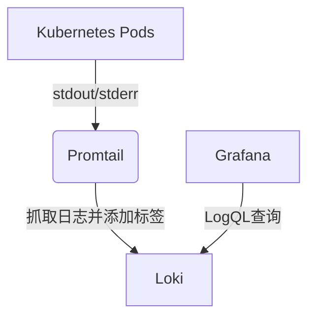

# Loki 与Kubernetes集成

## 介绍

Grafana Loki是一个轻量级的日志聚合系统，专为Kubernetes等云原生环境设计。与Kubernetes集成后，Loki可以无缝收集、存储和查询容器日志，同时保持低资源消耗。本章将指导您完成Loki在Kubernetes中的部署和基础配置。

:::note 为什么选择Loki？
- **低开销**：不索引日志内容，仅索引元数据（如Pod标签）
- **原生Kubernetes支持**：通过Promtail自动发现并收集Pod日志
- **Grafana集成**：直接在Grafana中查询日志
:::

---

## 前置条件

开始前请确保：
1. 运行中的Kubernetes集群（Minikube或生产环境均可）
2. `kubectl` 已配置并可以访问集群
3. Helm 3 已安装（推荐方式）

验证环境：
```bash
kubectl get nodes
helm version
```

---

## 部署步骤

### 1. 添加Loki Helm仓库
```bash
helm repo add grafana https://grafana.github.io/helm-charts
helm repo update
```

### 2. 安装Loki Stack（包含Promtail）
```bash
helm upgrade --install loki grafana/loki-stack \
  --namespace=loki \
  --create-namespace \
  --set promtail.enabled=true
```

:::tip 生产环境建议
添加 `--values custom-values.yaml` 指定持久化存储和资源限制：
```yaml
# custom-values.yaml 示例
loki:
  persistence:
    enabled: true
    storageClassName: "standard"
    size: 50Gi
  resources:
    limits:
      memory: 4Gi
```
:::

### 3. 验证安装
检查Pod状态：
```bash
kubectl -n loki get pods
```
预期输出：
```
NAME                           READY   STATUS    RESTARTS   AGE
loki-0                         1/1     Running   0          2m
promtail-abcde                 1/1     Running   0          2m
```

---

## 核心组件交互



1. **Promtail**：运行在每个节点上的DaemonSet，负责：
   - 自动发现Pod日志文件
   - 附加Kubernetes标签（namespace, pod_name等）
   - 将日志推送到Loki

2. **Loki**：接收并存储日志数据

3. **Grafana**：通过LogQL查询日志

---

## 实际案例：调试Nginx日志

### 场景
查看`ingress-nginx`命名空间下所有Pod的ERROR日志

### 步骤
1. 在Grafana中添加Loki数据源（URL: `http://loki.loki:3100`）
2. 使用LogQL查询：
```logql
{namespace="ingress-nginx"} |= "ERROR"
```

### 输出示例
```
2023-01-01T12:00:00Z nginx-ingress-abc123 ERROR: Failed to reload config
2023-01-01T12:01:00Z nginx-ingress-def456 ERROR: 502 Bad Gateway
```

---

## 常见问题处理

:::caution 问题1：Promtail无法收集日志
检查项：
- 确认Promtail有节点读写权限
- 查看Promtail日志：
```bash
kubectl logs -n loki -l app=promtail
```
:::

:::warning 问题2：Loki存储空间不足
解决方案：
- 扩展PVC容量
- 调整保留策略：
```yaml
loki:
  config:
    table_manager:
      retention_deletes_enabled: true
      retention_period: 720h # 30天
```
:::

---

## 总结

通过本章您已经学会：
- 使用Helm在Kubernetes部署Loki全家桶
- 理解Promtail的自动发现机制
- 执行基础LogQL查询
- 处理常见运维问题

## 扩展练习
1. 为Loki配置S3兼容的持久化存储
2. 创建告警规则，当检测到"OutOfMemory"错误时触发通知
3. 比较Loki与EFK的资源消耗差异

## 附加资源
- [官方Helm Chart配置项](https://grafana.com/docs/loki/latest/setup/helm/)
- [LogQL完整语法](https://grafana.com/docs/loki/latest/logql/)
- [Kubernetes标签最佳实践](https://kubernetes.io/docs/concepts/overview/working-with-objects/labels/)