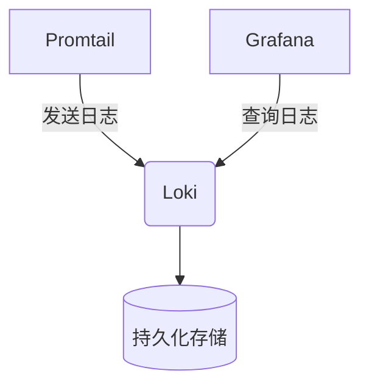

# Loki 的Helm部署

## 介绍

Helm是Kubernetes的包管理工具，它允许您轻松部署和管理应用程序。Grafana Loki是一个水平可扩展、高可用性、多租户的日志聚合系统，专门用于存储和查询日志数据。通过Helm部署Loki，您可以快速在Kubernetes集群中设置完整的Loki栈。

## 先决条件

在开始之前，请确保您已具备以下条件：

- 已安装并配置好Kubernetes集群
- 已安装Helm (v3或更高版本)
- 具有集群管理员权限的kubectl访问权限

## 添加Loki Helm仓库

首先，我们需要将Grafana的Helm仓库添加到本地：

```bash
helm repo add grafana https://grafana.github.io/helm-charts
helm repo update
```

## 基本部署

最简单的Loki部署可以使用以下命令完成：

```bash
helm upgrade --install loki grafana/loki-stack \
  --namespace=loki \
  --create-namespace
```

这个命令会：
1. 创建一个名为`loki`的命名空间
2. 部署Loki和Promtail（用于收集日志的代理）
3. 使用默认配置参数

## 自定义部署

大多数生产环境需要自定义配置。您可以创建一个`values.yaml`文件来覆盖默认设置：

```yaml
loki:
  config:
    auth_enabled: false
    ingester:
      lifecycler:
        ring:
          kvstore:
            store: inmemory
          replication_factor: 1
    schema_config:
      configs:
        - from: 2020-10-24
          store: boltdb-shipper
          object_store: filesystem
          schema: v11
          index:
            prefix: index_
            period: 24h
```

然后使用自定义值进行安装：

```bash
helm upgrade --install loki grafana/loki-stack \
  --namespace=loki \
  --create-namespace \
  -f values.yaml
```

## 部署组件说明

Loki Helm chart包含多个组件：

1. **Loki** - 日志聚合系统核心
2. **Promtail** - 日志收集代理（默认在所有节点上部署为DaemonSet）
3. **Grafana** - 可视化工具（可选）

:::tip
生产环境中，您可能希望单独部署这些组件以获得更好的控制和灵活性。
:::

## 验证部署

部署完成后，检查Pod状态：

```bash
kubectl get pods -n loki
```

预期输出应显示所有Pod都处于`Running`状态：

```
NAME                            READY   STATUS    RESTARTS   AGE
loki-0                          1/1     Running   0          2m
promtail-abc12                  1/1     Running   0          2m
```

## 访问Loki

要访问Loki服务，您可以创建一个端口转发：

```bash
kubectl port-forward --namespace loki service/loki 3100:3100
```

现在，您可以在本地通过`http://localhost:3100`访问Loki。

## 实际应用案例

假设您有一个Web应用程序运行在Kubernetes集群中，您可以使用以下配置让Promtail收集这些日志：

```yaml
promtail:
  config:
    clients:
      - url: http://loki:3100/loki/api/v1/push
    scrape_configs:
    - job_name: kubernetes-pods
      kubernetes_sd_configs:
        - role: pod
      pipeline_stages:
        - docker: {}
      relabel_configs:
        - source_labels: [__meta_kubernetes_namespace]
          target_label: namespace
        - source_labels: [__meta_kubernetes_pod_name]
          target_label: pod
```

## 扩展部署

对于高可用性设置，您可以考虑：

1. 增加Loki副本数
2. 配置持久化存储
3. 设置适当的资源限制



## 总结

通过Helm部署Loki提供了一种快速、可重复的方式来设置日志聚合系统。您可以从简单的单节点部署开始，然后根据需要扩展到更复杂的生产配置。

## 附加资源

1. [官方Loki Helm Chart文档](https://grafana.com/docs/loki/latest/installation/helm/)
2. [Helm官方文档](https://helm.sh/docs/)
3. [Kubernetes日志收集最佳实践](https://kubernetes.io/docs/concepts/cluster-administration/logging/)

## 练习

1. 使用Helm部署Loki到您的测试集群
2. 自定义values.yaml文件以更改存储后端
3. 配置Promtail收集特定命名空间的应用程序日志
4. 验证日志是否能够正确查询

:::note
在生产环境中部署前，请务必在测试环境中验证您的配置。
:::