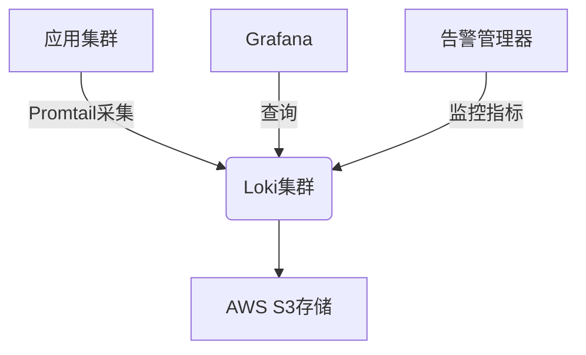

# Loki 云端部署

## 介绍

Grafana Loki是一个水平可扩展、高可用的多租户日志聚合系统，专为云原生环境设计。云端部署Loki能充分利用云平台的基础设施优势，如自动扩展、持久存储和托管服务。本指南将介绍在AWS、GCP和Azure三大云平台部署Loki的核心方法。

:::tip 为什么选择云端部署？
- **弹性扩展**：根据日志量自动调整资源<br />
- **托管服务集成**：轻松对接云存储和认证服务<br />
- **高可用性**：利用云平台的多区域部署能力
:::

---

## 前置准备

在开始前请确保：
1. 拥有目标云平台的账户和CLI工具配置
2. 安装 `helm` 和 `kubectl`（Kubernetes部署场景）
3. 了解基础的容器和Kubernetes概念

```bash
# 验证helm安装
helm version --short
# 预期输出示例: v3.11.1+g293b50c
```

---

## AWS部署方案

### 使用EKS部署

1. 创建S3存储桶用于日志存储：
```bash
aws s3api create-bucket --bucket my-loki-storage --region us-west-2
```

2. 通过Helm安装Loki Stack：
```bash
helm repo add grafana https://grafana.github.io/helm-charts
helm install loki grafana/loki-stack \
  --set loki.config.storage.aws.bucketnames=my-loki-storage \
  --set loki.config.storage.aws.region=us-west-2
```

### IAM权限配置
创建具有以下权限的IAM策略：
```json
{
  "Version": "2012-10-17",
  "Statement": [
    {
      "Effect": "Allow",
      "Action": [
        "s3:ListBucket",
        "s3:PutObject",
        "s3:GetObject",
        "s3:DeleteObject"
      ],
      "Resource": [
        "arn:aws:s3:::my-loki-storage",
        "arn:aws:s3:::my-loki-storage/*"
      ]
    }
  ]
}
```

---

## GCP部署方案

### 使用GKE部署

1. 创建Google Cloud Storage桶：
```bash
gsutil mb -l us-central1 gs://my-loki-data
```

2. 使用Helm配置GCS后端：
```yaml
# values-gcp.yaml
loki:
  config:
    storage:
      gcs:
        bucket_name: my-loki-data
    auth_enabled: false
```

3. 部署命令：
```bash
helm install loki grafana/loki -f values-gcp.yaml
```

---

## Azure部署方案

### 使用AKS部署

1. 创建Storage Account：
```bash
az storage account create --name lokistorage --resource-group my-resource-group --sku Standard_LRS
```

2. 配置Helm values：
```yaml
# values-azure.yaml
loki:
  config:
    storage:
      azure:
        account_name: lokistorage
        account_key: "<YOUR_KEY>"
        container_name: loki-container
```

---

## 部署验证

检查Loki组件状态：
```bash
kubectl get pods -n loki
# 预期看到loki-0和promtail-*等Pod处于Running状态
```

测试日志查询：
```bash
curl -G "http://localhost:3100/loki/api/v1/query" --data-urlencode 'query={job="varlogs"}'
```

---

## 实际案例：电商平台日志系统

**场景需求**：
- 每天处理10TB日志数据<br />
- 需要保留30天日志<br />
- 多团队共享但数据隔离

**解决方案**：


配置参数：
```yaml
limits_config:
  ingestion_rate_mb: 50
  ingestion_burst_size_mb: 100
  retention_period: 720h
```

---

## 总结与进阶

### 关键要点
- 云平台部署需重点配置存储后端认证<br />
- 生产环境建议启用多副本和高可用模式<br />
- 合理设置日志保留策略控制成本

### 后续学习
1. 尝试配置日志采集侧的自动发现规则
2. 实践基于日志指标的告警配置
3. 探索Loki的日志分析函数

:::warning 生产环境注意事项
- 始终启用身份验证<br />
- 监控Loki组件资源使用情况<br />
- 定期备份索引数据
:::